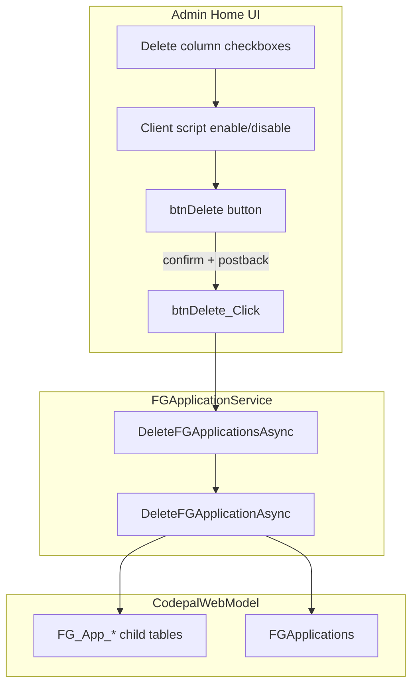

# Admin Delete Application — Implementation Plan

**Project:** NMSFM Fire Grant Web Application  
**Document version:** 1.0  
**Date:** June 29, 2026  
**Status:** Implemented  
**Scope:** Bulk hard-delete of Fire Grant applications from Admin Home. No schema
changes.

**Related artifacts:**

- Planning summary: [`planning/admin-delete-application-plan.md`](planning/admin-delete-application-plan.md)
- Admin list page: [`Home.aspx`](../NMSFMFireGrantWF/Admin/Home.aspx)
- Code-behind: [`Home.aspx.cs`](../NMSFMFireGrantWF/Admin/Home.aspx.cs)
- Service interface: [`IFGApplicationServices.cs`](../NMSFM.Services/FireGrant/IFGApplicationServices.cs)
- Service implementation: [`FGApplicationService.cs`](../NMSFM.Services/FireGrant/FGApplicationService.cs)
- EF context: [`CodepalWebModel.cs`](../NMSFM.Data/DataModels/CodepalWebModel.cs)

---

## 1. Problem statement

Internal admins use Admin Home to review Fire Grant applications by fiscal year.
There is no way to remove an application that was created in error or should no
longer exist. Admins need to select one or more applications and permanently
delete them along with all related form data, scores, documents, and signatures.

Today, `FGApplicationService` supports deleting individual documents
(`DeleteApplicationDocumentAsync`) but not a full application cascade.

---

## 2. Architecture



**Auth:** Existing `Page_Init` in `Home.aspx.cs` already restricts access to
`Session["Role"] == "Internal"`. No additional role check required.

---

## 3. Service layer

### 3.1 Interface additions

**File:** [`IFGApplicationServices.cs`](../NMSFM.Services/FireGrant/IFGApplicationServices.cs)

Add:

```csharp
Task<bool> DeleteFGApplicationAsync(Guid applicationId);
Task<int> DeleteFGApplicationsAsync(IEnumerable<Guid> applicationIds);
```

### 3.2 `DeleteFGApplicationAsync`

**File:** [`FGApplicationService.cs`](../NMSFM.Services/FireGrant/FGApplicationService.cs)

Delete all rows where `ApplicationId` matches, then remove the parent
`FGApplications` row. Use one EF transaction per application:

```csharp
using (var tx = ((DbContext)cwmContext).Database.BeginTransaction())
{
  // RemoveRange for each table (child tables first)
  await ((DbContext)cwmContext).SaveChangesAsync();
  tx.Commit();
}
```

**Delete order — collection/child tables first:**

| DbSet | Entity |
|-------|--------|
| `FG_App_AidDistricts` | `FG_App_AidDistricts` |
| `FG_App_WaterSources` | `FG_App_WaterSources` |
| `FG_App_TrainingOpportunities` | `FG_App_TrainingOpportunities` |
| `FG_App_ApparatusEquipment` | `FG_App_ApparatusEquipment` |
| `FG_App_CommunicationEquipment` | `FG_App_CommunicationEquipment` |
| `FG_App_HazardThreatEvents` | `FG_App_HazardThreatEvents` |
| `FG_App_StandardPPEs` | `FG_App_StandardPPE` |
| `FG_App_StandardSCBAs` | `FG_App_StandardSCBA` |
| `FG_App_ApplicationEquipments` | `FG_App_ApplicationEquipment` |
| `FG_App_Documents` | `FG_App_Documents` |
| `FG_App_Signatures` | `FG_App_Signatures` |
| `FG_App_Scores` | `FG_App_Scores` |

**Then section/parent tables:**

| DbSet | Entity |
|-------|--------|
| `FG_App_GeneralInfos` | `FG_App_GeneralInfo` |
| `FG_App_BudgetInfos` | `FG_App_BudgetInfo` |
| `FG_App_CommunityInfos` | `FG_App_CommunityInfo` |
| `FG_App_ResponseHistories` | `FG_App_ResponseHistory` |
| `FG_App_WaterAvailabilities` | `FG_App_WaterAvailability` |
| `FG_App_Trainings` | `FG_App_Training` |
| `FG_App_Apparatuses` | `FG_App_Apparatus` |
| `FG_App_Communications` | `FG_App_Communication` |
| `FG_App_HazardsThreats` | `FG_App_HazardsThreats` |
| `FG_App_PPEs` | `FG_App_PPE` |
| `FG_App_EquipmentNeeds` | `FG_App_EquipmentNeeds` |
| `FG_App_FundingJustifications` | `FG_App_FundingJustification` |
| `FG_App_ProjectBudgets` | `FG_App_ProjectBudget` |
| `FG_App_DocsSigs` | `FG_App_DocsSigs` |
| `FG_App_Reviews` | `FG_App_Review` |

**Finally:**

| DbSet | Entity |
|-------|--------|
| `FGApplications` | `FGApplications` |

**Per-table pattern:**

```csharp
var rows = await cwmContext.FG_App_AidDistricts
  .Where(a => a.ApplicationId == applicationId)
  .ToListAsync();
cwmContext.FG_App_AidDistricts.RemoveRange(rows);
```

**Not deleted:**

- `FG_App_Helps` (global page help)
- `FG_Priorities`, `FG_Categories`, `FG_FDIDs` (reference data)
- `FGApplicationSettings` (fiscal-year program settings)
- Address/department records (`AddressId` on `FGApplications`)

**Error handling:**

- Log via `ILogging` on exception
- Roll back transaction on failure
- Return `false` from `DeleteFGApplicationAsync`

### 3.3 `DeleteFGApplicationsAsync`

Loop distinct `applicationId` values; call `DeleteFGApplicationAsync` for each;
return count of successful deletes. Skip empty/null GUIDs.

---

## 4. UI — Home.aspx

### 4.1 Message area

Add above the grid (after the instructional row, before `rgDepartments`):

```aspx
<div class="row">
  <div class="col-md-12" id="dvMessage" runat="server"></div>
</div>
```

Use Bootstrap alert classes for success/error feedback.

### 4.2 Delete button

In the date-range row, update the Search button column to include both buttons:

```aspx
<div class="col-md-3">
  <asp:Button ID="btnSearch" CssClass="btn btn-primary" runat="server"
    Text="Search" OnClick="btnSearch_Click" />
  <asp:Button ID="btnDelete" CssClass="btn btn-danger" runat="server"
    Text="Delete" Enabled="false" OnClick="btnDelete_Click"
    OnClientClick="return confirm('Are you sure you want to permanently delete the selected application(s) and all associated data?');" />
</div>
```

### 4.3 Delete column on RadGrid

Add as the **last** column inside `<Columns>`:

```aspx
<telerik:GridTemplateColumn HeaderText="Delete" UniqueName="Delete"
  FilterControlAltText="Filter Delete column">
  <ItemTemplate>
    <asp:CheckBox ID="chkDelete" runat="server" CssClass="app-delete-chk" />
  </ItemTemplate>
</telerik:GridTemplateColumn>
```

The hidden `ApplicationId` bound column already exists (`Display="False"`).

### 4.4 Client script

Add to `HeadContent`:

```html
<script type="text/javascript">
  function updateDeleteButtonState() {
    var btn = document.getElementById('<%= btnDelete.ClientID %>');
    if (!btn) return;
    var anyChecked = false;
    var boxes = document.querySelectorAll('.app-delete-chk input[type=checkbox]');
    for (var i = 0; i < boxes.length; i++) {
      if (boxes[i].checked) { anyChecked = true; break; }
    }
    btn.disabled = !anyChecked;
  }

  function initDeleteCheckboxes() {
    var boxes = document.querySelectorAll('.app-delete-chk input[type=checkbox]');
    for (var i = 0; i < boxes.length; i++) {
      boxes[i].removeEventListener('change', updateDeleteButtonState);
      boxes[i].addEventListener('change', updateDeleteButtonState);
    }
    updateDeleteButtonState();
  }

  if (typeof Sys !== 'undefined' && Sys.Application) {
    Sys.Application.add_load(initDeleteCheckboxes);
  } else {
    document.addEventListener('DOMContentLoaded', initDeleteCheckboxes);
  }
</script>
```

---

## 5. Code-behind — Home.aspx.cs

### 5.1 `btnDelete_Click`

```csharp
protected async void btnDelete_Click(object sender, EventArgs e)
{
  var ids = new List<Guid>();
  foreach (GridDataItem item in rgDepartments.MasterTableView.Items)
  {
    var chk = item.FindControl("chkDelete") as CheckBox;
    if (chk != null && chk.Checked)
    {
      var appIdText = item["ApplicationId"].Text;
      if (Guid.TryParse(appIdText, out Guid appId))
        ids.Add(appId);
    }
  }

  if (ids.Count == 0)
  {
    dvMessage.InnerHtml = "<div class='alert alert-warning'>No applications selected.</div>";
    btnDelete.Enabled = false;
    return;
  }

  int deleted = await fgAppService.DeleteFGApplicationsAsync(ids);
  if (deleted == ids.Count)
  {
    dvMessage.InnerHtml = string.Format(
      "<div class='alert alert-success'>{0} application(s) deleted.</div>", deleted);
  }
  else if (deleted > 0)
  {
    dvMessage.InnerHtml = string.Format(
      "<div class='alert alert-warning'>{0} of {1} application(s) deleted. Some deletions failed.</div>",
      deleted, ids.Count);
  }
  else
  {
    dvMessage.InnerHtml = "<div class='alert alert-danger'>Delete failed. No applications were removed.</div>";
  }

  await LoadApplications();
  btnDelete.Enabled = false;
}
```

### 5.2 Paging behavior

`rgDepartments.MasterTableView.Items` contains only rows on the **current page**.
Checkbox selection and delete apply to the visible page only. Document this in QA.
Cross-page selection can be added later via a hidden-field tracker if needed.

### 5.3 Designer

**File:** [`Home.aspx.designer.cs`](../NMSFMFireGrantWF/Admin/Home.aspx.designer.cs)

Add declarations for `btnDelete` and `dvMessage`.

---

## 6. QA checklist

| # | Test | Expected |
|---|------|----------|
| T1 | Internal admin opens Admin Home | Delete column is last; Delete button is disabled |
| T2 | Check one row | Delete button becomes enabled |
| T3 | Uncheck all rows | Delete button becomes disabled again |
| T4 | Click Delete, cancel confirm | No data removed; grid unchanged |
| T5 | Check row(s), confirm Delete | Selected applications removed from grid |
| T6 | DB check after delete | No `FGApplications` or `FG_App_*` rows for deleted `ApplicationId` |
| T7 | Department still exists | `AddressId` record unchanged; new app can be created |
| T8 | Delete multiple rows on same page | All selected applications removed |
| T9 | Delete fails (simulate) | Error message shown; no silent partial state |
| T10 | External / unauthorized user | Redirect to Unauthorized (existing behavior) |
| T11 | Search + delete workflow | Search filters grid; delete still works on visible results |

---

## 7. Files changed (summary)

| File | Change |
|------|--------|
| `docs/planning/admin-delete-application-plan.md` | Planning doc |
| `docs/admin-delete-application-implementation-plan.md` | This file |
| `NMSFM.Services/FireGrant/IFGApplicationServices.cs` | New delete method signatures |
| `NMSFM.Services/FireGrant/FGApplicationService.cs` | Cascade hard-delete implementation |
| `Admin/Home.aspx` | Delete column, button, script, message div |
| `Admin/Home.aspx.cs` | `btnDelete_Click` handler |
| `Admin/Home.aspx.designer.cs` | New control declarations |

---

## 8. Build

From `NMSFM_FGF_CVE/NMSFMFireGrantWF/`:

```powershell
.\build.ps1
```

Restart IIS / app pool after deploy for runtime testing.
