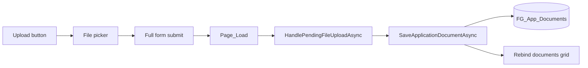

# Application Document Upload Feature

**Project:** NMSFM Fire Grant Web Application  
**Document version:** 1.0  
**Date:** June 22, 2026  
**Status:** Implemented  

**Related planning artifacts:**

- [`docs/planning/ppe-scba-document-upload-plan.md`](planning/ppe-scba-document-upload-plan.md)
- [`docs/ppe-scba-document-upload-implementation-plan.md`](ppe-scba-document-upload-implementation-plan.md)

---

## 1. Overview

This feature adds file upload support to equipment-list sections on three application
pages. Applicants can attach supporting documents (spreadsheets, PDFs, Word files) as an
alternative to manually entering line items in the equipment grids.

Files are stored in the existing `FG_App_Documents` table using the same persistence
pattern as **Signatures and Supporting Docs** (`SignaturesDocs.aspx`). Each page section
uses a distinct `DocumentType` value so uploads can be filtered and displayed separately.

### Pages affected

| Page | Section | Upload button label | Document type stored in DB |
|------|---------|---------------------|----------------------------|
| PPE | Standard Compliant PPE | Upload PPE Documents | `PPE File Upload` |
| PPE | Standard Compliant SCBA | Upload SCBA Documents | `SCBA File Upload` |
| Communication Equipment | List Existing Communication Equipment | Upload Communication Equipment Documents | `Communication Equipment File Upload` |
| Apparatus | List All Apparatus | Upload Apparatus Documents | `Apparatus File Upload` |

---

## 2. User-facing functionality

### Upload

- An **Upload … Documents** button appears beside each section's **Add** button.
- Clicking the button opens the file picker.
- Allowed extensions: `.xls`, `.xlsx`, `.csv`, `.pdf`, `.doc`, `.docx`
- Maximum file size: 10 MB (enforced in code; IIS `maxRequestLength` is 4 MB — see
  [Deployment notes](#9-deployment-notes))
- Maximum file name length: 255 characters
- After the user selects a file and clicks **Open**, the page performs a full form
  postback and the file appears in the uploaded-documents grid below the equipment grid.

### Uploaded documents grid

Each section has a grid below the equipment list with these columns:

| Column | Description |
|--------|-------------|
| Document Type | Value from the table above (set automatically in code) |
| Document Name | Original file name; editable after upload |
| Edit Name | Opens a modal to rename the document |
| View | Opens a PDF viewer modal (PDF and convertible Word/text formats) |
| Download | Downloads the file |
| Remove | Deletes the document from the application |

### Validation (list OR file)

When the relevant **"… is part of the project?"** answer is **Yes**, the applicant must
provide **either**:

- At least one row in the equipment grid, **or**
- At least one uploaded document for that section

Validation error messages:

| Page | Message |
|------|---------|
| PPE (PPE section) | `PPE list or File Upload is required` |
| PPE (SCBA section) | `SCBA list or File Upload is required` |
| Communication Equipment | `Communication Equipment list or File Upload is required` |
| Apparatus | `Apparatus list or File Upload is required` |

Legacy messages stored in the database (for example `PPE list is required` or
`You must list Apparatus`) are normalized to the new wording on display and on save via
`NormalizeInvalidText()`.

### Layout

- On **PPE**, a horizontal rule and margin separate the PPE documents grid from the SCBA
  **"SCBA is part of the project?"** question.
- On **Communication Equipment**, spacing separates the documents grid from the
  interoperability questions below.

### Error message behavior

- Section-specific success/error messages appear below the upload button area
  (`dvPPEDocumentError`, `dvSCBADocumentError`, etc.).
- On **successful upload**, the top-of-page error area (`dvError`) is cleared so stale
  validation messages from a prior Save/Next attempt do not persist.
- If the user reloads the page without saving after fixing validation by uploading, the
  old error may reappear from the database until they click **Save** again.

### Read-only mode

When the application is read-only (`Session["ReadOnly"]`):

- Upload buttons are hidden
- **Edit Name** and **Remove** links are hidden in document grids
- **View** and **Download** remain available

---

## 3. Technical architecture

### Data flow



### Upload mechanism

Earlier attempts used hidden-button clicks and ScriptManager partial postbacks, which
stripped file data. The implemented approach:

1. Hidden `asp:FileUpload` control (visually hidden, not `display:none`)
2. `onchange` sets `hfUploadAction` to a section code (`PPE`, `SCBA`, `COMMUNICATION`,
   `APPARATUS`)
3. `document.forms[0].submit()` performs a **full** postback (not async)
4. `Page_Load` calls `HandlePendingFileUploadAsync()` when `IsPostBack`
5. `OnPreRender` sets `Page.Form.Enctype = "multipart/form-data"`

### ViewState keys

| Key | Page | Contents |
|-----|------|----------|
| `dtPPEDocuments` | PPE | PPE-section document list |
| `dtSCBADocuments` | PPE | SCBA-section document list |
| `dtCommunicationDocuments` | Communication Equipment | Communication documents |
| `dtApparatusDocuments` | Apparatus | Apparatus documents |

### PDF viewing

- Uses Telerik `RadPdfViewer` and pdf.js (same as Signatures & Docs)
- Word/text formats (`.docx`, `.rtf`, `.html`, `.txt`) are converted to PDF via RadFlow
  for in-browser preview
- Excel and legacy `.doc` files: preview not available; user is directed to **Download**

---

## 4. Service layer changes

### New method

**`IFGApplicationServices` / `FGApplicationService`:**

```csharp
Task<List<FG_AppDocListItem>> GetApplicationDocumentsByTypesAsync(
    Guid applicationId, string[] documentTypes);
```

Filters `FG_App_Documents` by `ApplicationId` and optional `DocumentType` values.
Returns lightweight `FG_AppDocListItem` rows (no binary content) for grid binding.

### Existing methods reused

| Method | Usage |
|--------|--------|
| `SaveApplicationDocumentAsync` | Insert/update document records |
| `GetApplicationDocumentByIdAsync` | View, download, rename |
| `DeleteApplicationDocumentAsync` | Remove from grid |

No changes were required to `SavePPEAsync`, `SaveCommunicationAsync`, or
`SaveApparatusAsync` beyond validation logic in the page code-behind.

---

## 5. Database

### Table: `FG_App_Documents`

No new table. Existing columns used:

| Column | Usage |
|--------|--------|
| `DocumentId` | PK, generated at upload |
| `ApplicationId` | From session / `hfApplicationId` |
| `DocumentType` | Section-specific label (see table in §1) |
| `DocumentName` | File name (user-editable) |
| `Document` | File binary |
| `DocType` | File extension (e.g. `.pdf`) |

### Schema change (required for deployment)

`DocumentName` was extended from `varchar(50)` to `varchar(255)` to support long file
names. Without this change, uploads with names longer than 50 characters fail at save
time.

```sql
ALTER TABLE FG_App_Documents ALTER COLUMN DocumentName varchar(255) NOT NULL;
```

This change was applied on the local dev database (`Codepal_NMSFM`). Run the same script
on staging and production before deploying the application update.

---

## 6. Files modified

### Application pages (UI + code-behind)

| File | Changes |
|------|---------|
| `NMSFMFireGrantWF/Application/PPE.aspx` | Upload buttons, file inputs, document grids, PDF/edit modals, scripts, spacing |
| `NMSFMFireGrantWF/Application/PPE.aspx.cs` | Document upload, grid commands, validation, error normalization |
| `NMSFMFireGrantWF/Application/PPE.aspx.designer.cs` | New control declarations |
| `NMSFMFireGrantWF/Application/CommunicationEquipment.aspx` | Same pattern as PPE (single section) |
| `NMSFMFireGrantWF/Application/CommunicationEquipment.aspx.cs` | Same pattern as PPE |
| `NMSFMFireGrantWF/Application/CommunicationEquipment.aspx.designer.cs` | New control declarations |
| `NMSFMFireGrantWF/Application/Apparatus.aspx` | Same pattern as PPE (single section) |
| `NMSFMFireGrantWF/Application/Apparatus.aspx.cs` | Same pattern; replaced `You must list Apparatus` validation |
| `NMSFMFireGrantWF/Application/Apparatus.aspx.designer.cs` | New control declarations |

### Service layer

| File | Changes |
|------|---------|
| `NMSFM.Services/FireGrant/IFGApplicationServices.cs` | `GetApplicationDocumentsByTypesAsync` signature |
| `NMSFM.Services/FireGrant/FGApplicationService.cs` | Implementation |

### Tooling / project conventions

| File | Changes |
|------|---------|
| `.cursor/rules/build-dev-tests.mdc` | Agent rule to run `.\build.ps1` after code changes |

### Planning docs (pre-implementation)

| File | Notes |
|------|-------|
| `docs/planning/ppe-scba-document-upload-plan.md` | Original requirements |
| `docs/ppe-scba-document-upload-implementation-plan.md` | Detailed plan (status: planned at time of writing; superseded by this doc for as-built behavior) |

---

## 7. Modifications to existing behavior

### PPE page

- **Before:** PPE and SCBA sections required at least one grid row when part of project.
- **After:** Grid rows **or** uploaded documents satisfy the requirement.
- Validation messages updated to mention file upload.
- Document type dropdowns in markup were planned but are commented out; types are set in
  code.

### Communication Equipment page

- **Before:** No requirement to list communication equipment items (only other field
  validations when Communications is part of project).
- **After:** When Communications is part of project, applicants must provide equipment
  list **or** uploaded documents.

### Apparatus page

- **Before:** `You must list Apparatus` when apparatus is part of project.
- **After:** `Apparatus list or File Upload is required` — grid **or** documents.

### Apparatus validation message only

No other apparatus pump/hose test validation was changed.

---

## 8. Build and verification

From `NMSFM_FGF_CVE/NMSFMFireGrantWF/`:

```powershell
.\build.ps1
```

Output assemblies: `NMSFMFireGrantWF/bin/`. Do not test against the stale `publish/`
folder unless that is your deployment target and it has been refreshed.

---

## 9. Deployment notes

1. Apply the `DocumentName` column `ALTER` on each environment database.
2. Deploy built binaries from `bin/` (or your standard publish pipeline).
3. Restart IIS / the application pool so the site loads the new DLL.
4. **IIS request size:** `web.config` sets `maxRequestLength="4096"` (4 MB) and
   `maxAllowedContentLength="4194304"`. Code allows up to 10 MB; files between 4–10 MB
   may be rejected by IIS before reaching application code. Increase both limits if
   larger uploads are required.

---

## 10. Test checklist

### Per page (PPE PPE, PPE SCBA, Communication, Apparatus)

- [ ] Upload each allowed file type
- [ ] Document appears in grid with correct Document Type
- [ ] View PDF in modal
- [ ] Download file
- [ ] Edit document name
- [ ] Remove document
- [ ] Validation passes with grid rows only (no upload)
- [ ] Validation passes with upload only (no grid rows)
- [ ] Validation fails with neither grid rows nor upload
- [ ] Top `dvError` clears after successful upload following a failed Save
- [ ] Save persists valid state and updated validation messages
- [ ] Read-only mode hides upload/edit/remove

### Edge cases

- [ ] File name longer than 50 characters (requires `varchar(255)` column)
- [ ] File name longer than 255 characters (friendly error before save)
- [ ] Disallowed extension rejected
- [ ] File over 4 MB (IIS limit behavior)

---

## 11. Document type reference (for reporting / admin)

| DocumentType value | Application page | Section |
|------------------|------------------|---------|
| `PPE File Upload` | PPE | Standard Compliant PPE |
| `SCBA File Upload` | PPE | Standard Compliant SCBA |
| `Communication Equipment File Upload` | Communication Equipment | Equipment list |
| `Apparatus File Upload` | Apparatus | Apparatus list |

Signatures & Docs page continues to use its existing types (`Stipend`, `Scope of
Project/Work`, etc.) in the same table.
