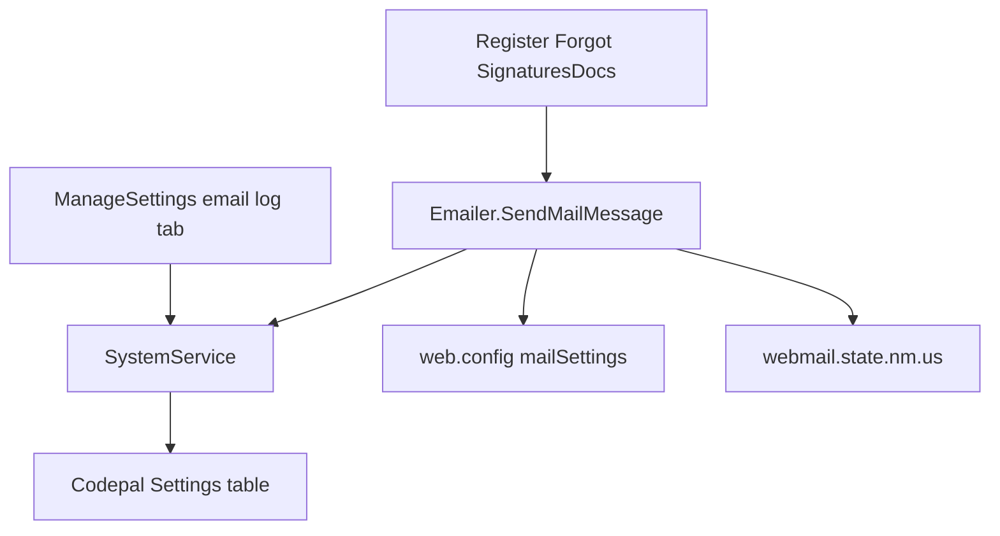

# Email Send Logging — Implementation Plan

**Project:** NMSFM Fire Grant Web Application  
**Document version:** 1.0  
**Date:** June 29, 2026  
**Status:** Implemented  
**Scope:** State webmail SMTP migration; corrected From domain; WebUser-based
Reply-To and body attribution; Settings-table send logging; admin log UI. No
schema changes. No third-party email provider.

**Related artifacts:**

- Planning summary: [`planning/email-send-logging-plan.md`](planning/email-send-logging-plan.md)
- Email sender: [`Emailer.cs`](../NMSFM.Services/FireGrant/Emailer.cs)
- Settings entity: [`Setting.cs`](../NMSFM.Data/Codepal Tables/Setting.cs)
- Settings service: [`SystemService.cs`](../NMSFM.Services/CPSystem/SystemService.cs)
- Web config: [`web.config`](../NMSFMFireGrantWF/web.config)

---

## 1. Problem statement

Grant email uses SendGrid and `donotreply@newmexicostatefireservicesgrant.com`
(a non-existent domain). `Emailer.SendMailMessage` has no persistence layer.
Signatory emails do not identify the logged-in external user. Stakeholders need
send attempt history for support without third-party delivery webhooks.

---

## 2. Architecture



**Send identity rules:**

| Field | Source |
|-------|--------|
| From | `DefaultEmailSender` → `donotreply@fireservicesgrant.dhsem.nm.gov` |
| Reply-To | `Session["WebUserEmail"]` when `Session["Role"] == "External"` and non-empty |
| Display name (optional) | `"{login} (NMSFM Fire Grant)"` on From address |
| sentByEmail in log | `User.Email` from `NMSFM_WebUsers_FG` — not Party email |

---

## 3. Configuration

**File:** [`NMSFMFireGrantWF/web.config`](../NMSFMFireGrantWF/web.config)

### 3.1 Replace `<mailSettings>`

```xml
<system.net>
  <mailSettings>
    <smtp from="donotreply@fireservicesgrant.dhsem.nm.gov">
      <network defaultCredentials="true"
               host="webmail.state.nm.us"
               port="25"
               enableSsl="true" />
    </smtp>
  </mailSettings>
</system.net>
```

Remove active SendGrid `<network>` entry (may leave commented for rollback reference).

### 3.2 `appSettings`

| Key | Value |
|-----|-------|
| `DefaultEmailSender` | `donotreply@fireservicesgrant.dhsem.nm.gov` |
| `ApplicationUrl` | `https://fireservicesgrant.dhsem.nm.gov/` |
| `EnableEmailSendLogging` | `true` |
| `EmailSendLogRetentionDays` | `90` |

Do not edit `publish/Web.config` by hand — regenerate via `build-release.ps1`.

### 3.3 Emailer TLS

After SMTP migration, verify whether
`ServicePointManager.SecurityProtocol = SecurityProtocolType.Tls12` in
[`Emailer.cs`](../NMSFM.Services/FireGrant/Emailer.cs) is appropriate for port 25
state relay. Remove or gate behind config if relay fails.

---

## 4. Settings table contract

**Constant** — add to [`FireGrantSettingKeys.cs`](../NMSFM.Services/CPSystem/FireGrantSettingKeys.cs):

```csharp
public const string EmailLogPrefix = "FireGrant_EmailLog_";
```

**One row per outbound message:**

| Column | Value |
|--------|-------|
| `PropertyField` | `FireGrant_EmailLog_{messageId}` (GUID string) |
| `ValueField` | JSON metadata (max 3000 chars; no HTML body) |
| `AgencyId` | `Session["AgencyId"]` when available; `null` for Forgot/Register |
| `DateInserted` | First log write |
| `DateUpdated` | Last status change |
| `UserName` | Empty |

**JSON shape:**

```json
{
  "status": "Sent",
  "from": "donotreply@fireservicesgrant.dhsem.nm.gov",
  "replyTo": "user@example.com",
  "to": "signatory@example.com",
  "subject": "Approval Requested for NMSFM Fire Grant Application",
  "ctx": "SignatoryRequest",
  "ctxId": "application-guid",
  "sentByUserId": "web-user-guid",
  "sentByEmail": "user@example.com",
  "sentByLogin": "jsmith",
  "sentByRole": "External",
  "fail": ""
}
```

**Statuses:** `Queued`, `Sent`, `Failed` (optional `Skipped` if send blocked before SMTP).

**Do not use `SaveCodepalSetting`** for logs — that upserts config keys. Email logs
require insert-on-send and update-on-outcome with a unique `PropertyField` per message.

---

## 5. Service layer

### 5.1 New types (proposed location: `NMSFM.Services/FireGrant/`)

**`EmailSendContext`**

| Property | Type | Notes |
|----------|------|-------|
| `ContextType` | string | e.g. `SignatoryRequest`, `ForgotPassword` |
| `ContextId` | string | Application id, user id, etc. |
| `AgencyId` | Guid? | From session |
| `SentByUserId` | string | `Session["WebUserId"]` |
| `SentByEmail` | string | `Session["WebUserEmail"]` |
| `SentByLogin` | string | `Session["WebUser"]` |
| `SentByRole` | string | `Session["Role"]` |

**`EmailSendLogPayload`** — mirrors JSON contract for serialize/deserialize.

### 5.2 SystemService extensions

**Files:**

| File | Change |
|------|--------|
| [`ISystemService.cs`](../NMSFM.Services/CPSystem/ISystemService.cs) | Add three method signatures |
| [`SystemService.cs`](../NMSFM.Services/CPSystem/SystemService.cs) | Implement insert, update, query |

**New methods:**

```csharp
Task InsertEmailSendLogAsync(Guid messageId, EmailSendLogPayload payload, Guid? agencyId);
Task UpdateEmailSendLogAsync(Guid messageId, EmailSendLogPayload payload);
Task<IReadOnlyList<EmailSendLogEntry>> GetRecentEmailSendLogsAsync(Guid? agencyId, int take);
```

**`InsertEmailSendLogAsync`:** always insert; set `PropertyField =
FireGrantSettingKeys.EmailLogPrefix + messageId`.

**`UpdateEmailSendLogAsync`:** find by exact `PropertyField`; update `ValueField`,
`DateUpdated`.

**`GetRecentEmailSendLogsAsync`:** query `PropertyField.StartsWith(EmailLogPrefix)`;
order by `DateInserted` descending; deserialize `ValueField`; optional `agencyId` filter.

**`DeleteEmailSendLogsOlderThanAsync(DateTime cutoff)`** (optional): purge retention.

Register new types in [`NMSFM.Services.csproj`](../NMSFM.Services/NMSFM.Services.csproj).

---

## 6. Emailer changes

**File:** [`Emailer.cs`](../NMSFM.Services/FireGrant/Emailer.cs)

Extend signature (backward compatible):

```csharp
public void SendMailMessage(
  string from,
  string recepient,
  string bcc,
  string cc,
  string subject,
  string body,
  string att = "",
  string replyTo = "",
  EmailSendContext context = null,
  ISystemService systemService = null)
```

**When `EnableEmailSendLogging` is true and `systemService` is provided:**

1. `messageId = Guid.NewGuid()`
2. Build payload with `status = Queued`, truncate subject to ~200 chars if needed
3. `InsertEmailSendLogAsync`
4. If `context.SentByRole == "External"` and `context.SentByEmail` non-empty:
   set `mailMessage.ReplyToList` (unless explicit `replyTo` parameter overrides)
5. Optional: `new MailAddress(from, displayName)` with displayName from login
6. Existing retry loop (`SmtpClient` reads `web.config`)
7. Success → `UpdateEmailSendLogAsync` with `status = Sent`
8. Final failure → `UpdateEmailSendLogAsync` with `status = Failed`, `fail = ex.Message`

Logging failures must not prevent send attempts (swallow log exceptions after error log).

---

## 7. Session and WebUser email

### 7.1 Login

**File:** [`Login.aspx.cs`](../NMSFMFireGrantWF/Account/Login.aspx.cs)

After `webUser` is validated and `Session["WebUserId"]` is set (all roles):

```csharp
Session["WebUserEmail"] = webUser.Email;
```

Do not use `Session["CodePalEmailAddress"]` for Reply-To or logging.

### 7.2 WebUser email hygiene

| File | Change |
|------|--------|
| [`AddCodePalUser.aspx.cs`](../NMSFMFireGrantWF/Account/AddCodePalUser.aspx.cs) | Set `user.Email = txtEmail.Text` before `SaveWebUserAsync` |
| [`EditUser.aspx.cs`](../NMSFMFireGrantWF/Account/EditUser.aspx.cs) | When saving external user, set `duplicate.Email = txtEmail.Text` in `UpdateExistingUser` path |

---

## 8. Instrument send call sites

### 8.1 Shared helper (optional static in `Emailer` or small helper class)

```csharp
static EmailSendContext BuildContextFromSession(string contextType, string contextId)
{
  // Read WebUserId, WebUserEmail, WebUser, Role, AgencyId from HttpContext.Current.Session
}
```

### 8.2 Call sites

| File | Method | ctx | Reply-To |
|------|--------|-----|----------|
| `SignaturesDocs.aspx.cs` | `SendSignatorEmails` | `SignatoryRequest` | External WebUser email |
| `SignaturesDocs.aspx.cs` | `SendSubmittalEmails` | `ApplicationSubmitted` | External WebUser email |
| `SignaturesDocs.aspx.cs` | `SendFireChiefEmail` | `FireChiefSubmit` | External WebUser email |
| `Register.aspx.cs` | approval email | `RegistrationApproval` | None |
| `Register.aspx.cs` | admin notification | `Registration` | None |
| `Forgot.aspx.cs` | reset email | `ForgotPassword` | None |

**From (all sites):**

```csharp
ConfigurationManager.AppSettings["DefaultEmailSender"]
```

**SignaturesDocs body example:**

```html
An approval has been requested by {login} ({email}) for the fire grant
application for {department}. Please click the link below...
```

Pass `systemService` into `SendMailMessage` on pages that already construct
`SystemService` in `Page_Init`.

---

## 9. Admin UI — email send log

**Location:** New tab on [`ManageSettings.aspx`](../NMSFMFireGrantWF/Admin/ManageSettings.aspx)
(Internal web admin only — same auth as existing page).

**Tab: Email Log**

| Control | Behavior |
|---------|----------|
| Grid | Date, Status, To, Subject, SentByLogin, SentByEmail, Context, Fail |
| Filter checkbox | Failed only |
| Refresh | Reload `GetRecentEmailSendLogsAsync(Session["AgencyId"], 100)` |
| Purge button | `DeleteEmailSendLogsOlderThanAsync` using `EmailSendLogRetentionDays` |
| Email Test button (optional) | Send test message via `Emailer` to verify SMTP |

**Code-behind:** [`ManageSettings.aspx.cs`](../NMSFMFireGrantWF/Admin/ManageSettings.aspx.cs)

Deserialize log JSON for grid binding. Show friendly status badges for
Queued / Sent / Failed.

---

## 10. QA checklist

- [ ] State webmail accepts relay from IIS app pool identity
- [ ] Email Test (if implemented) returns Sent log row
- [ ] External save on SignaturesDocs → signatory mail has Reply-To = WebUser email
- [ ] Body names sender login and email
- [ ] Submit application → submittal email logged Sent
- [ ] Forgot password → log with `ctx=ForgotPassword`, empty sentBy fields
- [ ] Registration emails logged
- [ ] Simulated SMTP failure → Failed row with `fail` populated
- [ ] Admin grid lists recent rows; failed filter works
- [ ] Purge removes rows older than retention days
- [ ] Links in email use `https://fireservicesgrant.dhsem.nm.gov/`
- [ ] `.\build.ps1` passes from `NMSFM_FGF_CVE/NMSFMFireGrantWF/`

---

## 11. Build command

```powershell
cd NMSFM_FGF_CVE/NMSFMFireGrantWF
.\build.ps1
```

---

## 12. File checklist

| Area | Files |
|------|-------|
| Docs | `docs/planning/email-send-logging-plan.md`, `docs/email-send-logging-implementation-plan.md` |
| Config | `NMSFMFireGrantWF/web.config` |
| Constants | `FireGrantSettingKeys.cs` |
| Types | `EmailSendContext.cs`, `EmailSendLogPayload.cs`, `EmailSendLogEntry.cs` (proposed) |
| Service | `ISystemService.cs`, `SystemService.cs` |
| Email | `Emailer.cs` |
| Session | `Login.aspx.cs` |
| User email | `AddCodePalUser.aspx.cs`, `EditUser.aspx.cs` |
| Senders | `SignaturesDocs.aspx.cs`, `Register.aspx.cs`, `Forgot.aspx.cs` |
| Admin | `ManageSettings.aspx`, `ManageSettings.aspx.cs`, `.designer.cs` |
| Project | `NMSFM.Services.csproj` |
