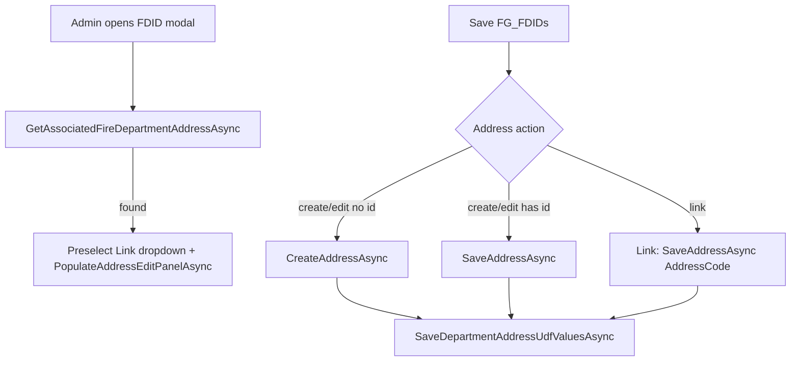

# Manage FDIDs Modal — Address Edit + Department UDFs Implementation Plan

**Project:** NMSFM Fire Grant Web Application  
**Document version:** 1.0  
**Date:** June 27, 2026  
**Status:** Planned  
**Scope:** Phase 2 — edit existing fire-department addresses, save department UDFs (ISO, station counts), pre-load associated address on modal open. No schema changes.

**Related artifacts:**

- Planning summary: [`planning/fdid-modal-address-edit-udf-plan.md`](planning/fdid-modal-address-edit-udf-plan.md)
- Phase 1: [`planning/fdid-modal-address-sync-plan.md`](planning/fdid-modal-address-sync-plan.md)
- Page: [`ManageFDIDs.aspx`](../NMSFMFireGrantWF/Admin/ManageFDIDs.aspx)
- Services: [`AddressService.cs`](../NMSFM.Services/Address/AddressService.cs)

---

## 1. Problem statement

Phase 1 saves `FG_FDIDs` and creates/links `Addresses` rows. Department metadata (ISO, station counts) is stored in **`UserDefValues`** keyed by `AddressId`, not in `Addresses`. The modal does not write UDFs, cannot update an existing address, and does not pre-load the address linked to an FDID row.

General Information loads UDFs in `LoadDepartmentUDFs` ([`GeneralInformation.aspx.cs`](../NMSFMFireGrantWF/Application/GeneralInformation.aspx.cs) ~418).

---

## 2. Constants

| Item | Value |
|------|-------|
| Fire dept `AddressTypeId` | `43856752-8b7a-4e6f-b697-bf8acd457c16` |
| ISO UDF | `6b8517ef-9483-4b8b-8c95-5b95a6b8f579` |
| Main Stations UDF | `7ad61001-cac8-4f3c-ae4e-32d28393f891` |
| Admin Buildings UDF | `8baa0b86-f1e5-4d84-b4f9-a8219f4b11b8` |
| Substations UDF | `4f34b96d-d944-44aa-9665-d47c55cc025d` |
| Kill switch | `EnableFdidAddressSync` in Web.config |

---

## 3. Architecture



---

## 4. Service layer

Add to [`IAddressService.cs`](../NMSFM.Services/Address/IAddressService.cs) and [`AddressService.cs`](../NMSFM.Services/Address/AddressService.cs):

### 4.1 `GetAssociatedFireDepartmentAddressAsync(string departmentName)`

- Load active fire-dept addresses from `v_Addresses2`.
- Filter where `AddressCode.Trim()` equals `departmentName.Trim()` (ordinal ignore case).
- Return single `v_Addresses2` if count = 1; `null` if 0.
- If count > 1: throw `InvalidOperationException` with message to use Link dropdown.

### 4.2 `GetDepartmentAddressUdfValuesAsync(Guid addressId)`

- Return `DepartmentAddressUdfValues` DTO with ISO, MainStations, SubStations, AdminBldgs.
- Read from `UserDefValues`; default empty to `"0"` (match GI).

### 4.3 `SaveDepartmentAddressUdfValuesAsync(Guid addressId, DepartmentAddressUdfValues values)`

- Upsert four `UserDefValue` rows (`RecordId = addressId`).
- Pattern: [`SaveUserDefinedValuesAsync`](../NMSFM.Services/Address/AddressService.cs) or FPF upsert.

### 4.4 `GetZipTextByZipIdAsync(Guid? zipId)`

- Return `Zip1` from `Zips` for edit-panel prefill.

### 4.5 View model

New file: [`DepartmentAddressUdfValues.cs`](../NMSFM.Services/ViewModels/DepartmentAddressUdfValues.cs)

---

## 5. UI — ManageFDIDs.aspx

1. Rename radio: **Create / Edit Address**
2. Panel title: **Address (create or edit — required for invoices and legal documents)**
3. Add after zip row:
   - `txtDeptIso` — ISO Rating
   - `txtMainStations` — Main Stations
   - `txtSubStations` — Substations
   - `txtAdminBldgs` — Admin Buildings
4. Hidden button: `btnLoadAddressForEdit` — postback when link dropdown changes
5. JS:
   - `fdidAddressLinkChanged` — postback `btnLoadAddressForEdit` when valid AddressId selected; `__CREATE__` → create mode
   - `fdidClearAddressFields` — clear UDFs and `hfAddressId`

---

## 6. Code-behind — ManageFDIDs.aspx.cs

### 6.1 Load — `btnLoadAddressMatches_Click`

After `BindAddressLinkDropdownAsync`:

1. `GetAssociatedFireDepartmentAddressAsync(departmentName)`
2. If found: set `ddlAddressLink`, `hfAddressId`, `PopulateAddressEditPanelAsync`, switch to create/edit mode
3. Register reopen script

### 6.2 Load — `btnLoadAddressForEdit_Click`

- Parse `ddlAddressLink.SelectedValue` as `AddressId`
- `GetAddressByIdAsync` + `PopulateAddressEditPanelAsync`
- Set `hfAddressId`; switch to create/edit mode

### 6.3 `PopulateAddressEditPanelAsync(v_Addresses2 address)`

- Map physical fields, zip text, dropdown selections
- Load UDFs via `GetDepartmentAddressUdfValuesAsync`

### 6.4 Save — `ProcessAddressSyncAsync`

| Mode | Condition | Action |
|------|-----------|--------|
| create/edit | `hfAddressId` empty | `CreateFireDepartmentAddressAsync` |
| create/edit | `hfAddressId` set | `UpdateFireDepartmentAddressAsync` |
| link | dropdown selected | `LinkFireDepartmentAddressAsync` + UDF save |

Always call `SaveDepartmentUdfsFromPanelAsync(addressId)` when `addressId` is known.

### 6.5 Validation

- UDF: non-negative integers; parse failures → modal error
- Physical address: existing create validation when create/edit mode active

---

## 7. QA checklist

| # | Test | Expected |
|---|------|----------|
| T1 | New dept, no address | Create address + UDFs; GI shows values |
| T2 | Existing associated address | Modal pre-fills; edit ISO/street; save persists |
| T3 | Clovis duplicate | Pick correct link row; edit panel loads; save one row |
| T4 | Link mode, UDF only | UDFs save without new address |
| T5 | Rename department | `AddressCode` updated; reopen resolves |
| T6 | Kill switch false | No address/UDF UI |

---

## 8. Files changed

| File | Change |
|------|--------|
| `docs/planning/fdid-modal-address-edit-udf-plan.md` | Planning doc |
| `docs/fdid-modal-address-edit-udf-implementation-plan.md` | This file |
| `NMSFM.Services/ViewModels/DepartmentAddressUdfValues.cs` | DTO |
| `NMSFM.Services/Address/IAddressService.cs` | New methods |
| `NMSFM.Services/Address/AddressService.cs` | Implementations |
| `ManageFDIDs.aspx` | UI + JS |
| `ManageFDIDs.aspx.cs` | Load/save logic |
| `ManageFDIDs.aspx.designer.cs` | New controls |

---

## 9. Build

From `NMSFMFireGrantWF/`:

```powershell
.\build.ps1
```

Restart IIS/app pool after deploy for runtime testing.
