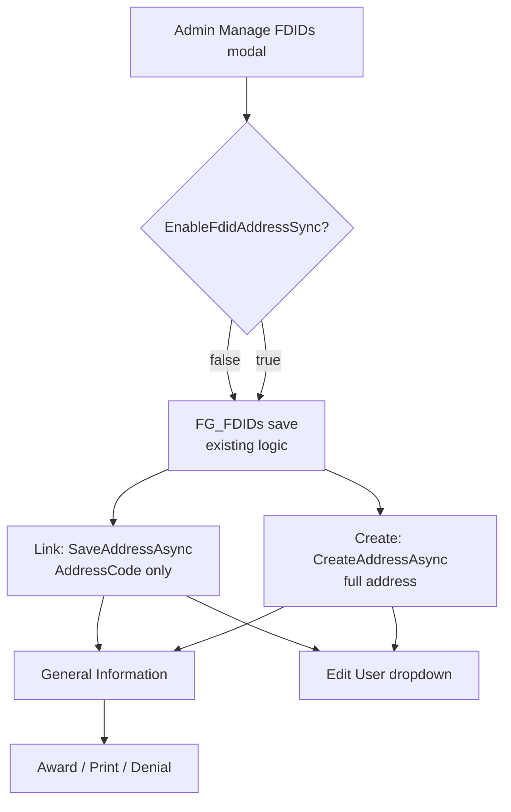

# Manage FDIDs Modal — Address Link + Create Implementation Plan

**Project:** NMSFM Fire Grant Web Application  
**Document version:** 1.0  
**Date:** June 27, 2026  
**Status:** Planned (not yet implemented)  
**Scope:** Extend Manage FDIDs modal to link or create fire-department addresses aligned with NERIS master list; fix false NERIS warning on General Information. No database schema changes.

**Related artifacts:**

- Planning summary: [`planning/fdid-modal-address-sync-plan.md`](planning/fdid-modal-address-sync-plan.md)
- Page under change: [`ManageFDIDs.aspx`](../NMSFMFireGrantWF/Admin/ManageFDIDs.aspx)
- Service layer: [`AddressService.cs`](../../NMSFM.Services/Address/AddressService.cs), [`FGService.cs`](../../NMSFM.Services/FireGrant/FGService.cs)

---

## 1. Problem statement

### 1.1 Root cause

NERIS migration updated **`FG_FDIDs`** (`FDID`, `FireDepartment`) without updating **`Addresses.AddressCode`**. The application resolves departments by string equality:

```
FG_FDIDs.FireDepartment  ≈  Addresses.AddressCode   (Trim, OrdinalIgnoreCase)
```

Used by:

| Consumer | Mechanism |
|----------|-----------|
| General Information NERIS prefill | `GetFDIDByDepartmentNameAsync(department.AddressCode)` |
| Edit User department dropdown | `v_Addresses2.AddressCode` via `GetFPFApplicationsAllAsync()` |
| Award/denial/print reports | `v_AddressParties` address components + `AddressCode` header |

**Validated on dev:** updating the correct `AddressId`’s `AddressCode` to match `FG_FDIDs.FireDepartment` restored dropdown label, GI department name, and NERIS prefill (Clovis duplicate scenario).

### 1.2 False NERIS warning

[`GeneralInformation.aspx.cs`](../NMSFMFireGrantWF/Application/GeneralInformation.aspx.cs) calls `LoadDepartment()` before `LoadGeneralInfoData()` when saved gen info exists. `LoadDepartment()` always invokes `ApplyMasterListNerisIdOverrideAsync()` (line 297), which shows a warning when master-list lookup by `AddressCode` fails — even though saved `FG_App_GeneralInfo.NERISID` is loaded immediately after.

---

## 2. Goals and non-goals

### Goals

1. Semi-manual admin workflow in existing Manage FDIDs modal.
2. **Link** existing fire-dept address: rename `AddressCode` to match Department Name.
3. **Create** new fire-dept address with **full physical address** for legal/invoice documents.
4. Disambiguate duplicate department names using **`FullAddress`** + app/user counts.
5. Fix false NERIS warning when saved NERIS exists.
6. Support fast rollback (code + runtime kill switch + documented data undo).

### Non-goals (v1)

- Adding `AddressId` column to `FG_FDIDs`
- Bulk SQL auto-sync (optional backlog tool only)
- Creating remittance address rows (`FPF_Remittance` types)
- Auto-creating `AddressParties` / user links
- Syncing `FG_App_GeneralInfo.DepartmentName`
- Setting `SubAddress` for CITY vs county remittance routing

---

## 3. Constants and entities

| Item | Value / location |
|------|------------------|
| Fire department `AddressTypeId` | `43856752-8b7a-4e6f-b697-bf8acd457c16` |
| Address entity | `NMSFM.Data.Address` / table `Addresses` |
| Read view | `v_Addresses2` |
| Party link view | `v_AddressParties`, table `AddressParties` |
| Applications | `FGApplications` / `nm_FGApplications` keyed by `AddressId` |
| Master list | `FG_FDIDs` |
| Create API | `AddressService.CreateAddressAsync(v_Addresses2)` ~line 1220 |
| Update API | `AddressService.SaveAddressAsync(v_Addresses2)` ~line 1057 |

---

## 4. Architecture



---

## 5. Implementation phases

Execute in order. Use **separate git commits** for Phase 1 vs Phases 2–5.

| Phase | Description | Est. |
|-------|-------------|------|
| 0 | Branch, kill switch, baseline export | 30 min |
| 1 | GI false warning fix | 30 min |
| 2 | Service layer | 2–3 hrs |
| 3 | Modal UI + JS | 3–4 hrs |
| 4 | Save handler + validation | 2–3 hrs |
| 5 | Build + QA | 2–4 hrs |

---

## 6. Phase 0 — Preparation

### 6.1 Git branch

```powershell
git checkout -b feature/fdid-modal-address-sync
```

### 6.2 Kill switch — [`Web.config`](../NMSFMFireGrantWF/Web.config)

Add under `<appSettings>`:

```xml
<add key="EnableFdidAddressSync" value="true" />
```

Helper in `ManageFDIDs.aspx.cs`:

```csharp
private static bool IsFdidAddressSyncEnabled()
{
  string setting = ConfigurationManager.AppSettings["EnableFdidAddressSync"];
  return string.IsNullOrEmpty(setting)
    || setting.Equals("true", StringComparison.OrdinalIgnoreCase);
}
```

When disabled: hide address UI; `btnSaveFDID_Click` runs FDID-only path (current behavior).

### 6.3 Baseline export (dev DB)

Run before pilot linking; store CSV for data rollback:

```sql
SELECT
  f.FDID,
  f.FireDepartment,
  f.Inactive AS FdidInactive,
  a.AddressId,
  a.AddressCode,
  a.FullAddress,
  a.Inactive AS AddressInactive
FROM FG_FDIDs f
LEFT JOIN v_Addresses2 a
  ON a.AddressTypeId = '43856752-8b7a-4e6f-b697-bf8acd457c16'
  AND LTRIM(RTRIM(a.AddressCode)) = LTRIM(RTRIM(f.FireDepartment))
  AND a.Inactive = 0
WHERE f.Inactive = 0
ORDER BY f.FireDepartment;
```

Also export rows where join returns NULL (backlog for modal work).

---

## 7. Phase 1 — General Information false NERIS warning

**File:** [`GeneralInformation.aspx.cs`](../NMSFMFireGrantWF/Application/GeneralInformation.aspx.cs)

### 7.1 Change signature

```csharp
private async Task<bool> LoadDepartment(bool applyMasterListNerisOverride = true)
```

### 7.2 Guard master-list override

Replace unconditional call at ~line 297:

```csharp
if (applyMasterListNerisOverride)
{
  bool masterListIdFound = await ApplyMasterListNerisIdOverrideAsync(department.AddressCode);
  if (masterListIdFound && priorApp != null)
  {
    dvError.InnerHtml = "<div class='alert alert-info'>Some data has been loaded from prior fiscal year application (FY"
      + priorApp.FiscalYear + "). NERIS ID loaded from master list. Please verify all data is current.</div>";
  }
}
```

### 7.3 Page_Load call sites (~lines 121–138)

When saved gen info exists:

```csharp
await LoadDepartment(applyMasterListNerisOverride: false);
await LoadGeneralInfoData(genInfo);
```

When no saved gen info (new application):

```csharp
await LoadDepartment(); // default true — prefill NERIS from master list
```

**Behavior preserved:**

- New apps: master list still prefills empty NERIS field.
- Saved apps with empty NERIS: `LoadGeneralInfoData` still calls `ApplyMasterListNerisIdOverrideAsync` at line 362.
- Saved apps with NERIS: no false warning from address/master mismatch.

**Commit message suggestion:** `Fix false NERIS master-list warning when saved gen info exists`

---

## 8. Phase 2 — Service layer

**Files:**

- [`IAddressService.cs`](../../NMSFM.Services/Address/IAddressService.cs)
- [`AddressService.cs`](../../NMSFM.Services/Address/AddressService.cs)
- New view model (propose): [`FireDepartmentAddressMatch.cs`](../../NMSFM.ViewModels/FireDepartmentAddressMatch.cs)

### 8.1 View model

```csharp
namespace NMSFM.ViewModels
{
  public class FireDepartmentAddressMatch
  {
    public Guid AddressId { get; set; }
    public string AddressCode { get; set; }
    public string FullAddress { get; set; }
    public string City { get; set; }
    public int AppCount { get; set; }
    public int PartyLinkCount { get; set; }
    public int MatchRank { get; set; }
  }
}
```

> **Note:** Propose this file path before implementation per project convention.

### 8.2 Interface additions

```csharp
Task<IReadOnlyList<FireDepartmentAddressMatch>> GetFireDepartmentAddressMatchesAsync(
  string departmentName,
  int maxResults = 20);

Task<bool> ActiveFireDeptAddressCodeExistsAsync(
  string addressCode,
  Guid? excludeAddressId = null);
```

### 8.3 `GetFireDepartmentAddressMatchesAsync`

**Filter:**

- `AddressTypeId == 43856752-8b7a-4e6f-b697-bf8acd457c16`
- `Inactive == false`

**Ranking** (assign `MatchRank` 1 = best):

1. Exact `AddressCode` match (trim, case-insensitive) to `departmentName`
2. `AddressCode` starts with first token of department name
3. `AddressCode` contains department name (or department name contains `AddressCode`)
4. `FullAddress` or `City` contains any token from department name (length > 2)

**Enrichment** (per candidate `AddressId`):

```csharp
AppCount = await cwmContext.FGApplications
  .CountAsync(a => a.AddressId == addressId);

PartyLinkCount = await cwmContext.AddressParties
  .CountAsync(ap => ap.AddressID == addressId && !ap.Inactive);
```

Sort: `MatchRank`, then `AppCount + PartyLinkCount` descending, then `AddressCode`. Take `maxResults`.

**Empty department name:** return empty list.

### 8.4 `ActiveFireDeptAddressCodeExistsAsync`

```csharp
return await cwmContext.v_Addresses2.AnyAsync(a =>
  a.AddressTypeId == fireDeptTypeId
  && !a.Inactive
  && a.AddressCode.Trim().Equals(normalized, StringComparison.OrdinalIgnoreCase)
  && (excludeAddressId == null || a.AddressId != excludeAddressId));
```

---

## 9. Phase 3 — Modal UI

**Files:**

- [`ManageFDIDs.aspx`](../NMSFMFireGrantWF/Admin/ManageFDIDs.aspx)
- [`ManageFDIDs.aspx.designer.cs`](../NMSFMFireGrantWF/Admin/ManageFDIDs.aspx.designer.cs)

Wrap new section in server-side visibility tied to kill switch (or always render, hide via code-behind when disabled).

### 9.1 Hidden fields

```aspx
<asp:HiddenField ID="hfAddressAction" runat="server" ClientIDMode="Static" Value="link" />
<asp:HiddenField ID="hfAddressId" runat="server" ClientIDMode="Static" Value="" />
<asp:HiddenField ID="hfPriorAddressCode" runat="server" ClientIDMode="Static" Value="" />
```

`hfPriorAddressCode`: populated when link target selected (for rollback logging).

### 9.2 Address action radios

Insert after Department Name row, before Inactive checkbox:

```aspx
<div class="row" id="dvAddressSyncSection" runat="server">
  <div class="col-sm-12">
    <h5>Fire department address</h5>
    <p class="help-block">
      Link an existing Codepal fire department address or create a new one.
      Use Full Address to distinguish departments with the same name.
    </p>
  </div>
  <div class="col-sm-12">
    <asp:RadioButton ID="rbAddressLink" runat="server" ClientIDMode="Static"
      GroupName="AddressAction" Text="Link existing address" Checked="true"
      onclick="fdidSetAddressAction('link'); return true;" />
    <asp:RadioButton ID="rbAddressCreate" runat="server" ClientIDMode="Static"
      GroupName="AddressAction" Text="Create new address"
      onclick="fdidSetAddressAction('create'); return true;" />
  </div>
</div>
```

### 9.3 Link panel — dropdown

Use `asp:DropDownList` (consistent with existing WebForms; avoid new Telerik dependency in modal):

```aspx
<div id="dvAddressLinkPanel" class="row">
  <div class="col-sm-3">
    <asp:Label ID="lblAddressLink" runat="server"
      AssociatedControlID="ddlAddressLink" Text="Link to address:" />
  </div>
  <div class="col-sm-9">
    <asp:DropDownList ID="ddlAddressLink" runat="server" ClientIDMode="Static"
      CssClass="form-control" Width="100%" />
  </div>
</div>
```

**Item format:**

```
{AddressCode} — {FullAddress} (Apps: {AppCount}, Users: {PartyLinkCount})
```

**First item:**

```
— Select an address —
Value: (empty)
```

**Last item (optional):**

```
— Create new fire department address —
Value: __CREATE__
```

Selecting `__CREATE__` calls `fdidSetAddressAction('create')` via JS `onchange`.

### 9.4 Create panel — full address fields

```aspx
<div id="dvAddressCreatePanel" class="row" style="display:none;">
  <!-- Street number -->
  <asp:TextBox ID="txtCreateAddressNumber" runat="server" ClientIDMode="Static"
    CssClass="form-control" MaxLength="50" />
  <!-- Direction: DropDownList from GetDirectionListAsync + blank -->
  <asp:DropDownList ID="ddlCreateDirection" runat="server" CssClass="form-control" />
  <!-- Street name -->
  <asp:TextBox ID="txtCreateAddress" runat="server" ClientIDMode="Static"
    CssClass="form-control" MaxLength="50" />
  <!-- Suffix: DropDownList from GetSuffixListAsync + blank -->
  <asp:DropDownList ID="ddlCreateSuffix" runat="server" CssClass="form-control" />
  <!-- City -->
  <asp:TextBox ID="txtCreateCity" runat="server" ClientIDMode="Static"
    CssClass="form-control" MaxLength="50" />
  <!-- State -->
  <asp:DropDownList ID="ddlCreateState" runat="server" CssClass="form-control" />
  <!-- County -->
  <asp:DropDownList ID="ddlCreateCounty" runat="server" CssClass="form-control" />
  <!-- Zip -->
  <asp:DropDownList ID="ddlCreateZip" runat="server" CssClass="form-control" />
</div>
```

Bind dropdowns in `Page_Load` when `!IsPostBack` (same session `userConnection` as existing page init).

**Default state:** select New Mexico row from `GetStateListAsync()` if `StateAbbr == "NM"`.

**Zip filtering:** on county change, filter `GetZipListAsync()` where `Zip.CountyId == selectedCountyId` (client-side filter via postback or pre-render grouped list).

### 9.5 JavaScript additions

Extend existing script block in `ManageFDIDs.aspx`:

```javascript
function fdidSetAddressAction(action) {
  document.getElementById('hfAddressAction').value = action || 'link';
  var linkPanel = document.getElementById('dvAddressLinkPanel');
  var createPanel = document.getElementById('dvAddressCreatePanel');
  if (!linkPanel || !createPanel) { return; }
  var isCreate = action === 'create';
  linkPanel.style.display = isCreate ? 'none' : '';
  createPanel.style.display = isCreate ? '' : 'none';
}

function fdidAddressLinkChanged(select) {
  if (select && select.value === '__CREATE__') {
    fdidSetAddressAction('create');
    var rbCreate = document.getElementById('rbAddressCreate');
    if (rbCreate) { rbCreate.checked = true; }
  }
}

function fdidClearForm() {
  // existing clears...
  fdidSetAddressAction('link');
  var ddl = document.getElementById('ddlAddressLink');
  if (ddl) { ddl.selectedIndex = 0; }
  document.getElementById('hfAddressId').value = '';
  document.getElementById('hfPriorAddressCode').value = '';
  // clear create fields...
}
```

### 9.6 Populate matches on modal open

**Option A (recommended v1):** server-side bind in `Page_Load` not sufficient for dynamic dept name.

Use **`PageMethod` or small handler** — simpler v1 approach:

- Add optional query-less postback helper: **`btnLoadAddressMatches`** hidden button triggered from JS after `fdidOpenForEdit`, OR
- Pre-bind matches in **`btnSaveFDID` validation failure reopen** only,

**Recommended v1:** extend `fdidOpenForEdit` to call **`__doPostBack`** on a hidden `LinkButton` with department name in `hfMatchDeptName`, handler loads dropdown and reopens modal via startup script.

Alternative: load top 20 matches on every `Page_Load` into ViewState keyed by dept — heavy.

**Simplest v1:** add async handler method `LoadAddressMatchesForDepartment(string departmentName)` called from new `btnLoadAddressMatches_Click` where `txtDepartmentName` is read; register startup script `fdidShowModal()` after bind.

Update `fdidOpenForEdit`:

```javascript
function fdidOpenForEdit(link) {
  // ... existing field population ...
  fdidSetAddressAction('link');
  // trigger postback to load matches
  __doPostBack('<%= btnLoadAddressMatches.UniqueID %>', '');
  return false;
}
```

Implement `btnLoadAddressMatches_Click` in code-behind:

```csharp
protected async void btnLoadAddressMatches_Click(object sender, EventArgs e)
{
  if (!IsFdidAddressSyncEnabled()) { return; }
  await BindAddressLinkDropdownAsync(txtDepartmentName.Text.Trim());
  ScriptManager.RegisterStartupScript(this, GetType(), "ReopenFDIDModal", "fdidShowModal();", true);
}
```

---

## 10. Phase 4 — Save handler

**File:** [`ManageFDIDs.aspx.cs`](../NMSFMFireGrantWF/Admin/ManageFDIDs.aspx.cs)

### 10.1 Refactor structure

```csharp
protected async void btnSaveFDID_Click(object sender, EventArgs e)
{
  try
  {
    // 1. Existing validation + FG_FDIDs save (lines 259–318) — extract to SaveFdidAsync()
    await SaveFdidAsync();

    // 2. Address sync (new)
    string addressMessage = string.Empty;
    if (IsFdidAddressSyncEnabled())
    {
      addressMessage = await ProcessAddressSyncAsync();
    }

    Session["SaveMessage"] = BuildSuccessMessage(addressMessage);
    Response.Redirect("~/Admin/ManageFDIDs", false);
    Context.ApplicationInstance.CompleteRequest();
  }
  catch (Exception ex) { /* existing error + reopen modal */ }
}
```

### 10.2 `ProcessAddressSyncAsync`

```csharp
private async Task<string> ProcessAddressSyncAsync()
{
  string action = hfAddressAction.Value ?? "link";
  string departmentName = txtDepartmentName.Text.Trim();

  if (action == "create")
  {
    return await CreateFireDepartmentAddressAsync(departmentName);
  }

  return await LinkFireDepartmentAddressAsync(departmentName);
}
```

### 10.3 Link path

```csharp
private async Task<string> LinkFireDepartmentAddressAsync(string departmentName)
{
  string selected = ddlAddressLink.SelectedValue;
  if (string.IsNullOrEmpty(selected) || selected == "__CREATE__")
  {
    return " Address was not linked.";
  }

  Guid addressId = new Guid(selected);
  var existing = await addressService.GetAddressByIdAsync(addressId);
  if (existing == null)
  {
    throw new Exception("Selected address was not found.");
  }

  string priorCode = existing.AddressCode ?? string.Empty;
  if (await addressService.ActiveFireDeptAddressCodeExistsAsync(departmentName, addressId))
  {
    throw new Exception("Another active fire department already uses this department name.");
  }

  existing.AddressCode = departmentName;
  await addressService.SaveAddressAsync(existing);

  logger.Info(string.Format(
    "FDID address link: AddressId={0}, prior AddressCode='{1}', new AddressCode='{2}'",
    addressId, priorCode, departmentName));

  return string.Format(
    " Address linked (AddressId: {0}). Prior name: '{1}'.",
    addressId, priorCode);
}
```

### 10.4 Create path

```csharp
private async Task<string> CreateFireDepartmentAddressAsync(string departmentName)
{
  ValidateCreateAddressFields();

  if (await addressService.ActiveFireDeptAddressCodeExistsAsync(departmentName, null))
  {
    throw new Exception("An active fire department address already uses this department name.");
  }

  Guid newId = Guid.NewGuid();
  var model = new v_Addresses2
  {
    AddressId = newId,
    rowguid = Guid.NewGuid(),
    AddressTypeId = new Guid("43856752-8b7a-4e6f-b697-bf8acd457c16"),
    AddressCode = departmentName,
    AddressNumber = txtCreateAddressNumber.Text.Trim(),
    Direction = ddlCreateDirection.SelectedValue,
    Address = txtCreateAddress.Text.Trim(),
    Suffix = ddlCreateSuffix.SelectedValue,
    City = txtCreateCity.Text.Trim(),
    StateId = ParseGuidOrThrow(ddlCreateState.SelectedValue, "State"),
    CountyId = ParseGuidOrThrow(ddlCreateCounty.SelectedValue, "County"),
    ZipId = ParseGuidOrThrow(ddlCreateZip.SelectedValue, "Zip"),
    Inactive = false
  };

  await addressService.CreateAddressAsync(model);

  logger.Info(string.Format(
    "FDID address create: AddressId={0}, AddressCode='{1}'",
    newId, departmentName));

  return string.Format(" New fire department address created (AddressId: {0}).", newId);
}
```

### 10.5 Validation — create

```csharp
private void ValidateCreateAddressFields()
{
  if (string.IsNullOrWhiteSpace(txtCreateAddressNumber.Text))
  {
    throw new Exception("Street number is required when creating an address.");
  }
  if (string.IsNullOrWhiteSpace(txtCreateAddress.Text))
  {
    throw new Exception("Street name is required when creating an address.");
  }
  if (string.IsNullOrWhiteSpace(txtCreateCity.Text))
  {
    throw new Exception("City is required when creating an address.");
  }
  if (ddlCreateState.SelectedValue == "")
  {
    throw new Exception("State is required when creating an address.");
  }
  if (ddlCreateCounty.SelectedValue == "")
  {
    throw new Exception("County is required when creating an address.");
  }
  if (ddlCreateZip.SelectedValue == "")
  {
    throw new Exception("Zip is required when creating an address.");
  }
}
```

### 10.6 Failure semantics

**Current plan:** FDID saves first, then address step. If address step fails after FDID save, user sees error but FDID change persists.

**Improvement (optional):** validate address inputs **before** FDID save so failure is all-or-nothing from user perspective. Recommended for v1:

```csharp
if (IsFdidAddressSyncEnabled())
{
  await ValidateAddressSyncInputsAsync(); // throws before FDID write
}
await SaveFdidAsync();
await ExecuteAddressSyncAsync();
```

### 10.7 Success message

```csharp
private string BuildSuccessMessage(string addressPart)
{
  return "<div class='alert alert-success'>NERIS ID saved successfully." + addressPart + "</div>";
}
```

---

## 11. Phase 5 — Build and test

### 11.1 Build

From `NMSFM_FGF_CVE/NMSFMFireGrantWF/`:

```powershell
.\build-release.ps1
```

Fix all compiler errors before QA.

### 11.2 Manual test matrix

| # | Scenario | Steps | Expected |
|---|----------|-------|----------|
| T1 | Link duplicate name | Open Clovis FDID; pick row by FullAddress with apps; save | Edit User + GI show new name; NERIS prefills |
| T2 | Rename on link | Change Department Name text; link; save | `FG_FDIDs.FireDepartment` and `Addresses.AddressCode` match |
| T3 | Skip link | Save FDID with no address selected | FDID saved; info message; address unchanged |
| T4 | Create new | Choose create; fill all fields; save | New `v_Addresses2` row; success shows AddressId |
| T5 | Create validation | Omit city; save | Error; modal reopens; FDID not saved (if pre-validate) |
| T6 | Duplicate name block | Link/create name used by another active fire dept | Error message |
| T7 | GI false warning | App with saved NERIS; mismatched AddressCode | No false warning; saved NERIS shown |
| T8 | GI new app | No saved gen info | Master list NERIS prefill still works |
| T9 | Kill switch | Set `EnableFdidAddressSync=false` | Address UI hidden; FDID-only save |
| T10 | Award letter | User linked to linked/created address | Department name + street + city/county on print |

### 11.3 SQL verification

**After link:**

```sql
SELECT AddressId, AddressCode, FullAddress
FROM v_Addresses2
WHERE AddressId = @AddressId;
-- AddressCode should equal FG_FDIDs.FireDepartment
```

**After create:**

```sql
SELECT AddressId, AddressCode, AddressNumber, Address, City, County, StateAbbr, Zip, FullAddress
FROM v_Addresses2
WHERE AddressId = @NewAddressId;
```

**Master list join:**

```sql
SELECT f.FDID, f.FireDepartment, a.AddressCode, a.AddressId
FROM FG_FDIDs f
INNER JOIN v_Addresses2 a
  ON a.AddressTypeId = '43856752-8b7a-4e6f-b697-bf8acd457c16'
  AND LTRIM(RTRIM(a.AddressCode)) = LTRIM(RTRIM(f.FireDepartment))
  AND a.Inactive = 0
WHERE f.FDID = @NerisId;
```

---

## 12. Rollback and backout

### 12.1 Code rollback

| Commit | Contents | Revert if |
|--------|----------|-----------|
| 1 | GI warning fix only | GI regression |
| 2 | Modal + AddressService | Modal UX/data issues |

```powershell
git revert <commit-2-sha>   # keep commit 1
.\build-release.ps1
# redeploy
```

### 12.2 Runtime disable

```xml
<add key="EnableFdidAddressSync" value="false" />
```

Recycle app pool / restart site. No address writes from Manage FDIDs.

### 12.3 Data rollback SQL

**Restore linked AddressCode:**

```sql
UPDATE Addresses
SET AddressCode = @PriorAddressCode,
    DateUpdated = GETDATE()
WHERE AddressId = @AddressId;
-- PriorAddressCode from save log / baseline CSV / Codepal audit
```

**Inactivate created address (only if unreferenced):**

```sql
-- Verify zero references first
SELECT COUNT(*) FROM AddressParties WHERE AddressID = @AddressId AND Inactive = 0;
SELECT COUNT(*) FROM FGApplications WHERE AddressId = @AddressId;

UPDATE Addresses SET Inactive = 1, DateUpdated = GETDATE()
WHERE AddressId = @AddressId;
```

### 12.4 Acceptance gate (pilot before bulk)

Proceed to full backlog only if T1, T2, T4, T7, T10 pass on dev. Otherwise revert commit 2 or disable kill switch and use SQL bulk-sync plan.

---

## 13. File checklist

| File | Action |
|------|--------|
| `docs/planning/fdid-modal-address-sync-plan.md` | Planning summary (this effort) |
| `docs/fdid-modal-address-sync-implementation-plan.md` | This document |
| `Web.config` | `EnableFdidAddressSync` |
| `GeneralInformation.aspx.cs` | `LoadDepartment(bool)` |
| `IAddressService.cs` | 2 new methods |
| `AddressService.cs` | Implement methods |
| `FireDepartmentAddressMatch.cs` | New view model (proposed) |
| `ManageFDIDs.aspx` | Modal UI + JS |
| `ManageFDIDs.aspx.cs` | Bind, load matches, save paths |
| `ManageFDIDs.aspx.designer.cs` | Control declarations |

**Do not edit:** `publish/`, `_Backup_*`, bin/obj output.

---

## 14. Open items / phase 2

| Item | Notes |
|------|-------|
| `SubAddress` (CITY vs county) | Affects remittance block in GrantAwarded |
| Sync `FG_App_GeneralInfo.DepartmentName` | Optional checkbox on link save |
| PO Box / `SubAddress`-only addresses | Relax street number requirement |
| AJAX match load without postback | UX polish |
| Bulk SQL mismatch report script | One-time admin spreadsheet |

---

## 15. Estimated effort

| Phase | Hours |
|-------|-------|
| 0–1 | 1 |
| 2 | 2–3 |
| 3–4 | 5–7 |
| 5 | 2–4 |
| **Total** | **10–15 hrs (~2–3 days)** |
