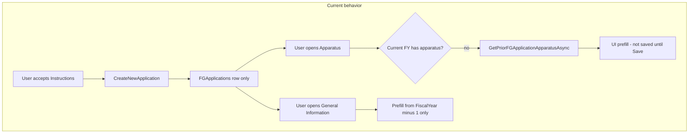
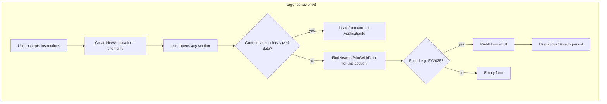

# Fiscal Year Baseline Copy — Implementation Plan

**Project:** NMSFM Fire Grant Web Application  
**Document version:** 3.0  
**Date:** June 1, 2026  
**Status:** Not implemented (plan only)  
**Scope:** **UI prefill alignment** — same behavior as the repo today, but source = nearest prior FY **with data** (not `FiscalYear - 1`). Supersedes v2.0 DB-copy-on-create approach.

**Related artifacts:**

- [Fire-Grant-FY-Rollover-Conversation.html](./Fire-Grant-FY-Rollover-Conversation.html) — background analysis
- [Fire-Grant-FY-Rollover-Conversation.docx](./Fire-Grant-FY-Rollover-Conversation.docx) — same content in Word

---

## 1. Problem statement

Departments need **apparatus** and **personnel-related data** (firefighter counts, chief/contact info) to carry forward when starting a new fiscal year’s Fire Grant application, even when intermediate fiscal years were skipped (e.g. no FY2026 data, starting FY2027 from FY2025).

Today:

- Operational data lives on **per-year applications** (`FGApplications` + child `FG_App_*` tables), not on a department master list keyed by fiscal year.
- Some UI pages prefill from prior applications at **page load**, but data is **not persisted** until the user saves each section.
- **General Information** only looks at `FiscalYear - 1`, so skipping a year breaks personnel prefill.
- **Apparatus** uses “latest other application” logic in the UI, but an **empty** intermediate-year application shell can block rollover.

**Goal:** Keep the **existing user workflow** (open section → see prior-year data in the form → user saves when ready). Fix source selection so that when an intermediate FY is missing or **empty** (e.g. FY2026 has no data, user starts FY2027), the app pulls from the **next available prior FY with data** (e.g. FY2025) — **not** `FiscalYear - 1` only.

**v3.0 does not copy data into the database on application create.** Data is persisted only when the user saves each section (same as today).

---

## 2. Current implementation status

| Item | Status |
|------|--------|
| Baseline copy on `CreateNewApplication` | **Not implemented** |
| `CopyBaselineFromLatestPriorApplicationAsync` (or equivalent) | **Does not exist** |
| UI-only apparatus prefill (`GetPriorFGApplicationApparatusAsync`) | Exists (Dec 2023) |
| UI-only general info prefill (`FiscalYear - 1`) | Exists; insufficient for skipped years |
| SQL rollover scripts in repo | **None** |

**Evidence:** [`FGApplicationService.CreateNewApplication`](../../NMSFM.Services/FireGrant/FGApplicationService.cs) inserts only a shell `FGApplications` row and returns after `SaveChangesAsync` — no copy step.

---

## 3. Scope (v3.0 — UI prefill alignment)

### Strategy change (v2.0 → v3.0)

| | v2.0 (superseded) | **v3.0 (current plan)** |
|---|-------------------|-------------------------|
| When data appears | On `CreateNewApplication` — written to DB | On **page open** — form prefill only |
| User saves | Optional; data already in DB | **Required** per section (unchanged) |
| Sections covered | All 13 content sections | **Only sections that prefill today** (6 areas) |
| `CreateNewApplication` | Hook + orchestrator | **No change** |
| Effort | ~3–4 days | **~1–2 days** |

### In scope — fix prior-FY source selection on page load

When the **current** application has no saved data for that section, prefill from the **nearest prior FY that has data for that section** (walk back from `newFiscalYear - 1` downward).

| Section | Page | Current source logic | v3.0 fix |
|---------|------|----------------------|----------|
| General Information (partial fields) | `GeneralInformation.aspx.cs` | `FiscalYear - 1` only | Walk back to first prior app with `FG_App_GeneralInfo` |
| Apparatus (equipment grid) | `Apparatus.aspx.cs` | Latest other app, no walk-back | Walk back to first prior app with apparatus equipment |
| Community Information | `CommunityInfo.aspx.cs` | Latest other app (`apps[0]`) | Walk back to first prior app with community info |
| Water Availability | `WaterAvailability.aspx.cs` | Latest other app | Walk back to first prior app with water data |
| Communication Equipment | `CommunicationEquipment.aspx.cs` | Latest other app | Walk back to first prior app with communication data |
| Hazards / Threats | `HazardsThreats.aspx.cs` | Latest other app | Walk back to first prior app with hazards data |

**Example (your scenario):** FY2027 app, FY2026 missing or empty → General Information and Apparatus prefill from **FY2025** when the user opens those pages.

### Out of scope (unchanged from today)

Sections with **no** prior-year UI prefill today — still empty until user enters data:

- Budget Information, Response History, Training, PPE, Equipment Needs, Grant Funding Justification, Project Budget Sheet

Also out of scope:

- DB copy on `CreateNewApplication`
- Documents, signatures, review, scores
- `FGApplicationSettings`, FPF tables, department master data

### FY2026 empty assumption

You indicated **FY2026 will definitely be empty of data**. v3.0 handles:

- **No FY2026 application row** — walk-back reaches FY2025.
- **FY2026 shell with no section data** — walk-back skips it and uses FY2025.

No ops cleanup required if walk-back is implemented per section.

---

## 4. Architecture

### 4.1 Current flow



### 4.2 Target flow (v3.0)



### 4.3 Entry point

| Trigger | File |
|---------|------|
| Instructions → Accept | [`Instructions.aspx.cs`](../NMSFMFireGrantWF/Application/Instructions.aspx.cs) → `fgAppService.CreateNewApplication(app)` |
| Service method | [`FGApplicationService.CreateNewApplication`](../../NMSFM.Services/FireGrant/FGApplicationService.cs) |

---

## 5. Detailed design (v3.0)

### 5.1 Core helper — walk-back source finder

**Location:** [`FGApplicationService.cs`](../../NMSFM.Services/FireGrant/FGApplicationService.cs)

```csharp
private async Task<FGApplications> FindNearestPriorApplicationWithDataAsync(
  Guid addressId,
  short currentFiscalYear,
  Guid currentApplicationId,
  Func<Guid, Task<bool>> sectionHasDataAsync)
```

**Algorithm:**

1. Load all `FGApplications` for `addressId` where `FiscalYear < currentFiscalYear`, order by `FiscalYear` descending.
2. For each candidate (FY2026, then FY2025, …), call `sectionHasDataAsync(candidate.ApplicationId)`.
3. Return the **first** application where the predicate is true; otherwise `null`.

**Per-section predicates (examples):**

| Section | `sectionHasDataAsync` checks |
|---------|------------------------------|
| General Info | `FG_App_GeneralInfo` row exists |
| Apparatus | `FG_App_ApparatusEquipment` any row **or** `FG_App_Apparatus` row |
| Community | `FG_App_CommunityInfo` row exists |
| Water | `FG_App_WaterAvailability` row exists |
| Communication | `FG_App_Communication` row exists |
| Hazards | `FG_App_HazardsThreats` row exists |

This ensures an **empty FY2026** (shell or no rows) is skipped and **FY2025** is used.

### 5.2 Refactor existing `GetPrior*` methods

Replace `apps[0]` pattern in:

- `GetPriorFGApplicationApparatusAsync`
- `GetFGApplicationPriorYearCommunityInfoAsync`
- `GetFGApplicationPriorYearWaterAvailabilityAsync`
- `GetFGApplicationPriorYearCommunicationAsync`
- `GetFGApplicationPriorYearHazardsThreatsAsync`

Each method: use `FindNearestPriorApplicationWithDataAsync` with its section predicate, then load and return the same DTOs as today (no DB writes).

### 5.3 Fix `GeneralInformation.aspx.cs`

In `LoadDepartment`, replace:

```csharp
int fYear = Convert.ToInt16(Session["FiscalYear"].ToString()) - 1;
lastYearApp = fgAppService.GetFGApplication(addId, sYear);
```

With a call to a new service method e.g. `GetNearestPriorApplicationGeneralInfoAsync(addressId, currentFiscalYear, currentApplicationId)` that uses the same walk-back logic.

Keep the **same partial field prefill** as today (chief, phone, firefighter counts, etc.) — do not expand to full general info unless product asks.

### 5.4 No change to `CreateNewApplication`

Shell creation only. **Do not** add copy orchestrator (v2.0 removed).

### 5.5 User workflow (unchanged)

1. Accept Instructions → FY2027 shell created.
2. User opens section → form prefilled from FY2025 if FY2026 empty/missing.
3. User reviews/edits → **Save** (or navigate away after `SaveForm` on menu click) → data written to FY2027 `ApplicationId`.

### 5.6 Optional UX consistency

- Use the same info message everywhere: “Information loaded from prior fiscal year application (FY####). Please verify data is current.”
- Include source `FiscalYear` in the message so users know it came from FY2025.

---

## 6. Files to change (v3.0)

| File | Change |
|------|--------|
| [`FGApplicationService.cs`](../../NMSFM.Services/FireGrant/FGApplicationService.cs) | Add `FindNearestPriorApplicationWithDataAsync`; refactor 5× `GetPrior*` methods |
| [`IFGApplicationServices.cs`](../../NMSFM.Services/FireGrant/IFGApplicationServices.cs) | Optional: expose new general-info helper |
| [`GeneralInformation.aspx.cs`](../NMSFMFireGrantWF/Application/GeneralInformation.aspx.cs) | Replace `FiscalYear - 1` with walk-back helper |

**No changes:** `CreateNewApplication`, `Instructions.aspx.cs`, Budget/Training/PPE pages (no prefill today).

---

## 7. Database tables

Read-only for prefill source; writes only when user saves each section. Tables involved in v3.0 prefill: `FGApplications`, `FG_App_GeneralInfo`, `FG_App_Apparatus`, `FG_App_ApparatusEquipment`, `FG_App_CommunityInfo`, `FG_App_AidDistricts`, `FG_App_WaterAvailability`, `FG_App_WaterSources`, `FG_App_Communication`, `FG_App_CommunicationEquipment`, `FG_App_HazardsThreats`, `FG_App_HazardThreatEvents`.

---

## 8. Test plan (v3.0)

### 8.1 Preconditions

- Department with **saved FY2025** data in General Info, Apparatus, Community, Water, Communication, Hazards.
- **FY2026 missing or empty** (no section data).
- FY2027 application created via Instructions.

### 8.2 Test cases

| # | Scenario | Expected |
|---|----------|----------|
| 1 | Open General Information (FY2027) | FY2025 chief / firefighter fields prefilled; message shown |
| 2 | Open Apparatus | FY2025 equipment grid prefilled |
| 3 | Open Community / Water / Comm / Hazards | FY2025 data prefilled in each |
| 4 | **Before Save** | SQL: **no** rows for FY2027 `ApplicationId` in those tables |
| 5 | Save Apparatus | SQL: rows now exist under FY2027 `ApplicationId` |
| 6 | Empty FY2026 shell + FY2027 | Walk-back still uses FY2025 for all six sections |
| 7 | Budget / Training | Still empty (no prefill — unchanged) |

### 8.3 SQL verification

```sql
-- Before user saves Apparatus on FY2027 app
SELECT COUNT(*) FROM FG_App_ApparatusEquipment WHERE ApplicationId = @FY2027AppId;
-- Expect 0 before Save, >0 after Save

-- Confirm source was FY2025
SELECT FiscalYear, ApplicationId FROM FGApplications
WHERE AddressId = @DeptId AND FiscalYear < 2027
ORDER BY FiscalYear DESC;
```

---

## 9. Operations notes

### Before go-live

1. **Database backup** before first production use of new build.
2. **Audit empty intermediate-year shells** — applications with no child data that could confuse UI prefill on pages not yet updated:
   ```sql
   SELECT a.ApplicationId, a.FiscalYear, a.AddressId
   FROM FGApplications a
   LEFT JOIN FG_App_GeneralInfo g ON g.ApplicationId = a.ApplicationId
   LEFT JOIN FG_App_ApparatusEquipment e ON e.ApplicationId = a.ApplicationId
   WHERE g.Id IS NULL AND e.ApparatusId IS NULL;
   ```
3. Decide whether to delete orphan empty shells or leave them (walk-back logic handles them for **new** copy).

### After go-live

- Departments starting a new year via Instructions get baseline data automatically.
- Departments with applications **already created** on old build need a **one-time backfill** (out of scope; separate SQL or admin utility if required).

---

## 10. Alternative: one-time SQL backfill (no deploy)

For environments that cannot deploy immediately. Pattern:

1. For each `(AddressId, TargetFiscalYear)` needing baseline:
2. Find source `ApplicationId` (max `FiscalYear` < target with equipment or general info).
3. If target application exists and target child rows missing:
   - `INSERT INTO FG_App_GeneralInfo ... SELECT ... NEWID(), @NewApplicationId, ...`
   - Same for `FG_App_Apparatus` and `FG_App_ApparatusEquipment`.

**Limitations:** Must match exact SQL Server table/column names; not maintained in repo today; does not help future years unless re-run. **Service hook remains the long-term fix.**

---

## 11. Implementation checklist (v3.0)

- [ ] Add `FindNearestPriorApplicationWithDataAsync` with section-specific predicates
- [ ] Refactor `GetPriorFGApplicationApparatusAsync` to walk back past empty FY2026
- [ ] Refactor 4× `GetFGApplicationPriorYear*Async` methods similarly
- [ ] Fix `GeneralInformation.aspx.cs` — replace `FiscalYear - 1` with walk-back
- [ ] Optional: consistent “loaded from FY####” user message
- [ ] Manual test: FY2027 + empty/missing FY2026 → six sections prefill from FY2025
- [ ] Verify data **not** in DB until user saves each section

---

## 12. Estimated effort (v3.0)

| Task | Estimate |
|------|----------|
| Shared walk-back finder | 2–3 hours |
| Refactor 5 service methods + General Information page | 3–5 hours |
| Manual QA (6 prefilling sections) | 2–3 hours |
| **Total** | **~1–2 days** |

---

## 13. Revision history

| Version | Date | Notes |
|---------|------|-------|
| 1.0 | 2026-06-01 | Initial plan — DB copy: general info + apparatus only |
| 2.0 | 2026-06-01 | Full DB copy of 13 content sections on create (superseded) |
| 3.0 | 2026-06-01 | **UI prefill alignment** — walk back to nearest prior FY with data; no DB copy on create; same workflow as repo today |
