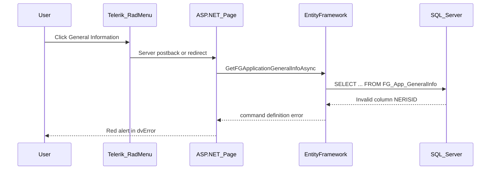

# General Information Error — Diagnosis and Fix Plan

**Project:** NMSFM Fire Grant Web Application  
**Document version:** 1.0  
**Date:** June 22, 2026  
**Status:** Handoff — pending implementation by another developer  
**Scope:** Fix "An error occurred while executing the command definition" when users click **General Information** in the Step 1 application menu.

**Related artifacts:**

- Entity: [`FG_App_GeneralInfo.cs`](../../NMSFM.Data/Codepal%20Tables/FG_App_GeneralInfo.cs)
- Page: [`GeneralInformation.aspx.cs`](../NMSFMFireGrantWF/Application/GeneralInformation.aspx.cs)
- NERIS rename context: [`neris-id-20-char-implementation-plan.md`](neris-id-20-char-implementation-plan.md)
- Build: [`build.ps1`](../build.ps1)

---

## Handoff notes

- **Reported symptom:** Red alert on the page with message *"An error occurred while executing the command definition. See the inner exception for details."*
- **Ruled out (low likelihood):** jQuery 3.6.0 CVE upgrade — error is server-rendered by ASP.NET, not browser JavaScript.
- **Leading hypothesis:** C# property `NERISID` does not map to database column `NFIRSID` after commit `029f7de`.
- **Prior attempt:** `[Column("NFIRSID")]` mapping was tried and reverted; issue persisted or was not deployed — verify DB column names before re-applying.
- **Current team focus:** Additional functionality elsewhere; this bug is parked for a separate developer.

---

## Short answer: not a jQuery issue

The exact message is a **.NET Entity Framework / SQL Server** error, not jQuery.

The red alert is rendered server-side in `GeneralInformation.aspx.cs`:

```csharp
catch (Exception ex)
{
    dvError.InnerHtml = "<div class='alert alert-danger'>" + ex.Message.ToString() + "</div>";
}
```

If jQuery were broken, you would typically see menu clicks doing nothing, errors in the browser console (F12), or broken Bootstrap modals — not an EF SQL message in a server-rendered alert.

---

## How navigation works



The Step 1 menu in `ApplicationMstr.Master` is a **Telerik RadMenu** with server-side handlers. From Instructions, General Information is a plain server redirect — no custom jQuery.

---

## Most likely root cause: entity/column name mismatch

In commit `029f7de`, the entity property was renamed without a column mapping:

| Layer | Name |
|-------|------|
| Database column (documented) | `NFIRSID` |
| C# property (current) | `NERISID` |
| EF-generated SQL | `SELECT ... [NERISID] ...` |

Current entity (`FG_App_GeneralInfo.cs`):

```csharp
public string NERISID { get; set; }  // no [Column("NFIRSID")]
```

When `GeneralInformation.aspx` loads, it calls `GetFGApplicationGeneralInfoAsync`, which queries `FG_App_GeneralInfos`. This fails if SQL Server has no `NERISID` column. Inner exception is typically: **Invalid column name 'NERISID'.**

The same mismatch may affect admin reports via `nm_FGApplicationReport.cs`.

---

## Step 1 — Verify before changing code

Run against `Codepal_NMSFM` (connection in `web.config`):

```sql
-- Confirm actual column name on the table
SELECT COLUMN_NAME
FROM INFORMATION_SCHEMA.COLUMNS
WHERE TABLE_NAME = 'FG_App_GeneralInfo'
  AND COLUMN_NAME IN ('NFIRSID', 'NERISID');

-- Confirm the view column (if using admin report)
SELECT COLUMN_NAME
FROM INFORMATION_SCHEMA.COLUMNS
WHERE TABLE_NAME = 'nm_FGApplicationReport'
  AND COLUMN_NAME IN ('NFIRSID', 'NERISID');
```

**Optional diagnostic:** Log or display `ex.InnerException?.Message` in the catch block to confirm the exact SQL error.

**Quick behavioral check:** Open **Budget Information** from the same menu. If it loads but General does not, the failure is isolated to `FG_App_GeneralInfo` queries.

---

## Step 2 — Recommended fix (code-only, no DB migration)

If SQL confirms the column is still `NFIRSID`, add explicit column mapping:

**`FG_App_GeneralInfo.cs`**

```csharp
[Column("NFIRSID")]
public string NERISID { get; set; }
```

**`nm_FGApplicationReport.cs`** — same mapping if the view column is still `NFIRSID`.

Then rebuild with `build.ps1` and retest General Information.

---

## Step 3 — Alternative (only if column was renamed in DB)

If SQL shows the column is already `NERISID`:

- Confirm IIS/site is running the newly built `NMSFM.Data.dll`
- Confirm `Session["userConnection"]` points at the expected database

---

## Step 4 — Low-priority jQuery check

Only investigate jQuery if RadMenu clicks produce no server round-trip, or the browser console shows jQuery/Telerik JS errors site-wide.

---

## Summary

| Hypothesis | Likelihood | Evidence |
|------------|------------|----------|
| EF column mismatch (`NERISID` vs `NFIRSID`) | **High** | EF error text; red server alert; property rename in git |
| jQuery 3.6.0 upgrade | **Low** | Error is server-rendered |
| Stale deployment | **Medium** | Check if fix was built and deployed |

---

## Implementation checklist

- [ ] Run SQL verification queries on target database
- [ ] Apply `[Column("NFIRSID")]` mapping if confirmed (2 entity files)
- [ ] Run `.\build.ps1` from `NMSFMFireGrantWF/`
- [ ] Redeploy / restart app
- [ ] Retest General Information load and save
- [ ] If still failing: capture inner exception and verify deployment + connection string
