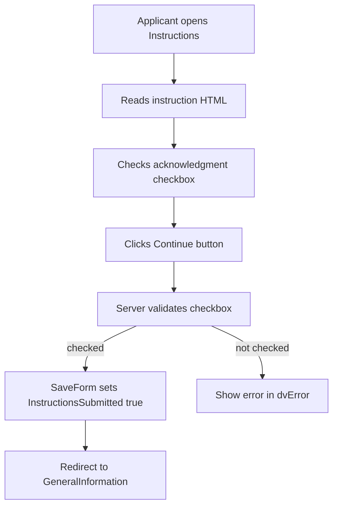

# Instructions Acknowledgment Checkbox — Implementation Plan

**Project:** NMSFM Fire Grant Web Application  
**Document version:** 1.0  
**Date:** June 24, 2026  
**Status:** Implemented  
**Target doc path:** [docs/instructions-acknowledgment-checkbox-implementation-plan.md](./instructions-acknowledgment-checkbox-implementation-plan.md)

---

## 1. Problem statement

Applicants can currently click **"Click Here to Start Filling out the Application"** on the Instructions page without any explicit acknowledgment that they have read the instructions. The customer wants a **required checkbox** attestation before the applicant can continue.

Today, clicking either accept button calls `SaveForm()`, which creates a shell `FGApplications` row with `InstructionsSubmitted = true` and redirects to General Information. The sidebar in [`ApplicationMstr.Master.cs`](../NMSFMFireGrantWF/Application/ApplicationMstr.Master.cs) already hides all Step 1 menu items until `InstructionsSubmitted` is true.



---

## 2. Scope

### In scope

- Add acknowledgment checkbox + label below instruction content, above the action button
- Require checkbox before first-time acceptance (creating application / setting `InstructionsSubmitted`)
- Client-side UX: disable Continue button until checkbox is checked
- Server-side guard in `btnContinue_Click` (cannot be bypassed by posting without the checkbox)
- Remove the **top** accept button so applicants must scroll past instructions before acting
- Returning applicants (`InstructionsSubmitted` already true): show **"Go To Application"** only; no re-check required
- Read-only session: hide checkbox and buttons (existing behavior)
- Update designer file for new controls
- Run `.\build.ps1` from `NMSFMFireGrantWF/`

### Out of scope

- Database schema changes (see section 4)
- [`publish/`](../publish/) folder
- Backup project copies (`NMSFMFireGrantWF_Backup_*`)
- Audit trail columns (timestamp, user ID, instructions version)
- Changes to other application pages (menu gating in master page is sufficient once flag is set)

---

## 3. UX design

### Layout (target)

```text
[Error area — dvError]

--- instructions HTML (ltrInstructions) ---

<hr />

[ ] I have read and understand the application instructions above.

[ Continue to Application ]   (btn-primary, disabled until checked)

```

### Copy recommendations

| Control | Text |
|---------|------|
| Checkbox label | `I have read and understand the application instructions above.` |
| Primary button (first visit) | `Continue to Application` |
| Primary button (returning) | `Go To Application` (unchanged) |
| Server error | `You must confirm that you have read and understand the instructions before continuing.` |

### Pattern to follow

Mirror the Signatures page agreement block in [`SignaturesDocs.aspx`](../NMSFMFireGrantWF/Application/SignaturesDocs.aspx):

- `CheckBox` in a narrow column (`col-md-1` or `col-sm-1`)
- `Label` with `AssociatedControlID` in adjacent column (`col-md-9`)
- `formRow` class for spacing consistency

Server validation style matches [`SignaturesDocs.aspx.cs`](../NMSFMFireGrantWF/Application/SignaturesDocs.aspx.cs) (~line 954): build error message, set `dvError.InnerHtml` with `alert alert-error`, return without saving.

---

## 4. Database impact

**No schema changes required.**

The existing `FGApplications.InstructionsSubmitted` column ([`FGApplications.cs`](../../NMSFM.Data/Codepal Tables/FGApplications.cs)) already records that the applicant passed the Instructions step. The checkbox is a UI gate before that flag is set in [`Instructions.aspx.cs`](../NMSFMFireGrantWF/Application/Instructions.aspx.cs) `SaveForm()`.

Optional future enhancement (not in this plan): `InstructionsAcknowledgedDate`, `InstructionsAcknowledgedBy` if compliance needs an audit trail.

---

## 5. Files to change

| File | Changes |
|------|---------|
| [`Instructions.aspx`](../NMSFMFireGrantWF/Application/Instructions.aspx) | Remove top `btnAccept` row; add `chkInstructionsRead` + `lblInstructionsAck` above bottom button; rename bottom button text; add jQuery to toggle button disabled state; wrap acknowledgment in `div` with `runat="server"` for visibility control |
| [`Instructions.aspx.designer.cs`](../NMSFMFireGrantWF/Application/Instructions.aspx.designer.cs) | Declare `chkInstructionsRead`, `lblInstructionsAck`, `dvAcknowledgment`; remove `btnAccept` |
| [`Instructions.aspx.cs`](../NMSFMFireGrantWF/Application/Instructions.aspx.cs) | Server validation; visibility logic for acknowledgment block; consolidate button references from two buttons to one |

---

## 6. Implementation details

### 6.1 Markup — [`Instructions.aspx`](../NMSFMFireGrantWF/Application/Instructions.aspx)

1. **Delete** the first button row (`btnAccept`) and the first `<hr />` above instructions.
2. Keep instruction literal unchanged.
3. After the bottom `<hr />`, add acknowledgment block with `dvAcknowledgment`, `chkInstructionsRead`, `lblInstructionsAck`.
4. Rename `btnAccept2` to `btnContinue` and set `CssClass="btn btn-primary"`, `ClientIDMode="Static"`.

### 6.2 Client script

- On `document.ready`: disable `#btnContinue` if `#chkInstructionsRead` is unchecked
- On `#chkInstructionsRead` change: enable/disable `#btnContinue`
- Keep `onbeforeunload` disable logic for the single button

When in **"Go To Application"** mode, hide `#dvAcknowledgment` and leave button enabled.

### 6.3 Code-behind — [`Instructions.aspx.cs`](../NMSFMFireGrantWF/Application/Instructions.aspx.cs)

- When `existingApp.InstructionsSubmitted` is true: set button text to `"Go To Application"`, hide `dvAcknowledgment`
- When read-only: hide `dvAcknowledgment` and button
- When first visit: show `dvAcknowledgment`, set button text to `"Continue to Application"`
- Server validation in `btnContinue_Click` before `SaveForm()`

### 6.4 Refactor note: two buttons → one

| Current | Target |
|---------|--------|
| `btnAccept` (top) | **Removed** |
| `btnAccept2` (bottom) | `btnContinue` (single action) |

---

## 7. Edge cases

| Scenario | Expected behavior |
|----------|-------------------|
| First-time applicant, checkbox unchecked | Button disabled (client); server rejects if bypassed |
| Returning applicant (`InstructionsSubmitted = true`) | "Go To Application", no checkbox |
| Read-only session | No checkbox, no button |
| Application window closed (`StartDate`/`EndDate`) | No checkbox, no button (existing) |
| Test user override (`tuser@test.com`) | Preserve existing date-window override for button visibility |
| Direct URL to `GeneralInformation` before accept | Still possible today; out of scope — master menu is primary gate |

---

## 8. Test plan

1. **First visit — happy path:** Open Instructions for a department with no application. Read content, check box, click Continue → redirects to General Information; sidebar shows other sections; Instructions menu item shows tick.
2. **First visit — unchecked:** Uncheck box (or bypass client script) and post → error in `dvError`, no redirect, `InstructionsSubmitted` remains false / no app created.
3. **Returning visit:** Re-open Instructions for same FY → "Go To Application" shown, checkbox hidden, click goes to General Information.
4. **Read-only:** View as read-only user → no checkbox, no button.
5. **Closed application period:** Buttons hidden per existing date logic.
6. **Long instructions:** Confirm no top button exists; user must scroll to acknowledgment area.
7. **Build:** `.\build.ps1` succeeds with no compile errors.

---

## 9. Implementation order

1. Save this plan to `docs/instructions-acknowledgment-checkbox-implementation-plan.md`
2. Update `Instructions.aspx` markup and script
3. Update `Instructions.aspx.designer.cs`
4. Update `Instructions.aspx.cs` validation and visibility
5. Run `.\build.ps1` from `NMSFMFireGrantWF/`
6. Manual test per section 8

**Estimated effort:** ~2–4 hours
