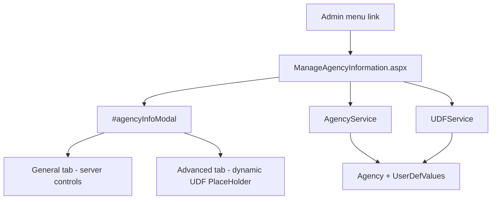

# Manage Agency Information — Implementation Plan

**Project:** NMSFM Fire Grant Web Application  
**Document version:** 1.0  
**Date:** June 28, 2026  
**Status:** Implemented  
**Scope:** Admin menu entry, editable agency modal (General + Advanced tabs), CodePal
`Agency` table and agency UDFs. No schema changes.

**Related artifacts:**

- Planning summary: [`planning/manage-agency-information-plan.md`](planning/manage-agency-information-plan.md)
- Legacy form: `E:\LegacyApp\forms\frmAgency.vb`
- Legacy UDF loader: `E:\LegacyApp\forms\frmUserDefValues.vb` (Agency: `AllAgency='Age'`)
- Entity: [`Agency.cs`](../NMSFM.Data/Codepal Tables/Agency.cs)

---

## 1. Problem statement

Internal admins need to manage agency contact information and agency-level UDFs
from the Fire Grant web app. Today this data is maintained only in the LegacyApp
desktop client (`frmAgency`). The web app reads agency UDFs for reporting
(e.g. Denial Letter, Grant Awarded) but provides no admin UI to edit the
underlying `Agency` row or its UDF values.

---

## 2. Architecture

**Pattern:** Menu → lightweight admin page → Bootstrap modal (auto-open).

A global `Site.Master` modal (Support pattern) is avoided because this feature
requires tabbed layout, dropdowns, file upload, dynamic UDF controls, and save
postbacks with modal reopen on validation failure.



**Agency scope:** `Session["AgencyId"]` set at login from the inspector record
([`Login.aspx.cs`](../NMSFMFireGrantWF/Account/Login.aspx.cs)).

---

## 3. Menu changes

Add to Admin dropdown in both master pages (after Manage Legacy Apps):

| File | Change |
|------|--------|
| [`Site.Master`](../NMSFMFireGrantWF/Site.Master) | New `<li>` link |
| [`ApplicationMstr.Master`](../NMSFMFireGrantWF/Application/ApplicationMstr.Master) | Same link |

```html
<li><a href="/Admin/ManageAgencyInformation">Manage Agency Information</a></li>
```

---

## 4. Service layer

### 4.1 New AgencyService

**Files (new):**

| File | Purpose |
|------|---------|
| `NMSFM.Services/Agency/IAgencyService.cs` | Interface |
| `NMSFM.Services/Agency/AgencyService.cs` | Implementation |

**Methods:**

```csharp
Task<Agency> GetAgencyAsync(Guid agencyId);
Task<bool> UpdateAgencyAsync(
  Agency agency,
  byte[] reportImage,
  bool clearReportImage);
```

**Implementation notes:**

- Query/update via existing EF entity [`Agency`](../NMSFM.Data/Codepal Tables/Agency.cs).
- Set `DateUpdated = DateTime.Now` on update.
- **Inactive:** map `chkInactive` ↔ `ExternalId` as `"0"` / `"1"` (legacy uses
  `Math.Abs(CInt(chkInactive.Checked))`).
- **Report image:** update `ReportImage` column when file uploaded; set `NULL`
  when clear requested.
- Log exceptions via `ILogging` (match `SystemService` / `AddressService`).

**Lookups (reuse, do not duplicate):**

- `addressService.GetStateListAsync()`
- `addressService.GetCountryListAsync()`

Register new service files in [`NMSFM.Services.csproj`](../NMSFM.Services/NMSFM.Services.csproj).

### 4.2 UDFService extension

**Files:**

| File | Change |
|------|--------|
| [`IUDFService.cs`](../NMSFM.Services/UDF/IUDFService.cs) | Add method signature |
| [`UDFService.cs`](../NMSFM.Services/UDF/UDFService.cs) | Implement query |

```csharp
Task<IEnumerable<UserDefinedValue>> GetUserDefinedValuesByAgencyIdAsync(Guid agencyId);
```

**Query logic (from legacy `frmUserDefValues.vb`):**

1. Resolve Agency module: `Modules` where `AgencyId == agencyId` AND
   `ModuleDesc == "Agency"`.
2. Load categories from `UserDefCategories` where
   `(ModuleId == agencyModuleId OR AllAgency == 'Age')` AND inactive = false,
   ordered by `SeqNum`, `Category`.
3. Join `UserDefFields` and left-join `UserDefValues` on
   `RecordId == agencyId`.
4. Reuse checkbox/resolution enrichment from
   `GetUserDefinedValuesByAddressIdAsync` (~line 625 in
   [`UDFService.cs`](../NMSFM.Services/UDF/UDFService.cs)).

**Save:** existing `SaveUserDefinedValuesAsync(List<UserDefValue> list)`.

---

## 5. UI — ManageAgencyInformation.aspx

**Files (new):**

| File | Purpose |
|------|---------|
| `Admin/ManageAgencyInformation.aspx` | Markup |
| `Admin/ManageAgencyInformation.aspx.cs` | Code-behind |
| `Admin/ManageAgencyInformation.aspx.designer.cs` | Designer |

**Page directive:**

```aspx
<%@ Page Title="Fire Grant: Manage Agency Information" Language="C#"
  MasterPageFile="~/Site.Master" AutoEventWireup="true"
  CodeBehind="ManageAgencyInformation.aspx.cs"
  Inherits="NMSFMFireGrantWF.Admin.ManageAgencyInformation" Async="true" %>
```

### 5.1 Page shell

- Minimal page content: error/success panel (`dvError`), hidden trigger button for
  modal reopen after postback.
- Bootstrap modal `#agencyInfoModal` (`data-backdrop="false"`, large dialog).
- Bootstrap tabs: **General** | **Advanced**.
- Footer: Created / Last Updated labels, **Save** (`onserverclick`), **Close**
  (redirect to `/Admin/Home`).

**Pattern references:**

- Auth: [`ManageFDIDs.aspx.cs`](../NMSFMFireGrantWF/Admin/ManageFDIDs.aspx.cs)
  `Page_Init` (WebUserId, Role != External, IsWebAdmin).
- Modal markup: [`ManageLegacyApps.aspx`](../NMSFMFireGrantWF/Admin/ManageLegacyApps.aspx).
- State binding: [`ManageFDIDs.aspx.cs`](../NMSFMFireGrantWF/Admin/ManageFDIDs.aspx.cs).

### 5.2 General tab controls

| Control ID | Type | Maps to |
|----------|------|---------|
| `txtAgencyName` | TextBox | `AgencyName` |
| `txtAgencySubName` | TextBox | `AgencySubName` (label: Sub Name) |
| `txtAddress` | TextBox | `Address` |
| `txtCity` | TextBox | `City` |
| `ddlState` | DropDownList | `StateId` |
| `txtZip` | TextBox | `Zip` |
| `ddlCountry` | DropDownList | `CountryId` |
| `txtPhone` | TextBox | `Phone` |
| `txtFax` | TextBox | `Fax` |
| `txtEmail` | TextBox | `Email` |
| `chkInactive` | CheckBox | `ExternalId` |
| `imgReportPreview` | Image | `ReportImage` preview |
| `fuReportImage` | FileUpload | New image |
| `btnClearReportImage` | Button | Clear image flag |
| `hfClearReportImage` | HiddenField | Server-side clear intent |
| `lblDateInserted` | Label | `DateInserted` |
| `lblDateUpdated` | Label | `DateUpdated` |

Layout: two-column row — fields left (~col-md-7), image panel right (~col-md-5).

### 5.3 Advanced tab

- `phAdvancedUdf` — `PlaceHolder` for dynamically generated UDF controls.
- Empty state label: *"There are no additional fields defined for this record."*
  (match legacy).

---

## 6. Code-behind — ManageAgencyInformation.aspx.cs

### 6.1 Page_Init

Instantiate services (same pattern as other admin pages):

- `ILogging`, `IAgencyService`, `IAddressService`, `IUDFService`, `IFGService`
- Auth redirects: Login → Unauthorized for external / non-web-admin

### 6.2 Page_Load

1. Load help text: `fgService.GetFGHelpByPage("Manage Agency Information (Admin)")`.
2. If not postback:
   - `agencyId = new Guid(Session["AgencyId"].ToString())`
   - `agency = await agencyService.GetAgencyAsync(agencyId)`
   - Bind General tab from agency
   - Bind state/country dropdowns
   - `udfs = await udfService.GetUserDefinedValuesByAgencyIdAsync(agencyId)`
   - `RenderAdvancedUdfControls(udfs)`
   - `RegisterStartupScript` → open `#agencyInfoModal`

### 6.3 RenderAdvancedUdfControls

1. Group `UserDefinedValue` by `Category` (order by `SequenceNumber`,
   `FieldSequenceNumber`).
2. For each category: add `<h4>` header + field rows to `phAdvancedUdf`.
3. Map `FieldType` GUID to control:

| FieldType GUID | Control |
|----------------|---------|
| `BCECC8B9-9C57-47F6-AB75-452F8A6F1488` | CheckBoxList (resolutions) |
| *(others as encountered)* | TextBox or DropDownList per legacy types |

4. Store `FieldId` / `ValueId` in control IDs or `Attributes` for round-trip on save.

### 6.4 btnSave_ServerClick

1. Read General tab into `Agency` model.
2. Validate max lengths (match DB / legacy).
3. Validate report image extension if file uploaded.
4. Collect UDF values from `phAdvancedUdf`; validate `Required` fields.
5. `await agencyService.UpdateAgencyAsync(...)`
6. `await udfService.SaveUserDefinedValuesAsync(udfList)`
7. On success: show success alert; optionally keep modal open or redirect.
8. On error: `ShowModalError()` + `RegisterReopenModalScript()` (ManageFDIDs pattern).

### 6.5 Report image preview

- If `ReportImage` byte array present: set `imgReportPreview.ImageUrl` to a
  page handler or inline base64 data URI for preview.
- Consider a minimal `AgencyReportImage.ashx?agencyId=` handler if inline base64
  is too large — implement only if needed during build.

---

## 7. Project registration

Add to [`NMSFMFireGrantWF.csproj`](../NMSFMFireGrantWF/NMSFMFireGrantWF.csproj):

- Content: `Admin/ManageAgencyInformation.aspx`
- Compile: `.aspx.cs`, `.aspx.designer.cs`

Add to [`NMSFM.Services.csproj`](../NMSFM.Services/NMSFM.Services.csproj):

- Compile: `Agency/IAgencyService.cs`, `Agency/AgencyService.cs`

No `RouteConfig` entry required (extensionless `/Admin/ManageAgencyInformation`
works by default).

---

## 8. QA checklist

| # | Test | Expected |
|---|------|----------|
| T1 | Admin opens menu item | Modal opens with General tab data |
| T2 | Advanced tab | UDF categories/fields render with current values |
| T3 | Edit contact fields, Save | `Agency` row updated; `DateUpdated` changes |
| T4 | Upload report image | Image persists; preview updates on reopen |
| T5 | Clear report image | `ReportImage` null after save |
| T6 | Required UDF empty | Save blocked; error shown; modal reopens |
| T7 | Inactive checkbox | `ExternalId` toggles `"0"` / `"1"` |
| T8 | External user / non-admin | Redirect to Unauthorized |
| T9 | Application master nav | Menu item visible and works during app edit |

---

## 9. Files changed (summary)

| File | Change |
|------|--------|
| `docs/planning/manage-agency-information-plan.md` | Planning doc |
| `docs/manage-agency-information-implementation-plan.md` | This file |
| `.cursor/rules/feature-documentation.mdc` | Ongoing documentation rule |
| `NMSFM.Services/Agency/IAgencyService.cs` | New |
| `NMSFM.Services/Agency/AgencyService.cs` | New |
| `NMSFM.Services/UDF/IUDFService.cs` | New method |
| `NMSFM.Services/UDF/UDFService.cs` | Agency UDF query |
| `Admin/ManageAgencyInformation.aspx` | New page + modal |
| `Admin/ManageAgencyInformation.aspx.cs` | Load/save/render |
| `Admin/ManageAgencyInformation.aspx.designer.cs` | Controls |
| `Site.Master` | Menu link |
| `ApplicationMstr.Master` | Menu link |
| `NMSFMFireGrantWF.csproj` | Register page |
| `NMSFM.Services.csproj` | Register service |

---

## 10. Build

From `NMSFM_FGF_CVE/NMSFMFireGrantWF/`:

```powershell
.\build.ps1
```

Restart IIS / app pool after deploy for runtime testing.
