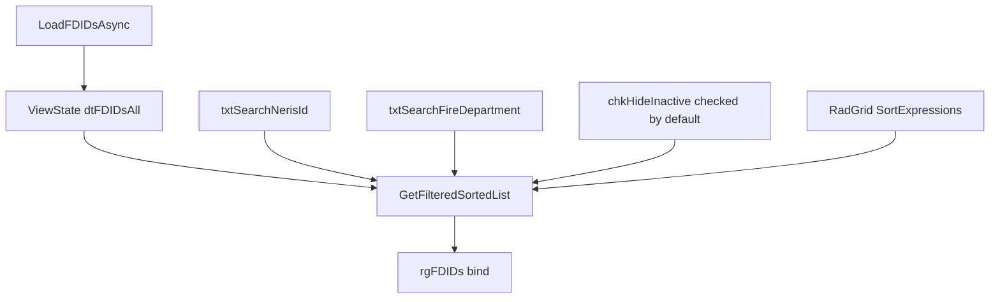

# Manage FD ID List — Filter, Sort, and Search Implementation Plan

**Project:** NMSFM Fire Grant Web Application  
**Document version:** 1.0  
**Date:** June 6, 2026  
**Status:** Implemented (June 6, 2026)  
**Scope:** Add sort-by-column, hide-inactive, and search-by-NERIS-ID / search-by-Fire-Department to the Fire Department ID List on the Manage FD ID's admin page. No database or service-layer changes.

**Related artifacts:**

- Cursor plan: `fdid_list_filter_sort_d5577da7.plan.md`
- Prerequisite: NERIS ID 20-char update — [`neris-id-20-char-implementation-plan.md`](./neris-id-20-char-implementation-plan.md) (implemented)
- Pattern references: [`ManageUsers.aspx`](../NMSFMFireGrantWF/Account/ManageUsers.aspx), [`AdminReport.aspx`](../NMSFMFireGrantWF/Admin/AdminReport.aspx)

---

## 1. Problem statement

The **Fire Department ID List** on [`ManageFDIDs.aspx`](../NMSFMFireGrantWF/Admin/ManageFDIDs.aspx) displays all NERIS IDs from the `FG_FDIDs` master table in a RadGrid with paging only. As the list grows, admins need to:

1. **Sort by NERIS ID**
2. **Sort by Fire Department**
3. **Hide inactive departments** (checkbox, checked by default on page load)
4. **Search by NERIS ID** (partial match)
5. **Search by Fire Department** (partial match)

Today the grid is always sorted by NERIS ID ascending (hard-coded in code-behind) and shows every row including inactive ones. There is no search UI.

**Goal:** Add toolbar controls for search and hide-inactive, enable column-header sorting on NERIS ID and Fire Department, and keep all logic server-side against the existing in-memory list pattern.

---

## 2. Current implementation status

| Item | Status |
|------|--------|
| Manage FD ID's modal (add/edit/save) | **Working** |
| Grid data source | `GetFG_FDIDs()` → `ViewState["dtFDIDs"]` |
| Default sort | Hard-coded `OrderBy(a => a.FDID)` on load |
| Search / filter UI | **None** |
| Column sorting | **Disabled** (`AllowSorting` not set) |
| Hide inactive | **None** — all rows shown |

**Evidence:** [`ManageFDIDs.aspx.cs`](../NMSFMFireGrantWF/Admin/ManageFDIDs.aspx.cs) lines 102–125.

---

## 3. Approach

Combine two existing repo patterns:

| Feature | Pattern source |
|---------|----------------|
| Search textboxes + Apply button | [`ManageUsers.aspx`](../NMSFMFireGrantWF/Account/ManageUsers.aspx) + [`ManageUsers.aspx.cs`](../NMSFMFireGrantWF/Account/ManageUsers.aspx.cs) |
| Column-header sort | [`AdminReport.aspx`](../NMSFMFireGrantWF/Admin/AdminReport.aspx) `AllowSorting="True"` |

All filtering and sorting runs **server-side in LINQ** against an in-memory list. No changes to `FGService`, `IFGService`, or entity classes.



### ViewState strategy

| Key | Contents |
|-----|----------|
| `dtFDIDsAll` | **New** — full unfiltered list from database |
| `dtFDIDs` | **Retired for grid binding** — replace with computed list from `GetFilteredSortedList()` |

Duplicate-check on save must use **`dtFDIDsAll`** (all rows), not the filtered grid subset, so inactive or hidden rows still block duplicate NERIS IDs.

---

## 4. UI changes — [`ManageFDIDs.aspx`](../NMSFMFireGrantWF/Admin/ManageFDIDs.aspx)

### 4.1 Toolbar (above RadGrid)

Insert a new row between the `<h3>Fire Department ID List</h3>` heading and the RadGrid:

```aspx
<div class="row formRow">
  <div class="col-md-12">
    <h4>Search and Filter</h4>
  </div>
</div>
<div class="row formRow" id="dvFdidFilters">
  <div class="col-md-2">
    <asp:Label ID="lblSearchNerisId" runat="server"
        Text="Search NERIS ID" AssociatedControlID="txtSearchNerisId" />
  </div>
  <div class="col-md-3">
    <asp:TextBox ID="txtSearchNerisId" runat="server" CssClass="form-control"
        MaxLength="20" placeholder="NERIS ID" />
  </div>
  <div class="col-md-2">
    <asp:Label ID="lblSearchFireDepartment" runat="server"
        Text="Search Fire Department" AssociatedControlID="txtSearchFireDepartment" />
  </div>
  <div class="col-md-3">
    <asp:TextBox ID="txtSearchFireDepartment" runat="server" CssClass="form-control"
        MaxLength="50" placeholder="Fire Department" />
  </div>
</div>
<div class="row formRow">
  <div class="col-md-3">
    <asp:CheckBox ID="chkHideInactive" runat="server" Text="Hide inactive departments"
        Checked="true" AutoPostBack="true"
        OnCheckedChanged="chkHideInactive_CheckedChanged" />
  </div>
  <div class="col-md-2">
    <asp:Button ID="btnApplyFilters" CssClass="btn btn-primary" runat="server"
        Text="Apply" CausesValidation="false" OnClick="btnApplyFilters_Click" />
  </div>
  <div class="col-md-2">
    <asp:Button ID="btnClearFilters" CssClass="btn btn-default" runat="server"
        Text="Clear" CausesValidation="false" OnClick="btnClearFilters_Click" />
  </div>
</div>
<div class="row">&nbsp;</div>
```

### 4.2 RadGrid sorting

Update the `rgFDIDs` declaration:

```aspx
<telerik:RadGrid ID="rgFDIDs" runat="server"
    AutoGenerateColumns="False"
    GroupPanelPosition="Top"
    Skin="Bootstrap"
    AllowPaging="True"
    AllowSorting="True"
    PageSize="25"
    OnNeedDataSource="rgFDIDs_NeedDataSource"
    OnPageIndexChanged="rgFDIDs_PageIndexChanged"
    OnItemDataBound="rgFDIDs_ItemDataBound"
    OnSortCommand="rgFDIDs_SortCommand">
```

Add `SortExpression` to sortable columns:

```aspx
<telerik:GridBoundColumn DataField="FDID" HeaderText="NERIS ID" UniqueName="FDID"
    SortExpression="FDID" ... />
<telerik:GridBoundColumn DataField="FireDepartment" HeaderText="Fire Department"
    UniqueName="FireDepartment" SortExpression="FireDepartment" ... />
```

The **Inactive** column does not need sorting for this feature set.

### 4.3 User-facing behavior

| Requirement | How it works |
|-------------|--------------|
| Sort by NERIS ID | Click **NERIS ID** column header (asc/desc toggle) |
| Sort by Fire Department | Click **Fire Department** column header |
| Hide inactive | Checkbox checked by default; uncheck to show inactive rows |
| Search by NERIS ID | Type in search box; click **Apply** (or toggle hide-inactive for immediate refresh) |
| Search by Fire Department | Type in search box; click **Apply** |

Default sort on first load: **NERIS ID ascending** (same as today).

---

## 5. Code-behind — [`ManageFDIDs.aspx.cs`](../NMSFMFireGrantWF/Admin/ManageFDIDs.aspx.cs)

### 5.1 Refactor data loading

Replace current `LoadFDIDsAsync`:

```csharp
private async System.Threading.Tasks.Task LoadFDIDsAsync()
{
    List<FG_FDIDs> fdids = await fgService.GetFG_FDIDs();
    ViewState["dtFDIDsAll"] = fdids ?? new List<FG_FDIDs>();
    BindFDIDGrid();
}

private void BindFDIDGrid()
{
    List<FG_FDIDs> display = GetFilteredSortedList();
    rgFDIDs.DataSource = display;
    rgFDIDs.DataBind();
}
```

On first load (`!Page.IsPostBack`), after help text load, set default sort before bind:

```csharp
rgFDIDs.MasterTableView.SortExpressions.Clear();
rgFDIDs.MasterTableView.SortExpressions.AddSortExpression(
    new GridSortExpression
    {
        FieldName = "FDID",
        SortOrder = GridSortOrder.Ascending
    });
await LoadFDIDsAsync();
```

### 5.2 `GetFilteredSortedList()`

Central method applying filter + sort pipeline:

```csharp
private List<FG_FDIDs> GetFilteredSortedList()
{
    List<FG_FDIDs> all = ViewState["dtFDIDsAll"] as List<FG_FDIDs>
        ?? new List<FG_FDIDs>();

    IEnumerable<FG_FDIDs> query = all;

    if (chkHideInactive.Checked)
    {
        query = query.Where(x => !x.Inactive);
    }

    string nerisSearch = txtSearchNerisId.Text.Trim().ToUpperInvariant();
    if (nerisSearch != "")
    {
        query = query.Where(x =>
            (x.FDID ?? "").ToUpperInvariant().Contains(nerisSearch));
    }

    string deptSearch = txtSearchFireDepartment.Text.Trim();
    if (deptSearch != "")
    {
        query = query.Where(x =>
            (x.FireDepartment ?? "").IndexOf(
                deptSearch, StringComparison.OrdinalIgnoreCase) >= 0);
    }

    return ApplySort(query).ToList();
}
```

### 5.3 `ApplySort()`

```csharp
private IEnumerable<FG_FDIDs> ApplySort(IEnumerable<FG_FDIDs> query)
{
    GridSortExpression sort = rgFDIDs.MasterTableView.SortExpressions
        .Cast<GridSortExpression>()
        .FirstOrDefault();

    if (sort == null || string.IsNullOrEmpty(sort.FieldName))
    {
        return query.OrderBy(a => a.FDID);
    }

    bool desc = sort.SortOrder == GridSortOrder.Descending;
    switch (sort.FieldName)
    {
        case "FireDepartment":
            return desc
                ? query.OrderByDescending(a => a.FireDepartment)
                : query.OrderBy(a => a.FireDepartment);
        default:
            return desc
                ? query.OrderByDescending(a => a.FDID)
                : query.OrderBy(a => a.FDID);
    }
}
```

### 5.4 Event handlers

| Handler | Action |
|---------|--------|
| `btnApplyFilters_Click` | `BindFDIDGrid()` |
| `btnClearFilters_Click` | Clear `txtSearchNerisId` and `txtSearchFireDepartment`; set `chkHideInactive.Checked = true`; reset page index to 0; clear sort expressions and re-add default FDID asc; `BindFDIDGrid()` |
| `chkHideInactive_CheckedChanged` | `BindFDIDGrid()` |
| `rgFDIDs_SortCommand` | `BindFDIDGrid()` |
| `rgFDIDs_NeedDataSource` | `rgFDIDs.DataSource = GetFilteredSortedList()` |
| `rgFDIDs_PageIndexChanged` | `BindFDIDGrid()` |

### 5.5 Save duplicate-check fix

In `btnSaveFDID_Click`, change:

```csharp
List<FG_FDIDs> fdidlist = ViewState["dtFDIDs"] as List<FG_FDIDs>;
```

To:

```csharp
List<FG_FDIDs> fdidlist = ViewState["dtFDIDsAll"] as List<FG_FDIDs>;
```

This ensures duplicate detection scans the **full** master list, including inactive rows hidden from the grid.

### 5.6 `btnClearFilters_Click` — sort reset detail

```csharp
protected void btnClearFilters_Click(object sender, EventArgs e)
{
    txtSearchNerisId.Text = "";
    txtSearchFireDepartment.Text = "";
    chkHideInactive.Checked = true;
    rgFDIDs.CurrentPageIndex = 0;
    rgFDIDs.MasterTableView.SortExpressions.Clear();
    rgFDIDs.MasterTableView.SortExpressions.AddSortExpression(
        new GridSortExpression
        {
            FieldName = "FDID",
            SortOrder = GridSortOrder.Ascending
        });
    BindFDIDGrid();
}
```

---

## 6. Designer — [`ManageFDIDs.aspx.designer.cs`](../NMSFMFireGrantWF/Admin/ManageFDIDs.aspx.designer.cs)

Register new controls:

- `lblSearchNerisId`
- `txtSearchNerisId`
- `lblSearchFireDepartment`
- `txtSearchFireDepartment`
- `chkHideInactive`
- `btnApplyFilters`
- `btnClearFilters`

---

## 7. Files changed (summary)

| File | Change |
|------|--------|
| `NMSFMFireGrantWF/Admin/ManageFDIDs.aspx` | Toolbar UI; `AllowSorting`; `SortExpression` on columns |
| `NMSFMFireGrantWF/Admin/ManageFDIDs.aspx.cs` | Filter/sort logic; event handlers; ViewState migration |
| `NMSFMFireGrantWF/Admin/ManageFDIDs.aspx.designer.cs` | New control declarations |

**No changes to:** `NMSFM.Services`, `NMSFM.Data`, `FGService.cs`

**Build command** (from `NMSFMFireGrantWF/`):

```powershell
.\build.ps1 -SkipToolingAudit -SkipDependencyAudit
```

---

## 8. Test plan

| # | Scenario | Expected result |
|---|----------|-----------------|
| 1 | First page load | Inactive rows hidden; sorted NERIS ID ascending |
| 2 | Uncheck hide inactive | Inactive rows appear in grid |
| 3 | Search NERIS ID (partial) | Matching rows only; case-insensitive |
| 4 | Search Fire Department (partial) | Matching rows only; case-insensitive |
| 5 | Search + hide inactive combined | Both filters apply |
| 6 | Click NERIS ID column header | Asc/desc toggle on filtered set |
| 7 | Click Fire Department column header | Asc/desc toggle on filtered set |
| 8 | Change page | Filters and sort persist |
| 9 | Clear button | Search cleared; hide inactive rechecked; default sort restored |
| 10 | Save new NERIS ID (redirect) | Page reloads with defaults (hide inactive checked) |
| 11 | Save duplicate NERIS ID (inactive row exists but hidden) | Error: "NERIS ID exists in the list" |
| 12 | Modal edit from filtered grid | View/Edit still opens correct row |

---

## 9. Rollback

Revert the three ManageFDIDs files to prior commit. No database migration or service deployment required.

---

## 10. Out of scope

- Database or `FGService` query changes
- Client-side-only (JavaScript) filtering
- Export or print of filtered results
- Sorting the Inactive column
- Changes to `publish/` or backup folders
- General Information master-list prefill (Phase 1 — separate plan)

---

## 11. Implementation checklist

- [x] Add toolbar controls to `ManageFDIDs.aspx`
- [x] Enable `AllowSorting` and `SortExpression` on NERIS ID and Fire Department columns
- [x] Implement `GetFilteredSortedList`, `ApplySort`, `BindFDIDGrid`
- [x] Add event handlers (Apply, Clear, hide-inactive, SortCommand)
- [x] Migrate ViewState to `dtFDIDsAll`; fix save duplicate-check
- [x] Register controls in designer
- [x] Build passes
- [ ] Manual test plan (section 8) complete
