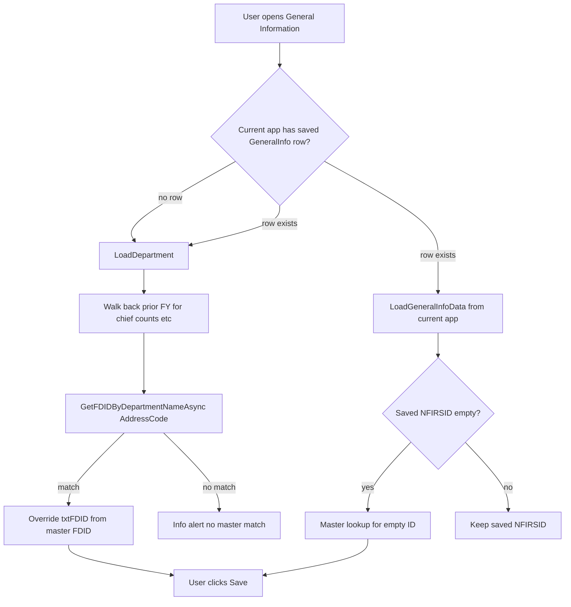

# Phase 1 — General Information Master-List Override (Option A)

**Project:** NMSFM Fire Grant Web Application  
**Document version:** 1.0  
**Date:** June 7, 2026  
**Status:** Implemented (June 7, 2026)  
**Scope:** When General Information prefills from a prior fiscal year application, source the **NERIS ID field** from the `FG_FDIDs` master list (matched by department name) instead of the stale `NFIRSID` on the rolled-over application. All other prefill fields (chief, phone, firefighter counts, etc.) continue to use FY walk-back — unchanged.

**Prerequisites (Phase 0 — complete):**

- Manage FD ID's modal CRUD — [`ManageFDIDs.aspx`](../NMSFMFireGrantWF/Admin/ManageFDIDs.aspx)
- NERIS ID 20-char + uppercase — [`neris-id-20-char-implementation-plan.md`](./neris-id-20-char-implementation-plan.md)
- Filter, sort, search — [`manage-fdid-list-filter-sort-implementation-plan.md`](./manage-fdid-list-filter-sort-implementation-plan.md)

**Related artifacts:**

- Cursor plan: `neris_id_master_override_7ffdb33a.plan.md`
- FY walk-back (parallel track) — [`fiscal-year-baseline-copy-implementation-plan.md`](./fiscal-year-baseline-copy-implementation-plan.md)
- Phase roadmap — `neris_fy_phase_roadmap_1d412f1b.plan.md`

---

## 1. Problem statement

State-issued NERIS IDs replace legacy NFIRS FDIDs. Admins maintain the authoritative ID list in **`FG_FDIDs`** via Manage FD ID's (Phase 0). General Information on a **new fiscal year application** already prefills chief, contact, and firefighter fields from the nearest prior FY with data (e.g. FY2025 when FY2026 is empty) via `GetNearestPriorApplicationWithGeneralInfoAsync`.

**The bug:** The NERIS ID field is still copied from the **prior application's saved `NFIRSID`**, which is often the old NFIRS value — not the new ID from the master list.

```249:249:NMSFM_FGF_CVE/NMSFMFireGrantWF/NMSFMFireGrantWF/Application/GeneralInformation.aspx.cs
                            txtFDID.Text = genInfo.NERISID.ToString();
```

Updating Manage FD ID's alone does **not** fix prefill — that page writes `FG_FDIDs`; General Information never reads it today.

**Goal (Option A):** After walk-back prefill, **override `txtFDID`** from `FG_FDIDs` when a non-inactive master row matches the department's `AddressCode`. User still must click **Save** to persist (UI prefill only — same as today).

---

## 2. Current implementation status

| Item | Status |
|------|--------|
| Phase 0 — Manage FD ID's admin tooling | **Complete** |
| FY walk-back for General Info partial fields | **Complete** — `GetNearestPriorApplicationWithGeneralInfoAsync` |
| Master lookup by department name | **Implemented** — `GetFDIDByDepartmentNameAsync` |
| General Information reads `FG_FDIDs` | **Implemented** |
| Override saved non-empty `NFIRSID` on current app | **Not implemented** — respect user's saved value |

---

## 3. Data sources after Phase 1

| Field group | Source |
|-------------|--------|
| Fire chief, phone, email, dept type, firefighter counts, etc. | Nearest prior FY with General Info data (walk-back) — **unchanged** |
| **Fire Department ID Number (`txtFDID`)** | `FG_FDIDs.FDID` where `FireDepartment` matches department `AddressCode` — **new** |
| Department name, address, county | `v_AddressParties` via `AddressId` — **unchanged** |



---

## 4. Name matching rules

Master lookup matches **`FG_FDIDs.FireDepartment`** to **`department.AddressCode`** (same text shown in `txtDepartment`):

```207:207:NMSFM_FGF_CVE/NMSFMFireGrantWF/NMSFMFireGrantWF/Application/GeneralInformation.aspx.cs
                    txtDepartment.Text = department.AddressCode;
```

| Rule | Implementation |
|------|----------------|
| Trim whitespace | Both sides `.Trim()` |
| Case-insensitive | `.ToUpperInvariant()` comparison |
| Skip inactive rows | `Inactive == false` |
| Exact match only | No fuzzy / partial matching |
| Multiple matches | First non-inactive row (document; unlikely if PK discipline maintained) |

**Admin workflow (manual, before rollout):**

1. Open General Information (or department record) and note exact **`AddressCode`**.
2. In Manage FD ID's, add or edit row with that **exact** Department Name and the **new NERIS ID**.
3. Optionally inactivate old NFIRS rows after the new NERIS row exists.

---

## 5. Detailed design

### 5.1 Service layer — expose master lookup

**Files:** [`IFGService.cs`](../../NMSFM.Services/FireGrant/IFGService.cs), [`FGService.cs`](../../NMSFM.Services/FireGrant/FGService.cs)

Add public method (refactor existing private helper):

```csharp
/// <summary>
/// Returns the active FG_FDIDs row whose FireDepartment matches the given name.
/// Comparison is trim + case-insensitive. Returns null if not found or inactive.
/// </summary>
Task<FG_FDIDs> GetFDIDByDepartmentNameAsync(string departmentName);
```

**Implementation notes:**

- Comment out (do not delete) the existing private `GetFGFDIDByDepartment(string department)` body and replace with call to new public method, **or** rename private → public and enhance matching.
- Replace exact `==` with trim + case-insensitive:

```csharp
string normalized = (departmentName ?? string.Empty).Trim();
if (normalized == string.Empty) { return null; }

string upper = normalized.ToUpperInvariant();
return await cwmContext.FG_FDIDs.FirstOrDefaultAsync(a =>
  !a.Inactive
  && a.FireDepartment != null
  && a.FireDepartment.Trim().ToUpper() == upper);
```

- Log errors via existing `logger.Error` pattern in `FGService`.

### 5.2 General Information — override after walk-back

**File:** [`GeneralInformation.aspx.cs`](../NMSFMFireGrantWF/Application/GeneralInformation.aspx.cs)

#### A. Add private helper (code-behind)

```csharp
private async Task ApplyMasterListNerisIdOverrideAsync(string departmentAddressCode)
{
  FG_FDIDs master = await fgService.GetFDIDByDepartmentNameAsync(departmentAddressCode);
  if (master != null && !string.IsNullOrWhiteSpace(master.FDID))
  {
    txtFDID.Text = master.FDID.Trim().ToUpperInvariant();
    return;
  }

  // Only append warning if dvError has no error alert already
  string warning = "<div class='alert alert-warning'>No NERIS ID found in the master list for this department. Contact an administrator.</div>";
  if (!dvError.InnerHtml.Contains("alert-danger"))
  {
    dvError.InnerHtml += warning;
  }
}
```

#### B. `LoadDepartment` — after walk-back block

Current flow (lines 243–293): walk-back loads prior `genInfo` and sets `txtFDID` from `genInfo.NERISID` along with chief/counts.

**Change:**

1. Keep all walk-back field assignments **except** defer `txtFDID` or overwrite immediately after.
2. After the walk-back block completes (inside `if (department != null)`), call:

```csharp
await ApplyMasterListNerisIdOverrideAsync(department.AddressCode);
```

3. Update the existing info message (line 292) to mention master-list ID when override succeeds, e.g.:

> "Some data has been loaded from prior fiscal year application (FY####). NERIS ID loaded from master list. Please verify all data is current."

#### C. `LoadGeneralInfoData` — empty saved ID case

Current line 330:

```csharp
if (model.NERISID != "") { txtFDID.Text = model.NERISID; }
```

**Change:** When `model.NERISID` is null or empty/whitespace, call master lookup using `txtDepartment.Text` (already set from `AddressCode` in `LoadDepartment`):

```csharp
if (!string.IsNullOrWhiteSpace(model.NERISID))
{
  txtFDID.Text = model.NERISID;
}
else
{
  await ApplyMasterListNerisIdOverrideAsync(txtDepartment.Text);
}
```

Because `LoadGeneralInfoData` is currently synchronous, either:

- Make it `async Task` and update callers in `Page_Load`, **or**
- Extract async override to a separate call in `Page_Load` after `LoadGeneralInfoData` when `genInfo.NERISID` is empty.

**Preferred:** Make `LoadGeneralInfoData` async for consistency with `LoadDepartment`.

#### D. Do not override saved non-empty ID

When current FY application already has a saved non-empty `NFIRSID`, `LoadGeneralInfoData` sets `txtFDID` from the model — **do not** call master override. This respects manual edits and apps already saved with an old ID (one-time admin fix if wrong).

---

## 6. Files to change

| File | Change |
|------|--------|
| [`IFGService.cs`](../../NMSFM.Services/FireGrant/IFGService.cs) | Add `GetFDIDByDepartmentNameAsync` |
| [`FGService.cs`](../../NMSFM.Services/FireGrant/FGService.cs) | Implement; comment out superseded private exact-match helper |
| [`GeneralInformation.aspx.cs`](../NMSFMFireGrantWF/Application/GeneralInformation.aspx.cs) | `ApplyMasterListNerisIdOverrideAsync`; update `LoadDepartment`, `LoadGeneralInfoData`, `Page_Load` |

**No changes:**

- `CreateNewApplication`, database schema, `ManageFDIDs.aspx`
- FY walk-back service methods (already implemented)
- Registration validation (`GetFDIDByIdAsync` — separate path)

---

## 7. Edge cases

| Scenario | Behavior |
|----------|----------|
| Department not in `FG_FDIDs` | Warning alert; `txtFDID` stays walk-back value or blank |
| Name mismatch (spacing/casing) | Trim + case-insensitive match reduces misses; still fails if name genuinely differs |
| Master row inactive | Skipped; treated as no match |
| FY2027 app already saved with old NFIRSID | Saved value kept; no override |
| FY2027 shell row, empty NFIRSID | Master lookup in `LoadGeneralInfoData` path |
| User changes ID on form before Save | Saved value on submit unchanged (existing save logic) |
| Multiple active rows same department name | First match from EF query — avoid via admin discipline |

---

## 8. Test plan

### 8.1 Preconditions

- Department with FY2025 General Info containing **old NFIRSID** (e.g. `12345`).
- `FG_FDIDs` row: `FireDepartment` = department's exact `AddressCode`, `FDID` = new NERIS ID (e.g. `NM-ABC-1234567890`), `Inactive = false`.
- FY2026 missing or empty; FY2027 application created via Instructions.

### 8.2 Test cases

| # | Scenario | Expected |
|---|----------|----------|
| 1 | Open General Information (FY2027, no saved row) | Chief/counts from FY2025; **txtFDID = new NERIS from master list** |
| 2 | Open General Information (FY2027, saved row, empty NFIRSID) | Master list ID shown |
| 3 | Open General Information (FY2027, saved row, non-empty old NFIRSID) | **Old saved ID kept** — no override |
| 4 | Master row inactive | Warning; walk-back ID or blank |
| 5 | No master row for department | Warning alert |
| 6 | Department name differs by case only | Match succeeds |
| 7 | Before Save | SQL: FY2027 `FG_App_GeneralInfo.NFIRSID` still empty/old until user saves |
| 8 | After Save | SQL: FY2027 `NFIRSID` = new NERIS ID from form |
| 9 | Build solution | No compile errors |

### 8.3 SQL verification

```sql
-- Master list row for department
SELECT FDID, FireDepartment, Inactive
FROM FG_FDIDs
WHERE FireDepartment LIKE '%DepartmentName%';

-- FY2027 app before user saves General Information
SELECT NFIRSID FROM FG_App_GeneralInfo
WHERE ApplicationId = @FY2027ApplicationId;
-- Expect NULL or old value until Save

-- After Save
-- Expect new NERIS ID
```

---

## 9. Deployment and admin checklist

**Before go-live:**

- [ ] Admins enter new NERIS IDs in Manage FD ID's for each active department (Department Name = `AddressCode`).
- [ ] Inactivate superseded NFIRS rows where appropriate.
- [ ] Database backup before first production use of new build.

**After go-live:**

- Departments opening FY2027 General Information see new NERIS ID on form open (unsaved until Save).
- Apps **already saved** with old NFIRSID require one-time manual edit on General Information (Option A does not auto-fix).

---

## 10. Out of scope

- Bulk CSV import of NERIS IDs
- Adding `AddressId` FK to `FG_FDIDs` (would eliminate name matching; requires migration)
- Auto-overwriting saved FY2027 rows that already contain old NFIRSID
- Response History "NERIS Current" field
- Sections other than General Information NERIS ID field (walk-back for other sections is separate FY v3.0 track)

---

## 11. Implementation checklist

- [x] Add `GetFDIDByDepartmentNameAsync` to `IFGService` / `FGService` (trim, case-insensitive, skip inactive)
- [x] Comment out superseded private `GetFGFDIDByDepartment` exact-match implementation
- [x] Add `ApplyMasterListNerisIdOverrideAsync` to `GeneralInformation.aspx.cs`
- [x] Update `LoadDepartment` — master override after walk-back; update info message
- [x] Update `LoadGeneralInfoData` / `Page_Load` — master lookup when saved `NFIRSID` empty
- [x] Build passes (`build.ps1`)
- [ ] Redeploy IIS Express (port 52945)
- [ ] Manual test plan (section 8) complete

---

## 12. Estimated effort

| Task | Estimate |
|------|----------|
| Service method exposure + enhanced matching | 1–2 hours |
| General Information code-behind changes | 2–3 hours |
| Build, deploy, manual QA | 2–3 hours |
| **Total** | **~half day** |

Admin manual NERIS ID data entry time depends on department count (outside dev scope).

---

## 13. Rollback

1. Revert `GeneralInformation.aspx.cs` override calls (master lookup no longer invoked).
2. Revert or comment out new `GetFDIDByDepartmentNameAsync` if unused elsewhere.
3. Rebuild and redeploy.
4. No database migration required.

---

## 14. Revision history

| Version | Date | Notes |
|---------|------|-------|
| 1.0 | 2026-06-07 | Initial Phase 1 implementation plan (Option A) |
