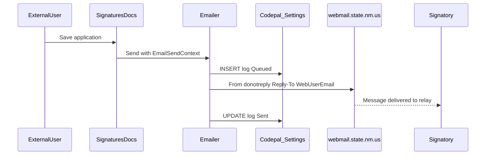
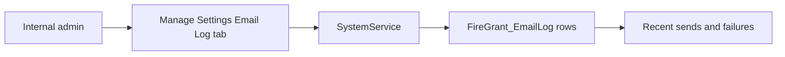

# Email Send Logging — Planning Document

> **Detailed implementation guide:**
> [`../email-send-logging-implementation-plan.md`](../email-send-logging-implementation-plan.md)

**Project:** NMSFM Fire Grant Web Application  
**Document version:** 1.0  
**Date:** June 29, 2026  
**Status:** Implemented

**Related artifacts:**

- Email sender: [`Emailer.cs`](../../../NMSFM.Services/FireGrant/Emailer.cs)
- Web config: [`web.config`](../../NMSFMFireGrantWF/web.config)
- CodePal entity: [`Setting.cs`](../../../NMSFM.Data/Codepal Tables/Setting.cs)
- Settings service: [`SystemService.cs`](../../../NMSFM.Services/CPSystem/SystemService.cs)
- Web user store: [`User.cs`](../../../NMSFM.Data/User Tables/User.cs) (`NMSFM_WebUsers_FG`)
- Send sites: [`SignaturesDocs.aspx.cs`](../../NMSFMFireGrantWF/Application/SignaturesDocs.aspx.cs), [`Register.aspx.cs`](../../NMSFMFireGrantWF/Account/Register.aspx.cs), [`Forgot.aspx.cs`](../../NMSFMFireGrantWF/Account/Forgot.aspx.cs)
- Reference (Fire Fund SMTP): Fire Fund `NMSFM/Web.config` `<mailSettings>`

---

## Overview

The Fire Grant application sends email for registration, password reset, and
application signature workflows. Today it uses **SendGrid** and an obsolete From
domain (`donotreply@newmexicostatefireservicesgrant.com`). There is no durable
audit trail when mail is sent or fails.

This feature migrates outbound mail to **New Mexico state webmail** (same
pattern as the Fire Fund application), corrects the Grant **From** address to
`donotreply@fireservicesgrant.dhsem.nm.gov`, attributes external-user sends via
**Reply-To** and message body text, and logs each send attempt in the existing
CodePal **Settings** table with status **Queued**, **Sent**, or **Failed**.

No third-party email provider and no delivery/bounce webhooks are included.

---

## Confirmed decisions

| Topic | Decision |
|-------|----------|
| SMTP | `webmail.state.nm.us:25`, `defaultCredentials="true"`, SSL enabled |
| Third-party provider | None (remove SendGrid from active config) |
| From address | `donotreply@fireservicesgrant.dhsem.nm.gov` |
| External user email | `User.Email` in `NMSFM_WebUsers_FG` via `Session["WebUserId"]` |
| Party email | Not used for send identity |
| Reply-To | External user's WebUser email when role is External and email present |
| Message body | Signatory/submittal templates name the sender (login + email) |
| Logging storage | CodePal `Settings` — `FireGrant_EmailLog_{messageId}` rows |
| Log statuses | `Queued`, `Sent`, `Failed` only |
| ApplicationUrl | `https://fireservicesgrant.dhsem.nm.gov/` |
| Admin UI | v1 includes read-only grid of recent send logs on Manage Settings |
| Schema changes | None |

---

## Problem

| Item | Today |
|------|-------|
| SMTP | SendGrid (`smtp.sendgrid.net`) |
| From domain | `newmexicostatefireservicesgrant.com` (does not exist) |
| Send audit | None — only inline page errors |
| External user attribution | Signatory emails do not identify who sent them |
| Delivery tracking | Not available (and not in scope without third-party webhooks) |

---

## User flows

### External user sends signatory email

### Admin reviews send history

---

## Implementation phases

| Phase | What | Primary files |
|-------|------|----------------|
| **A** | Planning + implementation docs | `docs/planning/`, `docs/` |
| **B** | `web.config` SMTP + appSettings | `web.config` |
| **C** | Settings log service methods | `SystemService.cs`, `FireGrantSettingKeys.cs` |
| **D** | Extend `Emailer` (logging, Reply-To) | `Emailer.cs`, new context types |
| **E** | Session + WebUser email hygiene | `Login.aspx.cs`, `AddCodePalUser.aspx.cs`, `EditUser.aspx.cs` |
| **F** | Instrument send call sites | `SignaturesDocs.aspx.cs`, `Register.aspx.cs`, `Forgot.aspx.cs` |
| **G** | Admin email log UI (+ optional test/purge) | `ManageSettings.aspx` |
| **H** | Build + manual QA | `build.ps1` |

---

## Success criteria

1. All existing email paths send through state webmail with the correct From domain.
2. Every outbound message creates a `FireGrant_EmailLog_{messageId}` Settings row.
3. External-user signatory/submittal emails set Reply-To to the WebUser email and
   name the sender in the body.
4. SMTP failures are recorded as `Failed` with an error message in the log JSON.
5. Admins can view recent send logs and filter failures without database access.
6. Email links use `https://fireservicesgrant.dhsem.nm.gov/`.
7. `.\build.ps1` succeeds.

---

## Out of scope

- Delivered, bounced, opened, or read receipts (requires provider webhooks or IT mail tooling)
- Using the external user's email as the SMTP **From** address
- New database tables or migrations
- SendGrid Event Webhook handler
- Party record email as the identity source

---

## Rollback

1. Revert `web.config` `<mailSettings>` to SendGrid and restore prior
   `DefaultEmailSender` if needed.
2. Set `EnableEmailSendLogging` to `false` to stop new log rows without removing code.
3. Optionally delete `Settings` rows where `PropertyField LIKE 'FireGrant_EmailLog_%'`.

---

## Risks

| Risk | Mitigation |
|------|------------|
| IIS app pool cannot relay via state webmail | Verify with IT before production; use Email Test on admin UI |
| `Sent` does not guarantee inbox delivery | Document as "handed off to mail server"; admin log for support |
| `User.Email` empty on some WebUsers | Fallback: no Reply-To; log `sentByEmail` empty; fix AddCodePalUser/EditUser |
| Settings table growth | Retention purge (default 90 days) on admin UI |

---

## Open items

- Confirm with IT that `donotreply@fireservicesgrant.dhsem.nm.gov` is authorized on the state relay.
- Confirm IIS app pool identity is permitted to send via `webmail.state.nm.us`.
- Validate `ServicePointManager.SecurityProtocol = Tls12` in `Emailer` against port 25 relay (remove if problematic).
