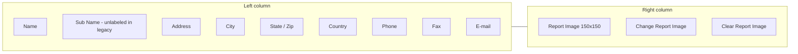
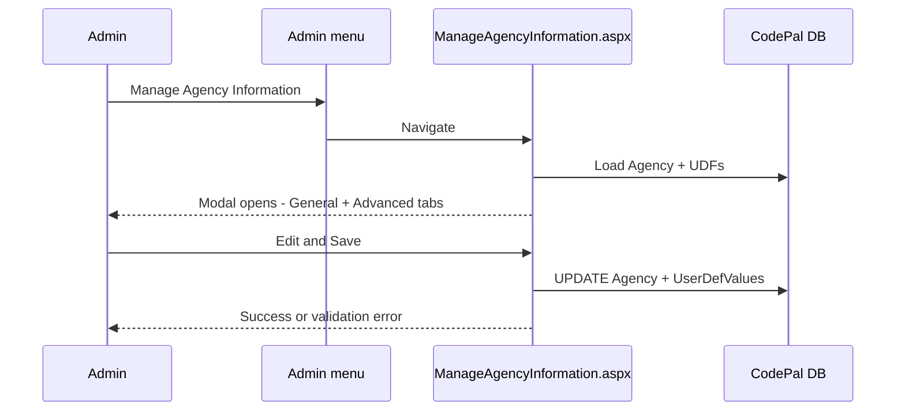

# Manage Agency Information — Planning Document

> **Detailed implementation guide:**
> [`../manage-agency-information-implementation-plan.md`](../manage-agency-information-implementation-plan.md)

**Project:** NMSFM Fire Grant Web Application  
**Document version:** 1.0  
**Date:** June 28, 2026  
**Status:** Implemented

**Related artifacts:**

- Legacy source form: `E:\LegacyApp\forms\frmAgency.vb`
- Legacy UDF loader: `E:\LegacyApp\forms\frmUserDefValues.vb`
- Admin menu: [`Site.Master`](../../NMSFMFireGrantWF/Site.Master)
- CodePal entity: [`Agency.cs`](../../../NMSFM.Data/Codepal Tables/Agency.cs)

---

## Overview

Add a new **Admin** menu item, **Manage Agency Information**, that opens an editable
modal containing agency data from the CodePal `Agency` table. The modal mirrors the
LegacyApp agency form (`frmAgency`) for the **General** and **Advanced** tabs.
Certifications are excluded from this release.

Admins can view and save agency contact information, report image, inactive flag,
and agency-level user-defined fields (UDFs).

---

## Confirmed decisions

| Topic | Decision |
|-------|----------|
| Menu label | Manage Agency Information |
| UX | Admin menu → dedicated page → Bootstrap modal auto-opens on load |
| Tabs | General + Advanced only (no Certifications) |
| Mode | Editable with Save (mirrors LegacyApp) |
| Agency scope | Current session `AgencyId` (logged-in internal admin's agency) |
| Data store | Existing CodePal tables — no schema changes |
| County field | Omitted (hidden and not persisted in legacy) |

---

## Graphical representation — LegacyApp Agency form

### Modal structure

```mermaid
flowchart TB
  subgraph modal [Agency Modal]
    inactive[Inactive checkbox]
    tabs[Tab control]
    footer[Created / Last Updated | Save | Close]
  end

  subgraph tabGeneral [Tab: General]
    leftCol[Contact fields]
    rightCol[Report image]
  end

  subgraph tabAdvanced [Tab: Advanced]
    udfCats[UDF categories]
    udfFields[Dynamic fields per category]
  end

  tabs --> tabGeneral
  tabs --> tabAdvanced
  tabGeneral --> leftCol
  tabGeneral --> rightCol
  tabAdvanced --> udfCats
  udfCats --> udfFields
```

### General tab — field layout



| UI Label | DB Column | Notes |
|----------|-----------|-------|
| Name | `AgencyName` | Max 50 |
| Sub Name | `AgencySubName` | Unlabeled in legacy edit form |
| Address | `Address` | Max 50 |
| City | `City` | Max 50 |
| State / Zip | `StateId`, `Zip` | State dropdown + zip text |
| Country | `CountryId` | Dropdown |
| Phone | `Phone` | Max 25 |
| Fax | `Fax` | Max 25 |
| E-mail | `Email` | Max 100 |
| Report Image | `ReportImage` | `.bmp`, `.jpg`, `.jpeg`, `.gif`, `.png` |
| Inactive | `ExternalId` | Legacy: `0` = active, `1` = inactive |

### Advanced tab

Dynamic UDF categories and fields from `UserDefCategories` where
`ModuleId = Agency module` OR `AllAgency = 'Age'`. Values stored in
`UserDefValues` with `RecordId = AgencyId`.

---

## User flow



---

## Implementation phases

| Phase | What | Primary files |
|-------|------|----------------|
| **A** | Planning + implementation docs | `docs/planning/`, `docs/` |
| **B** | AgencyService + UDF agency query | `AgencyService.cs`, `UDFService.cs` |
| **C** | Admin page + modal UI | `ManageAgencyInformation.aspx` |
| **D** | Load, dynamic UDF render, save | `.aspx.cs` |
| **E** | Menu entries + csproj registration | `Site.Master`, `ApplicationMstr.Master` |
| **F** | Build + manual QA | `build.ps1` |

---

## Success criteria

1. Internal web admin sees **Manage Agency Information** in the Admin dropdown
   (main nav and application master).
2. Modal opens with General tab populated from the session agency record.
3. Advanced tab shows configured agency UDF categories and current values.
4. Save persists agency fields and UDF values to CodePal.
5. Report image upload and clear work within legacy file-type constraints.
6. Required UDF validation blocks save and keeps the modal open with errors.
7. Non-admin and external users are redirected to Unauthorized.

---

## Out of scope

- Certifications tab and certification CRUD
- Agency list/search (`frmAgencies`)
- Audit history button
- Multi-agency picker (single session agency only)
- Database schema changes

---

## Rollback

| Layer | Action |
|-------|--------|
| **Code** | Revert feature commits; remove menu link |
| **Runtime** | Redeploy prior build |
| **Data** | Restore `Agency` / `UserDefValues` from backup or audit if bad save |
