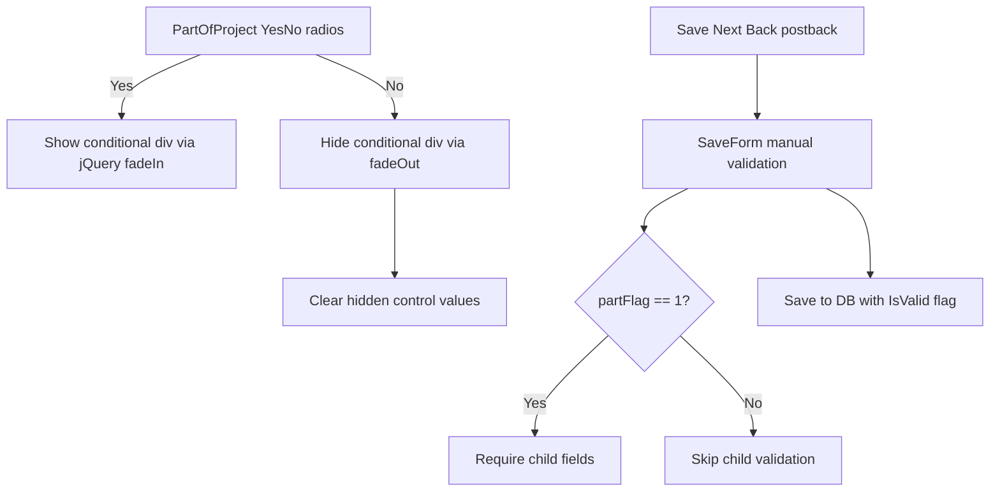

# Part-of-Project Conditional Sections — Implementation Plan

> **Detailed implementation guide:**
> [`../part-of-project-conditional-sections-implementation-plan.md`](../part-of-project-conditional-sections-implementation-plan.md)

## Overview

When an applicant answers **No** to a "part of the project?" gate question on the PPE,
Communication Equipment, or Apparatus pages, all fields below that question must be
**hidden**, **not required**, and **savable** with only the gate question answered.
Hidden field values are **cleared** when switching to No.

---

## Restated requirements

### 1. PPE page (`NMSFMFireGrantWF/Application/PPE.aspx`)

- **PPE is part of the project?** — when No, hide `#dvPPE` (inspection question +
  Standard Compliant PPE grid) and skip related validation.
- **SCBA is part of the project?** — when No, hide `#dvSCBA` (Standard Compliant SCBA
  grid) and skip related validation.
- Fix existing bug: PPE inspected validation must read `rbPPEInspectedYes`/`No`, not
  `rbPPEYes`/`No`.

### 2. Communication Equipment page (`CommunicationEquipment.aspx`)

- **Communications is part of the project?** — when No, hide all content below the gate
  (equipment inventory, interoperability, repeater sections) and skip related validation.
- Admin comments remain visible (admin only).

### 3. Apparatus page (`Apparatus.aspx`)

- **Apparatus is part of the project?** — when No, hide all content below the gate
  (pump tests, hose tests, apparatus list) and skip related validation.

### Confirmed decisions

| Topic | Decision |
|---|---|
| PPE page scope | Both PPE and SCBA gate questions |
| Data on hide | Clear hidden field values when switching to No |
| Validation | Server-side only in each page's `SaveForm()` |
| DB schema | No changes |

---

## Proposed implementation approach

Reuse the existing jQuery show/hide + manual `SaveForm()` validation pattern:

### Files to touch

| File | Changes |
|---|---|
| `Application/PPE.aspx` | Extend `showPPE()` / `showSCBA()` to clear fields on hide |
| `Application/PPE.aspx.cs` | Fix inspected bug; clear child data when gate = No |
| `Application/CommunicationEquipment.aspx` | Extend `#dvCommunications` wrapper; update JS |
| `Application/CommunicationEquipment.aspx.cs` | Gate all child validations; clear data when No |
| `Application/Apparatus.aspx` | Add `#dvApparatusDetails` wrapper; update JS |
| `Application/Apparatus.aspx.cs` | Clear child data when gate = No |
| `Application/Reporting/ApplicationPrint.aspx` | Wrap apparatus detail rows |
| `Application/Reporting/ApplicationPrint.aspx.cs` | Hide apparatus details when No |

---

## Validation matrix (target state)

| Field group | Required when gate = Yes | Required when gate = No |
|---|---|---|
| Gate question itself | Always | Always |
| PPE inspected + PPE grid | Yes | No |
| SCBA grid | Yes | No |
| Comm radio counts + interoperability + repeater | Yes | No |
| Apparatus pump/hose + apparatus list | Yes | No |
| Admin comments | Admin only (unchanged) | Admin only |

---

## Implementation checklist

- [x] PPE.aspx — clear-on-hide for PPE and SCBA sections
- [x] PPE.aspx.cs — fix inspected bug; persist cleared values when No
- [x] CommunicationEquipment.aspx — extend conditional wrapper + JS
- [x] CommunicationEquipment.aspx.cs — gate validations; clear data when No
- [x] Apparatus.aspx — `#dvApparatusDetails` wrapper + JS
- [x] Apparatus.aspx.cs — clear child data when No
- [x] ApplicationPrint — hide apparatus details when No
- [x] Build verified via `.\build.ps1`

---

## Test plan

For each page:

1. **No selected:** downstream fields hidden; Save succeeds; `IsValid = true`.
2. **Yes selected:** downstream fields visible; required fields enforced.
3. **Yes → No toggle:** hidden fields cleared; save persists cleared values.
4. **Reload:** saved No state shows only gate question; Yes state restores data.
5. **Print view:** child sections hidden when gate = No (Apparatus).
6. **Read-only session:** save bypass unchanged.

---

## Risks

- Clearing ViewState grid data on hide is intentional; toggling Yes → No removes child
  rows until re-entered.
- RadNumericTextBox client IDs use `ApplicationContent_*` prefix — follow existing page
  selectors when clearing Telerik controls.
