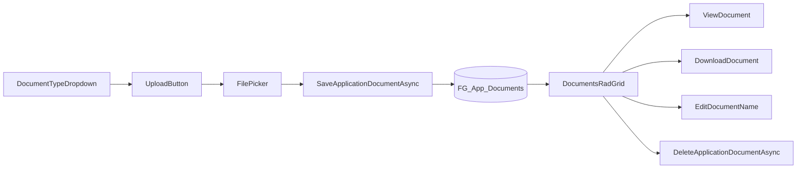

# PPE/SCBA Document Upload — Implementation Plan

> **Detailed implementation guide:**
> [`../ppe-scba-document-upload-implementation-plan.md`](../ppe-scba-document-upload-implementation-plan.md)

## Overview

Add paired **Upload PPE Documents** / **Upload SCBA Documents** buttons and document
grids to the PPE application page, persisting files to `FG_App_Documents` using patterns
from `SignaturesDocs.aspx`, with `DocumentName` as the editable text field.

---

## Restated requirements

On the **PPE application page**
(`NMSFMFireGrantWF/Application/PPE.aspx`), add **two parallel enhancements** — one for
each equipment section.

### 1. Standard Compliant PPE section

- Add a **Document Type dropdown** (initial option: **"PPE Document"**; designed so
  more options can be added later).
- Add a new button **to the right of** the existing **"Add Standard Compliant PPE"**
  button (currently in the `dvShowModal` row around lines 42–47).
- Button label: **"Upload PPE Documents"**.
- User selects **Document Type** from the dropdown, then clicks upload to open the
  **Windows file picker** and select a file.
- **Allowed file types:** `.xls`, `.xlsx`, `.csv`, `.pdf`, `.doc`, `.docx`.
- Uploaded files are **saved to the application** in the **`FG_App_Documents`** table
  (entity: `NMSFM.Data/Codepal Tables/FG_App_Documents.cs`).
- **Below** the existing Standard Compliant PPE grid (`rgStandardComplientPPE`), add a
  **new documents grid** showing:
  - **Document Type**
  - **Document Name**
  - **View** link (open/preview the document)
  - **Download** link
  - **Edit** capability for the document text field (edit `DocumentName`, not a separate
    Description column)
  - **Remove** capability (delete the document from the application)

### 2. Standard Compliant SCBA section

- Mirror the same behavior in the SCBA section:
  - **Document Type dropdown** (initial option: **"SCBA Document"**; extensible for
    future options).
  - New button **to the right of** **"Add Standard Compliant SCBA"** (`dvShowModal2`,
    lines 98–103).
  - Button label: **"Upload SCBA Documents"**.
  - Same allowed file types and same storage table.
  - New documents grid **below** the Standard Compliant SCBA grid
    (`rgStandardComplientSCBA`) with the same columns and actions.

### Confirmed decisions

| Topic | Decision |
|---|---|
| Editable text field | Use **`DocumentName`** (no new Description column) |
| Document Type values | **"PPE Document"** (PPE section) and **"SCBA Document"** (SCBA section) |
| Document Type selection | **Dropdown** on each section; user selects type before upload. Initial options are one per section; dropdowns should be easy to extend with additional values later (same pattern as `SignaturesDocs.aspx` `ddlCategory`). |

---

## Proposed implementation approach

Reuse the existing document infrastructure from
`NMSFMFireGrantWF/Application/SignaturesDocs.aspx` /
`NMSFMFireGrantWF/Application/SignaturesDocs.aspx.cs`:

### UI changes — `PPE.aspx`

- Widen button rows (`dvShowModal`, `dvShowModal2`) to place Document Type dropdowns
  and upload buttons beside existing add buttons.
- Add `ddlPPEDocumentType` (options: `"PPE Document"`) and `ddlSCBADocumentType`
  (options: `"SCBA Document"`) — populated in markup or code-behind so new ListItems
  can be added later without structural changes.
- Add hidden `asp:FileUpload` or `telerik:RadAsyncUpload` controls filtered to:
  `xls,xlsx,csv,pdf,doc,docx`.
- Wire upload buttons to trigger file selection (client-side click on file input) and
  server-side upload handler; require a selected Document Type before save.
- Add two new `RadGrid` controls:
  - `rgPPEDocuments` below `rgStandardComplientPPE`
  - `rgSCBADocuments` below `rgStandardComplientSCBA`
- Grid columns: Document Type, Document Name (inline edit), View, Download, Remove.

### Code-behind — `PPE.aspx.cs`

- On page load: load documents for current `ApplicationId`, filtered by section:
  - PPE grid: documents whose `DocumentType` matches PPE dropdown values (initially
    `"PPE Document"`)
  - SCBA grid: documents whose `DocumentType` matches SCBA dropdown values (initially
    `"SCBA Document"`)
- Upload handlers:
  - Validate Document Type dropdown is selected
  - Validate extension against allowed list
  - Persist via `fgAppService.SaveApplicationDocumentAsync()`
  - Set `DocumentType` from selected dropdown value (`ddlPPEDocumentType` /
    `ddlSCBADocumentType`)
  - Set `DocumentName` from uploaded filename (editable afterward)
- Grid commands (adapt from SignaturesDocs):
  - **View** — reuse PDF/Word preview logic where supported; Excel/CSV likely
    download-only with user-friendly message
  - **Download** — stream bytes with correct MIME type
  - **Edit** — update `DocumentName` via `SaveApplicationDocumentAsync`
  - **Remove** — `DeleteApplicationDocumentAsync`

### Service layer (minimal)

- Existing methods in `NMSFM.Services/FireGrant/FGApplicationService.cs` are
  sufficient:
  - `SaveApplicationDocumentAsync`
  - `GetApplicationDocumentByIdAsync`
  - `DeleteApplicationDocumentAsync`
- Optionally add `GetApplicationDocumentsByTypeAsync(applicationId, documentType)` to
  avoid loading all app documents on the PPE page.

### Files to touch

- `NMSFMFireGrantWF/Application/PPE.aspx` — buttons, upload controls, grids
- `NMSFMFireGrantWF/Application/PPE.aspx.cs` — upload/load/view/download/edit/delete
  logic
- `NMSFMFireGrantWF/Application/PPE.aspx.designer.cs` — new control declarations
- Optionally `NMSFM.Services/FireGrant/IFGApplicationServices.cs` +
  `NMSFM.Services/FireGrant/FGApplicationService.cs` — typed document query helper

### Out of scope (unless requested)

- Changes to `NMSFMFireGrantWF/Application/Reporting/ApplicationPrint.aspx` print/report
  output
- New database columns
- Showing PPE/SCBA documents on the Signatures & Docs page (documents will share the
  same table but be filtered by `DocumentType` on PPE page)

---

## Implementation checklist

- [x] Confirm DocumentType label strings (`"PPE Document"`, `"SCBA Document"`)
- [ ] Add PPE Document Type dropdown, Upload PPE Documents button, file upload control,
  and `rgPPEDocuments` grid to `PPE.aspx`
- [ ] Add SCBA Document Type dropdown, Upload SCBA Documents button, file upload control,
  and `rgSCBADocuments` grid to `PPE.aspx`
- [ ] Implement PPE document upload, load, view, download, edit DocumentName, and delete
  in `PPE.aspx.cs`
- [ ] Implement SCBA document upload, load, view, download, edit DocumentName, and
  delete in `PPE.aspx.cs`
- [ ] Optional: add `GetApplicationDocumentsByTypeAsync` to `FGApplicationService` for
  filtered loading
- [ ] Manually verify upload/view/download/edit/remove for both sections and all allowed
  file types

---

## Test plan

- Document Type dropdown defaults/selection works; saved value matches dropdown
  selection
- Upload each allowed file type from both sections; confirm row appears in correct grid
  only
- View/Download work for PDF, Word; Excel/CSV download works
- Edit Document Name persists after save/reload
- Remove deletes row and DB record
- Invalid extension rejected with clear error
- Page Save/Next/Back navigation does not lose document data
