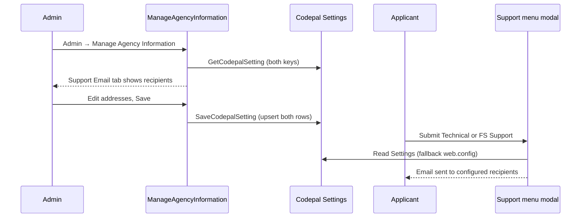

# Support Email Admin Tab — Planning Document

> **Detailed implementation guide:**
> [`../support-email-admin-tab-implementation-plan.md`](../support-email-admin-tab-implementation-plan.md)

**Project:** NMSFM Fire Grant Web Application  
**Document version:** 1.0  
**Date:** June 28, 2026  
**Status:** Implemented

**Related artifacts:**

- Parent feature: [`manage-agency-information-plan.md`](manage-agency-information-plan.md)
- Admin page: [`ManageAgencyInformation.aspx`](../../NMSFMFireGrantWF/Admin/ManageAgencyInformation.aspx)
- Support menu: [`Site.Master`](../../NMSFMFireGrantWF/Site.Master)
- CodePal entity: [`Setting.cs`](../../../NMSFM.Data/Codepal Tables/Setting.cs)
- Settings reader: [`SystemService.cs`](../../../NMSFM.Services/CPSystem/SystemService.cs)

---

## Overview

Support menu submissions (Technical Support and Fire Services Support) currently
send email to addresses hard-coded in `web.config`. Several of those addresses
are no longer valid. Internal admins need to update recipient lists without a
code deploy.

This feature adds a **Support Email** tab to the existing **Manage Agency
Information** admin modal. Admins can view and save two recipient lists stored
in the CodePal `Settings` table (agency-scoped key/value rows). The Support
menu continues to work unchanged for end users; only the destination addresses
become admin-configurable.

---

## Confirmed decisions

| Topic | Decision |
|-------|----------|
| Admin UI location | New tab on Manage Agency Information modal (not a new page) |
| Tab title | Support Email |
| Editable fields | Technical Support email(s); Fire Services Support email(s) |
| Storage | CodePal `Settings` table — `PropertyField` + `ValueField` + `AgencyId` |
| Property keys | `FireGrant_TechnicalSupportEmail`; `FireGrant_FireServicesSupportEmail` |
| Multiple recipients | Semicolon-separated list (matches existing `Emailer`) |
| Fallback | `web.config` appSettings when Settings row is empty |
| Fire Services vs registration | New `FireServicesSupportEmail` config key for FS modal; keep `AccountEmailApprovers` for registration approval only |
| Schema changes | None — uses existing `Settings` table |
| UDF approach | Not used — Settings table is simpler and already supports agency-scoped config |

---

## Problem

| Item | Today |
|------|-------|
| Technical Support recipient | `TechnicalSupportEmail` in `web.config` |
| Fire Services Support recipient | `AccountEmailApprovers` in `web.config` (shared with registration) |
| Admin UI to change recipients | None — requires config edit + redeploy |
| Known issues | Stale addresses; FS modal body uses wrong form fields (bug fix included) |

---

## User flow



---

## Modal change (high level)

```mermaid
flowchart TB
  subgraph modal [Agency Information Modal]
    tabs[General | Advanced | Support Email]
  end

  subgraph tabSupport [Tab: Support Email]
    ta[Technical Support Email]
    fs[Fire Services Support Email]
    help[Help: semicolon-separated addresses]
  end

  tabs --> tabSupport
  tabSupport --> ta
  tabSupport --> fs
  tabSupport --> help
```

Existing **General** and **Advanced** tabs are unchanged. Support Email fields
save with the same **Save** button as agency contact / UDF data.

---

## Implementation phases

| Phase | What | Primary files |
|-------|------|----------------|
| **A** | Planning + implementation docs | `docs/planning/`, `docs/` |
| **B** | `SaveCodepalSetting` + support email helpers | `SystemService.cs`, constants |
| **C** | Support Email tab UI | `ManageAgencyInformation.aspx` |
| **D** | Load, validate, save in code-behind | `ManageAgencyInformation.aspx.cs` |
| **E** | Wire Support menu send handlers | `Site.Master.cs`, `ApplicationMstr.Master.cs` |
| **F** | Config cleanup + Contact page | `web.config`, `Contact.aspx` |
| **G** | Build + manual QA | `build.ps1` |

---

## Success criteria

1. Internal web admin opens Manage Agency Information → **Support Email** tab
   shows current Technical Support and Fire Services Support recipient lists.
2. Admin saves new addresses; values persist in `Settings` for the session agency.
3. Support → **Technical Support** Send delivers to the configured address(es).
4. Support → **Fire Services Support** Send delivers to the configured
   address(es) with the correct submitter name, email, and description.
5. If Settings values are empty, `web.config` fallback still delivers mail.
6. Registration approval emails continue to use `AccountEmailApprovers` only.
7. No code deploy required for future recipient changes after initial release.

---

## Out of scope

- Changing Support menu labels or modal layout for applicants
- Admin UI for `DefaultEmailSender` or SMTP configuration
- Per-fiscal-year support email variants
- Email delivery logging or ticket system integration
- Moving registration approver addresses to the Support Email tab

---

## Rollback

1. Revert application binaries to prior release.
2. Support menu falls back to `web.config` addresses (Settings rows remain in DB
   but are ignored by older code).
3. Optionally delete or clear `Settings` rows where
   `PropertyField IN ('FireGrant_TechnicalSupportEmail',
   'FireGrant_FireServicesSupportEmail')` if a clean rollback is required.

---

## Open items

- Confirm initial recipient address(es) for each environment (admin first save,
  optional SQL seed, and/or updated `web.config` fallbacks).
