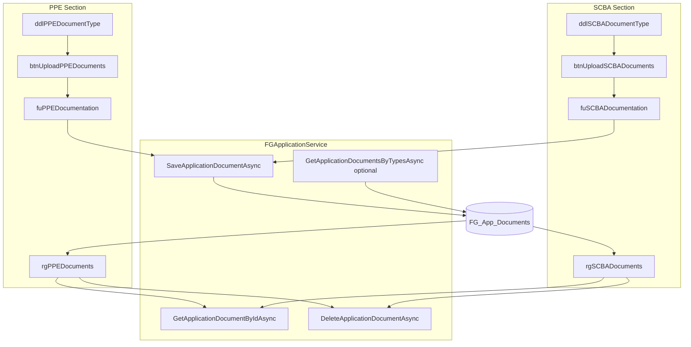

# PPE/SCBA Document Upload — Detailed Implementation Plan

**Project:** NMSFM Fire Grant Web Application  
**Document version:** 1.0  
**Date:** June 22, 2026  
**Status:** Planned (not yet implemented)  
**Scope:** Add document upload, listing, view, download, rename, and delete for the Standard
Compliant PPE and Standard Compliant SCBA sections on the PPE application page.

**Related artifacts:**

- Requirements summary: [`docs/planning/ppe-scba-document-upload-plan.md`](planning/ppe-scba-document-upload-plan.md)
- Target page: [`NMSFMFireGrantWF/Application/PPE.aspx`](../NMSFMFireGrantWF/Application/PPE.aspx)
- Reference upload page: [`NMSFMFireGrantWF/Application/SignaturesDocs.aspx`](../NMSFMFireGrantWF/Application/SignaturesDocs.aspx)
- Entity: [`NMSFM.Data/Codepal Tables/FG_App_Documents.cs`](../../NMSFM.Data/Codepal%20Tables/FG_App_Documents.cs)
- View model: [`NMSFM.Services/ViewModels/FG_AppDocListItem.cs`](../../NMSFM.Services/ViewModels/FG_AppDocListItem.cs)
- Service methods: [`NMSFM.Services/FireGrant/FGApplicationService.cs`](../../NMSFM.Services/FireGrant/FGApplicationService.cs)

---

## 1. Problem statement

Applicants on the PPE page can add Standard Compliant PPE and SCBA line items, but they
cannot attach supporting documents (spreadsheets, PDFs, Word files) to those sections.
Documents elsewhere in the application (Signatures & Docs) already persist to
`FG_App_Documents`; this work extends that pattern to PPE and SCBA with section-specific
UI and filtering.

### Functional requirements

| # | Requirement |
|---|-------------|
| R1 | PPE section: Document Type dropdown + **Upload PPE Documents** button beside **Add Standard Compliant PPE** |
| R2 | SCBA section: Document Type dropdown + **Upload SCBA Documents** button beside **Add Standard Compliant SCBA** |
| R3 | Upload opens the OS file picker; allowed extensions: `.xls`, `.xlsx`, `.csv`, `.pdf`, `.doc`, `.docx` |
| R4 | Files persist to `FG_App_Documents` for the current `ApplicationId` |
| R5 | Each section has a documents grid below its equipment grid |
| R6 | Grid columns: Document Type, Document Name, View, Download, Edit Name, Remove |
| R7 | Document Name (`DocumentName`) is user-editable after upload |
| R8 | Remove deletes the record from the application (DB + grid) |

### Confirmed design decisions

| Topic | Decision |
|-------|----------|
| Storage table | `FG_App_Documents` (user referred to `FG_Apps_Documents`; codebase uses `FG_App_Documents`) |
| Editable label field | `DocumentName` only — no new Description column |
| PPE Document Type options (initial) | `"PPE Document"` |
| SCBA Document Type options (initial) | `"SCBA Document"` |
| Document Type UX | Dropdown per section; values stored in `DocumentType` column |
| Future extensibility | Add new `<asp:ListItem>` entries to each dropdown without structural changes |

---

## 2. Current state

### PPE page today

File: `NMSFMFireGrantWF/Application/PPE.aspx`

| Control | Purpose |
|---------|---------|
| `dvShowModal` / `btnShowModal` | Opens modal to add/edit Standard Compliant PPE rows |
| `rgStandardComplientPPE` | Grid of PPE equipment line items |
| `dvShowModal2` / `btnShowModal2` | Opens modal to add/edit Standard Compliant SCBA rows |
| `rgStandardComplientSCBA` | Grid of SCBA equipment line items |
| `hfApplicationId` | Current application GUID from session |

Code-behind (`PPE.aspx.cs`):

- Loads PPE/SCBA data via `GetFGApplicationPPEAsync(appIdGuid)` in `Page_Load`.
- Stores equipment lists in `ViewState["dtPPE"]` and `ViewState["dtSCBA"]`.
- `DisableControls()` hides add buttons and first grid column when `Session["ReadOnly"]` is true.
- **No document upload or document service calls exist today.**

### Reference implementation: Signatures & Docs

File: `NMSFMFireGrantWF/Application/SignaturesDocs.aspx(.cs)`

Reuse these patterns:

| Pattern | Location |
|---------|----------|
| Document Type dropdown | `ddlCategory` |
| File upload control | `telerik:RadAsyncUpload` (`fuDocumentation`) |
| Upload confirmation link | `lnkAddDocument_Click` |
| Document list ViewState | `ViewState["dtDocuments"]` as `List<FG_AppDocListItem>` |
| Grid | `rgDocuments` with View / Download / Delete |
| Persist | `fgAppService.SaveApplicationDocumentAsync(doc)` |
| Load on page init | `LoadDocsSigs` → `model.Documents` from `GetFGApplicationDocsSigsAsync` |
| View / Download | `ViewDocument`, `DownloadDocument`, `GetExtension` helpers |

### Existing service API (sufficient for v1)

```csharp
Task<FG_App_Documents> GetApplicationDocumentByIdAsync(Guid id);
Task<bool> SaveApplicationDocumentAsync(FG_App_Documents model);
Task<bool> DeleteApplicationDocumentAsync(Guid id);
```

`GetFGApplicationDocsSigsAsync` loads **all** documents for an application. For the PPE
page, filter client-side or add a narrow query helper (recommended below).

---

## 3. Data model

### Table: `FG_App_Documents`

| Column | Type | Usage in this feature |
|--------|------|------------------------|
| `DocumentId` | `Guid` PK | Generated once at upload; reused for edit/delete |
| `ApplicationId` | `Guid` FK | From `hfApplicationId` / session |
| `DocumentType` | `string` | From dropdown: `"PPE Document"` or `"SCBA Document"` |
| `DocumentName` | `string` | Original filename; user may edit after upload |
| `Document` | `byte[]` | File binary content |
| `DocType` | `string` | Optional MIME or extension hint; may mirror extension |

No schema migration required.

### ViewState keys (new)

| Key | Type | Contents |
|-----|------|----------|
| `dtPPEDocuments` | `List<FG_AppDocListItem>` | PPE-section documents for grid binding |
| `dtSCBADocuments` | `List<FG_AppDocListItem>` | SCBA-section documents for grid binding |

### Document Type constants

Define in `PPE.aspx.cs` (or a small static helper class) for maintainability:

```csharp
private const string DocTypePpeDocument = "PPE Document";
private const string DocTypeScbaDocument = "SCBA Document";

private static readonly string[] PpeDocumentTypes = { DocTypePpeDocument };
private static readonly string[] ScbaDocumentTypes = { DocTypeScbaDocument };

private static readonly string[] AllowedExtensions =
  { '.xls', '.xlsx', '.csv', '.pdf', '.doc', '.docx' };
```

To add a future dropdown option, append to the array **and** add a `ListItem` in markup
or in `LoadDocumentTypeDropdowns()`.

---

## 4. Architecture



---

## 5. UI implementation — `PPE.aspx`

### 5.1 PPE upload row (replace / extend `dvShowModal`)

Current markup uses a single `col-md-3` column. Expand to accommodate dropdown + both
buttons:

```aspx
<div class="row" id="dvShowModal" runat="server">
  <div class="col-md-12">
    <button type="button" id="btnShowModal" class="btn btn-primary"
      onclick="clearNoteId()" data-toggle="modal"
      data-target="#standardCompliantPPEModal">
      Add Standard Compliant PPE
    </button>
    &nbsp;
    <asp:Label ID="lblPPEDocumentType" runat="server"
      AssociatedControlID="ddlPPEDocumentType" Text="Document Type:" />
    &nbsp;
    <asp:DropDownList ID="ddlPPEDocumentType" runat="server"
      CssClass="form-control" ClientIDMode="Static" Width="180px">
      <asp:ListItem Text="PPE Document" Value="PPE Document" />
    </asp:DropDownList>
    &nbsp;
    <asp:Button ID="btnUploadPPEDocuments" runat="server"
      CssClass="btn btn-primary" Text="Upload PPE Documents"
      OnClientClick="return triggerPPEFileUpload();" />
    <telerik:RadAsyncUpload ID="fuPPEDocumentation" runat="server"
      Style="display:none;" Skin="Bootstrap" MaxFileSize="10000000"
      MultipleFileSelection="Disabled" MaxFileInputsCount="1"
      OnFileUploaded="fuPPEDocumentation_FileUploaded">
      <FileFilters>
        <telerik:FileFilter
          Description="PPE Documents (xls;xlsx;csv;pdf;doc;docx)"
          Extensions="xls,xlsx,csv,pdf,doc,docx" />
      </FileFilters>
    </telerik:RadAsyncUpload>
  </div>
</div>
<div class="row" id="dvPPEDocumentError" runat="server"></div>
```

**Alternative upload UX (simpler):** hidden `<asp:FileUpload>` with
`onchange="__doPostBack(...)"` if RadAsyncUpload postback wiring proves awkward. Prefer
RadAsyncUpload for consistency with SignaturesDocs.

### 5.2 PPE documents grid (insert after `dvStandardComplientPPE`)

```aspx
<div class="row" id="dvPPEDocuments">
  <div class="col-md-12">
    <h4>Uploaded PPE Documents</h4>
    <telerik:RadGrid ID="rgPPEDocuments" runat="server"
      AutoGenerateColumns="False" Skin="Bootstrap"
      AllowPaging="True" PageSize="10"
      OnNeedDataSource="rgPPEDocuments_NeedDataSource"
      OnPageIndexChanged="rgPPEDocuments_PageIndexChanged"
      OnItemCommand="rgPPEDocuments_ItemCommand">
      <MasterTableView DataKeyNames="DocumentId">
        <Columns>
          <telerik:GridBoundColumn DataField="DocumentType"
            HeaderText="Document Type" UniqueName="DocumentType" />
          <telerik:GridBoundColumn DataField="DocumentName"
            HeaderText="Document Name" UniqueName="DocumentName" />
          <telerik:GridTemplateColumn HeaderText="Edit Name" UniqueName="EditName">
            <ItemTemplate>
              <asp:LinkButton ID="btnEditName" runat="server"
                Text="Edit Name" CommandName="EditName"
                CommandArgument='<%# Eval("DocumentId") %>' />
            </ItemTemplate>
          </telerik:GridTemplateColumn>
          <telerik:GridTemplateColumn HeaderText="View" UniqueName="View">
            <ItemTemplate>
              <asp:LinkButton ID="btnView" runat="server"
                Text="View Document" CommandName="View"
                CommandArgument='<%# Eval("DocumentId") %>' />
            </ItemTemplate>
          </telerik:GridTemplateColumn>
          <telerik:GridTemplateColumn HeaderText="Download" UniqueName="Download">
            <ItemTemplate>
              <asp:LinkButton ID="btnDownload" runat="server"
                Text="Download Doc" CommandName="Download"
                CommandArgument='<%# Eval("DocumentId") %>' />
            </ItemTemplate>
          </telerik:GridTemplateColumn>
          <telerik:GridTemplateColumn HeaderText="Remove" UniqueName="Remove">
            <ItemTemplate>
              <asp:LinkButton ID="btnRemove" runat="server"
                Text="Remove" CommandName="Delete"
                CommandArgument='<%# Eval("DocumentId") %>' />
            </ItemTemplate>
          </telerik:GridTemplateColumn>
        </Columns>
      </MasterTableView>
    </telerik:RadGrid>
  </div>
</div>
```

### 5.3 SCBA section

Mirror controls with SCBA-specific IDs:

| PPE control | SCBA control |
|-------------|--------------|
| `ddlPPEDocumentType` | `ddlSCBADocumentType` |
| `btnUploadPPEDocuments` | `btnUploadSCBADocuments` |
| `fuPPEDocumentation` | `fuSCBADocumentation` |
| `dvPPEDocumentError` | `dvSCBADocumentError` |
| `rgPPEDocuments` | `rgSCBADocuments` |
| `dvPPEDocuments` | `dvSCBADocuments` |

SCBA dropdown initial item: `<asp:ListItem Text="SCBA Document" Value="SCBA Document" />`

### 5.4 Edit Document Name modal (shared)

Add one Bootstrap modal (same pattern as existing PPE modals):

```aspx
<div class="modal fade" id="editDocumentNameModal" tabindex="-1" role="dialog"
  data-backdrop="false" aria-hidden="true">
  <div class="modal-dialog" role="document">
    <div class="modal-content">
      <div class="modal-header">
        <h4 class="modal-title">Edit Document Name</h4>
        <button type="button" class="close" data-dismiss="modal">&times;</button>
      </div>
      <div class="modal-body">
        <asp:Label ID="lblEditDocumentNameError" runat="server" />
        <asp:TextBox ID="txtEditDocumentName" runat="server"
          CssClass="form-control" Width="100%" />
        <asp:HiddenField ID="hfEditDocumentId" runat="server" />
        <asp:HiddenField ID="hfEditDocumentSection" runat="server" />
      </div>
      <div class="modal-footer">
        <button type="button" class="btn btn-primary" data-dismiss="modal">Close</button>
        <asp:Button ID="btnSaveDocumentName" runat="server"
          CssClass="btn btn-primary" Text="Save"
          OnClick="btnSaveDocumentName_Click" />
      </div>
    </div>
  </div>
</div>
```

Using a modal for rename matches existing PPE UX (no inline RadGrid edit mode exists
elsewhere in the app).

### 5.5 View document modal (optional but recommended)

Copy the PDF viewer modal from `SignaturesDocs.aspx` (`pdfView`, `openDocModal` script) into
`PPE.aspx` **Content1** head scripts if in-browser View is required for PDF/Word. Without
this, View can fall back to Download for unsupported types.

### 5.6 Client script additions

```javascript
function triggerPPEFileUpload() {
  var ddl = $('#ddlPPEDocumentType');
  if (!ddl.val()) {
    alert('Please select a Document Type before uploading.');
    return false;
  }
  // Trigger RadAsyncUpload browse dialog — exact selector depends on Telerik client API
  var upload = $find('<%= fuPPEDocumentation.ClientID %>');
  if (upload) { upload.click(); }
  return false;
}

function triggerSCBAFileUpload() {
  var ddl = $('#ddlSCBADocumentType');
  if (!ddl.val()) {
    alert('Please select a Document Type before uploading.');
    return false;
  }
  var upload = $find('<%= fuSCBADocumentation.ClientID %>');
  if (upload) { upload.click(); }
  return false;
}

function openEditDocumentNameModal() {
  $('#editDocumentNameModal').modal('show');
}
```

---

## 6. Code-behind implementation — `PPE.aspx.cs`

### 6.1 New using directives (if View modal added)

Mirror SignaturesDocs imports for RadFlow document conversion:

```csharp
using System.Text.RegularExpressions;
using Telerik.Windows.Documents.Common.FormatProviders;
using Telerik.Windows.Documents.Flow.Model;
using Telerik.Windows.Documents.Flow.FormatProviders.Docx;
using Telerik.Windows.Documents.Flow.FormatProviders.Pdf;
```

### 6.2 Page_Load changes

Inside `if (!Page.IsPostBack)` after loading PPE data:

```csharp
await LoadApplicationDocuments(appIdGuid);
```

```csharp
private async Task LoadApplicationDocuments(Guid applicationId)
{
  List<FG_AppDocListItem> allDocs =
    await fgAppService.GetApplicationDocumentsByTypesAsync(
      applicationId, PpeDocumentTypes.Concat(ScbaDocumentTypes).ToArray());

  List<FG_AppDocListItem> ppeDocs = allDocs
    .Where(d => PpeDocumentTypes.Contains(d.DocumentType))
    .ToList();
  List<FG_AppDocListItem> scbaDocs = allDocs
    .Where(d => ScbaDocumentTypes.Contains(d.DocumentType))
    .ToList();

  ViewState["dtPPEDocuments"] = ppeDocs;
  ViewState["dtSCBADocuments"] = scbaDocs;
  rgPPEDocuments.DataSource = ppeDocs;
  rgPPEDocuments.DataBind();
  rgSCBADocuments.DataSource = scbaDocs;
  rgSCBADocuments.DataBind();
}
```

If the optional service method is not added, query via existing
`GetFGApplicationDocsSigsAsync(applicationId).Documents` and filter in memory.

### 6.3 Upload handler (shared private method)

```csharp
private async Task UploadDocumentAsync(
  RadAsyncUpload upload,
  DropDownList documentTypeDropdown,
  HtmlGenericControl errorDiv,
  string[] allowedTypesForSection,
  string viewStateKey,
  RadGrid grid)
{
  errorDiv.InnerHtml = string.Empty;

  if (string.IsNullOrWhiteSpace(documentTypeDropdown.SelectedValue)) {
    throw new Exception("You must select a Document Type.<br />");
  }
  if (upload.UploadedFiles.Count == 0) {
    throw new Exception("You must select a file to upload.<br />");
  }

  UploadedFile file = upload.UploadedFiles[0];
  string extension = file.GetExtension().ToLowerInvariant();
  if (!AllowedExtensions.Contains(extension)) {
    throw new Exception("File type not allowed.<br />");
  }

  byte[] fileData = new byte[file.InputStream.Length];
  file.InputStream.Read(fileData, 0, Convert.ToInt32(file.InputStream.Length));

  Guid documentId = Guid.NewGuid();
  Guid appId = new Guid(hfApplicationId.Value);

  FG_App_Documents doc = new FG_App_Documents {
    DocumentId = documentId,
    ApplicationId = appId,
    DocumentType = documentTypeDropdown.SelectedItem.Text,
    DocumentName = file.FileName,
    Document = fileData,
    DocType = extension
  };

  bool saved = await fgAppService.SaveApplicationDocumentAsync(doc);
  if (!saved) {
    throw new Exception("An error occurred saving " + file.FileName + "<br />");
  }

  FG_AppDocListItem docItem = new FG_AppDocListItem {
    DocumentId = documentId,
    ApplicationId = appId,
    DocumentType = doc.DocumentType,
    DocumentName = doc.DocumentName,
    DocType = doc.DocType
  };

  List<FG_AppDocListItem> docs = GetDocumentListFromViewState(viewStateKey);
  docs.Add(docItem);
  ViewState[viewStateKey] = docs;
  grid.DataSource = docs;
  grid.DataBind();
  upload.UploadedFiles.Clear();

  errorDiv.InnerHtml =
    '<div class=\'alert alert-success\'>' + file.FileName + ' has been added.</div>';
}
```

Wire section-specific events:

```csharp
protected async void fuPPEDocumentation_FileUploaded(object sender, FileUploadedEventArgs e)
{
  try {
    await UploadDocumentAsync(
      fuPPEDocumentation, ddlPPEDocumentType, dvPPEDocumentError,
      PpeDocumentTypes, "dtPPEDocuments", rgPPEDocuments);
  } catch (Exception ex) {
    dvPPEDocumentError.InnerHtml =
      "<div class='alert alert-danger'>" + ex.Message + "</div>";
  }
}
```

### 6.4 Grid command handlers

Implement `rgPPEDocuments_ItemCommand` and `rgSCBADocuments_ItemCommand` (or one shared
method with section parameter):

| CommandName | Action |
|-------------|--------|
| `View` | Load doc by id; PDF/Word preview via RadFlow (copy from SignaturesDocs); Excel/CSV/legacy `.doc` → show message and offer Download |
| `Download` | Stream `Document` bytes with `Content-Disposition: attachment` |
| `Delete` | `DeleteApplicationDocumentAsync`; remove from ViewState list; rebind grid |
| `EditName` | Set `hfEditDocumentId`, populate `txtEditDocumentName`, open modal |

### 6.5 Save edited Document Name

**Critical:** `SaveApplicationDocumentAsync` overwrites `Document` with whatever is passed.
Always load the full record first:

```csharp
protected async void btnSaveDocumentName_Click(object sender, EventArgs e)
{
  Guid docId = new Guid(hfEditDocumentId.Value);
  FG_App_Documents doc = await fgAppService.GetApplicationDocumentByIdAsync(docId);
  if (doc == null) { /* error */ return; }

  doc.DocumentName = txtEditDocumentName.Text.Trim();
  bool saved = await fgAppService.SaveApplicationDocumentAsync(doc);
  // Update ViewState list + rebind appropriate grid based on hfEditDocumentSection
}
```

### 6.6 Shared helpers (copy from SignaturesDocs)

| Method | Purpose |
|--------|---------|
| `GetExtension(string path)` | Multi-part extension support |
| `ExtractFileNameWithoutExtention(string path)` | View modal title |
| `ViewDocument(string docId)` | In-browser preview |
| `DownloadDocument(string docId)` | File download response |
| `GetDocumentListFromViewState(string key)` | Safe ViewState list retrieval |

Enhance `DownloadDocument` with MIME mapping for PPE file types (copy switch from
`Training.aspx.cs`):

| Extension | Content-Type |
|-----------|--------------|
| `.doc` | `application/vnd.ms-word` |
| `.docx` | `application/vnd.openxmlformats-officedocument.wordprocessingml.document` |
| `.xls` | `application/vnd.ms-excel` |
| `.xlsx` | `application/vnd.openxmlformats-officedocument.spreadsheetml.sheet` |
| `.csv` | `text/csv` |
| `.pdf` | `application/pdf` |

### 6.7 Read-only mode — `DisableControls` updates

Extend existing `DisableControls` in `PPE.aspx.cs`:

```csharp
else if (con is RadAsyncUpload)
{
  con.Visible = false;
}
else if (con is DropDownList)
{
  DropDownList d = (DropDownList)con;
  d.Enabled = false;
}
```

Also hide:

- `btnUploadPPEDocuments`, `btnUploadSCBADocuments`
- Remove / Edit Name columns on both document grids (same as equipment grid: hide column 0
  or hide action columns individually in `ItemDataBound`)

---

## 7. Service layer (recommended addition)

### 7.1 Interface — `IFGApplicationServices.cs`

```csharp
Task<List<FG_AppDocListItem>> GetApplicationDocumentsByTypesAsync(
  Guid applicationId, string[] documentTypes);
```

### 7.2 Implementation — `FGApplicationService.cs`

```csharp
public async Task<List<FG_AppDocListItem>> GetApplicationDocumentsByTypesAsync(
  Guid applicationId, string[] documentTypes)
{
  var query = cwmContext.FG_App_Documents
    .Where(a => a.ApplicationId == applicationId);

  if (documentTypes != null && documentTypes.Length > 0)
  {
    query = query.Where(a => documentTypes.Contains(a.DocumentType));
  }

  return await query
    .Select(doc => new FG_AppDocListItem {
      DocumentId = doc.DocumentId,
      ApplicationId = doc.ApplicationId,
      DocumentName = doc.DocumentName,
      DocumentType = doc.DocumentType,
      DocType = doc.DocType
    })
    .ToListAsync();
}
```

Avoids loading Signatures-page document types when binding PPE grids.

---

## 8. Designer file — `PPE.aspx.designer.cs`

Regenerate or manually declare all new controls:

- `ddlPPEDocumentType`, `ddlSCBADocumentType`
- `btnUploadPPEDocuments`, `btnUploadSCBADocuments`
- `fuPPEDocumentation`, `fuSCBADocumentation`
- `dvPPEDocumentError`, `dvSCBADocumentError`
- `rgPPEDocuments`, `rgSCBADocuments`
- `dvPPEDocuments`, `dvSCBADocuments`
- Modal controls: `txtEditDocumentName`, `hfEditDocumentId`, `hfEditDocumentSection`,
  `btnSaveDocumentName`, `lblEditDocumentNameError`

---

## 9. View behavior by file type

| Extension | View action | Download |
|-----------|-------------|----------|
| `.pdf` | PDF.js modal (if added) or browser inline | Yes |
| `.docx` | Convert to PDF via RadFlow; show modal | Yes |
| `.doc` | No reliable in-browser preview — message + Download link | Yes |
| `.xls`, `.xlsx`, `.csv` | No in-browser preview — message + Download link | Yes |

Do not block View click for unsupported types; show a friendly alert:
*"Preview is not available for this file type. Use Download instead."*

---

## 10. Implementation sequence

Execute in this order to keep the page buildable at each step:

1. **Service helper** — add `GetApplicationDocumentsByTypesAsync` (optional but recommended).
2. **Constants + helpers** — add to `PPE.aspx.cs` bottom region.
3. **PPE markup** — dropdown, upload control, error div, grid (SCBA can wait).
4. **PPE code-behind** — load, upload, grid commands, edit modal.
5. **SCBA markup** — mirror PPE controls.
6. **SCBA code-behind** — wire to shared helpers with SCBA parameters.
7. **View modal** — copy PDF viewer from SignaturesDocs if preview is required.
8. **Read-only** — extend `DisableControls`.
9. **Designer** — sync control declarations.
10. **Build + manual test** — full matrix below.

---

## 11. Pitfalls to avoid

| Pitfall | Mitigation |
|---------|------------|
| Mismatched `DocumentId` between list item and DB row | Generate **one** `Guid`; assign to both `FG_App_Documents` and `FG_AppDocListItem` before save (SignaturesDocs currently creates two GUIDs — do not repeat) |
| Wiping file bytes on rename | Load full document before `SaveApplicationDocumentAsync` when only renaming |
| PPE docs appearing on Signatures page | Acceptable for v1 — same table. Filter Signatures grid later if needed (out of scope) |
| Upload without Document Type | Validate dropdown client-side and server-side |
| Large files | Keep `MaxFileSize="10000000"` (10 MB) consistent with SignaturesDocs |
| Read-only users uploading | Hide upload controls in `DisableControls` |

---

## 12. Test matrix

| # | Scenario | Expected |
|---|----------|----------|
| T1 | Select PPE Document Type, upload `.pdf` | Row in PPE grid only; DB row with correct `DocumentType` |
| T2 | Upload `.xlsx` from SCBA section | Row in SCBA grid only |
| T3 | Upload `.txt` (invalid) | Error message; no DB row |
| T4 | View `.pdf` | Preview or download |
| T5 | View `.xlsx` | Friendly no-preview message |
| T6 | Download each allowed extension | Correct filename and MIME |
| T7 | Edit Document Name → Save → reload page | Name persisted |
| T8 | Remove document | Row gone; DB record deleted |
| T9 | Read-only session | No upload; no Remove/Edit |
| T10 | Save / Next / Back on PPE page | Documents still present |
| T11 | Add future dropdown option (dev test) | New type saves and filters correctly |

---

## 13. Out of scope (v1)

- Printing PPE/SCBA documents on `ApplicationPrint.aspx`
- Filtering PPE/SCBA types out of Signatures & Docs grid
- Database schema changes
- Bulk/multi-file upload (`MultipleFileSelection` stays Disabled)
- Virus scanning or content inspection

---

## 14. Files changed (summary)

| File | Change |
|------|--------|
| `NMSFMFireGrantWF/Application/PPE.aspx` | Upload UI, grids, modals, scripts |
| `NMSFMFireGrantWF/Application/PPE.aspx.cs` | Document CRUD, helpers, read-only |
| `NMSFMFireGrantWF/Application/PPE.aspx.designer.cs` | New control fields |
| `NMSFM.Services/FireGrant/IFGApplicationServices.cs` | Optional query method |
| `NMSFM.Services/FireGrant/FGApplicationService.cs` | Optional query implementation |

**Not changed in v1:** `publish/Application/PPE.aspx` (update on publish/deploy workflow only).

---

## 15. Implementation checklist

- [x] Confirm DocumentType values and dropdown UX
- [ ] Add optional `GetApplicationDocumentsByTypesAsync` service method
- [ ] PPE section UI (dropdown, upload button, grid, error div)
- [ ] SCBA section UI (mirror PPE)
- [ ] Shared upload / load / view / download / delete / rename logic in `PPE.aspx.cs`
- [ ] Edit Document Name modal
- [ ] Read-only handling in `DisableControls`
- [ ] Update `PPE.aspx.designer.cs`
- [ ] Build solution without errors
- [ ] Execute test matrix (Section 12)
