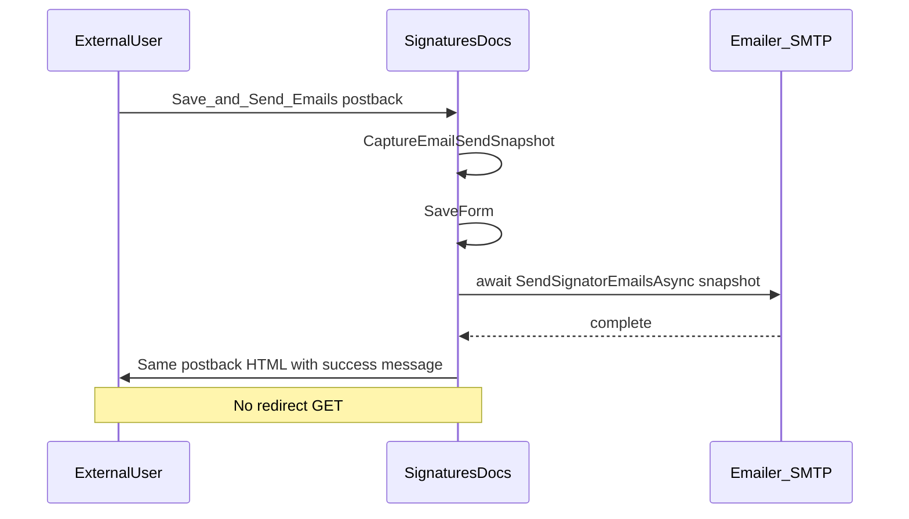

# Signatory Email Session Fix — Implementation Plan

**Project:** NMSFM Fire Grant Web Application  
**Document version:** 1.0  
**Date:** June 30, 2026  
**Status:** Implemented  
**Scope:** Prevent external users from being sent to login after Save & Send Emails on Signatures and Supporting Docs.

**Related artifacts:**

- Planning summary: [`planning/signatory-email-session-fix-plan.md`](planning/signatory-email-session-fix-plan.md)
- Page: [`SignaturesDocs.aspx.cs`](../NMSFMFireGrantWF/Application/SignaturesDocs.aspx.cs)
- Helper: [`EmailSendContextHelper.cs`](../NMSFM.Services/FireGrant/EmailSendContextHelper.cs)

---

## 1. Architecture



---

## 2. File changes

### 2.1 `EmailSendContextHelper.cs`

Add:

```csharp
public static EmailSendContext FromValues(
  string contextType, string contextId,
  string sentByUserId, string sentByEmail,
  string sentByLogin, string sentByRole, Guid? agencyId)

public static string BuildExternalSenderBodyLine(
  string role, string login, string email)
```

Refactor `FromSession` and parameterless `BuildExternalSenderBodyLine` to delegate to these overloads.

### 2.2 `SignaturesDocs.aspx.cs`

- Replace `async void btnSave_Click` with `RegisterAsyncTask(new PageAsyncTask(SaveAndSendAsync))`.
- Add private nested class `EmailSendSnapshot` holding application id, fiscal year, department name, external body line, and two `EmailSendContext` instances.
- Add `CaptureEmailSendSnapshot()`, `IsSessionIntact()`.
- Update `SendSignatorEmailsAsync(EmailSendSnapshot snap)` and `SendSubmittalEmailsAsync(EmailSendSnapshot snap)` to use snapshot instead of `Session` / `FromSession` during SMTP.
- **Save path (external, non-submit):** set `dvError.InnerHtml = saveMessage`; return without redirect.
- **Submit path:** after submittal email, redirect to AppConf only if `IsSessionIntact()`; else inline warning.
- **Admin save:** unchanged redirect via `Session["SaveMessage"]`.

### 2.3 `ApplicationMstr.Master.cs`

In `Page_Load` auth guard: remove `SignOut` and `Session.Abandon()`; keep redirect to login.

### 2.4 `Site.Master.cs`

In `Page_Load` auth guard: remove `SignOut` and `Session.Abandon()` when `WebUserId` is null; keep `lnkSearchHelp.Visible = false`.

---

## 3. QA checklist

1. External user → add unsigned signatory → **Save & Send Emails** → stay on page, success message, no login.
2. Navigate to another application step → still authenticated.
3. **Email Send Log** shows `SignatoryRequest` / Sent.
4. Multi-signatory save (2+) → browser waits, no login during wait.
5. Submit Application → AppConf when session intact.
6. Admin Save → redirect with message (unchanged).
7. Explicit logout → login required.
8. Production NM network retest before sign-off.

**Build:** `.\build.ps1` from `NMSFM_FGF_CVE/NMSFMFireGrantWF/`
