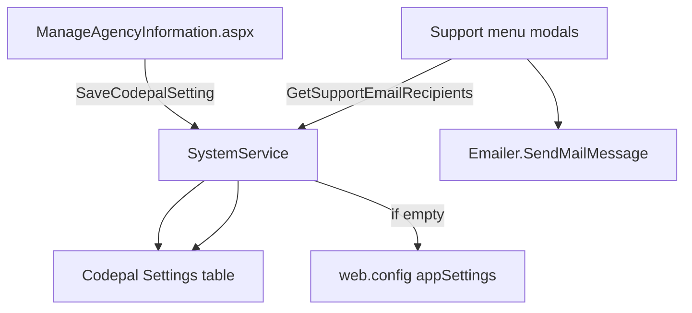

# Support Email Admin Tab — Implementation Plan

**Project:** NMSFM Fire Grant Web Application  
**Document version:** 1.0  
**Date:** June 28, 2026  
**Status:** Implemented  
**Scope:** Support Email tab on Manage Agency Information; CodePal `Settings`
storage; Support menu recipient resolution; `web.config` fallback. No schema
changes.

**Related artifacts:**

- Planning summary: [`planning/support-email-admin-tab-plan.md`](planning/support-email-admin-tab-plan.md)
- Admin page: [`ManageAgencyInformation.aspx`](../NMSFMFireGrantWF/Admin/ManageAgencyInformation.aspx)
- Settings entity: [`Setting.cs`](../NMSFM.Data/Codepal Tables/Setting.cs)
- Settings service: [`SystemService.cs`](../NMSFM.Services/CPSystem/SystemService.cs)

---

## 1. Problem statement

Support menu modals send email to recipients from `web.config`. Configured
addresses include obsolete vendor mailboxes. There is no admin UI to update
recipients. Fire Services Support incorrectly shares the `AccountEmailApprovers`
key with new-user registration approval, and the FS send handler has a bug
(populates the email body from the Technical Support fields).

Admins need to maintain two recipient lists from **Manage Agency Information**
without redeploying the application.

---

## 2. Architecture



**Agency scope:** `Session["AgencyId"]` — same as Manage Agency Information.

**Resolution order when sending:**

1. Non-empty `Settings.ValueField` for the property key + agency
2. `web.config` appSetting fallback
3. If still empty → validation error shown to user (no silent dead-address default)

---

## 3. Settings table contract

| PropertyField | Purpose |
|---------------|---------|
| `FireGrant_TechnicalSupportEmail` | Technical Support modal `To` |
| `FireGrant_FireServicesSupportEmail` | Fire Services Support modal `To` |

| Column | Value |
|--------|-------|
| `PropertyField` | Key from table above |
| `ValueField` | Semicolon-separated email list |
| `AgencyId` | `Session["AgencyId"]` |
| `UserName` | Empty (agency-scoped, not user-scoped) |

Rows are **upserted on admin Save** — no mandatory pre-deploy SQL script.

Optional seed script (per environment):

```sql
-- Example only — replace addresses and AgencyId before running
INSERT INTO Settings (SettingsId, PropertyField, ValueField, AgencyId, rowguid, DateInserted, DateUpdated)
VALUES (NEWID(), 'FireGrant_TechnicalSupportEmail', 'admin@example.com', '<AgencyId>', NEWID(), GETDATE(), GETDATE());
```

---

## 4. Service layer

### 4.1 Constants

**New file (proposed):** `NMSFM.Services/CPSystem/FireGrantSettingKeys.cs`

```csharp
namespace NMSFM.Services.CPSystem
{
  public static class FireGrantSettingKeys
  {
    public const string TechnicalSupportEmail = "FireGrant_TechnicalSupportEmail";
    public const string FireServicesSupportEmail = "FireGrant_FireServicesSupportEmail";
  }
}
```

Register in [`NMSFM.Services.csproj`](../NMSFM.Services/NMSFM.Services.csproj).

### 4.2 SystemService extensions

**Files:**

| File | Change |
|------|--------|
| [`ISystemService.cs`](../NMSFM.Services/CPSystem/ISystemService.cs) | Add save + support email helpers |
| [`SystemService.cs`](../NMSFM.Services/CPSystem/SystemService.cs) | Implement upsert + helpers |

**New methods:**

```csharp
Task<bool> SaveCodepalSetting(string propertyField, string value, Guid? agencyId);

Task<(string TechnicalSupport, string FireServicesSupport)>
  GetSupportEmailRecipientsAsync(Guid agencyId);

Task<bool> SaveSupportEmailRecipientsAsync(
  Guid agencyId,
  string technicalSupport,
  string fireServicesSupport);
```

**SaveCodepalSetting — upsert logic:**

1. Query `Settings` where `PropertyField == propertyField` and `AgencyId == agencyId`.
2. If found: update `ValueField`, set `DateUpdated = DateTime.Now`.
3. If not found: insert new row with `SettingsId = Guid.NewGuid()`,
   `rowguid = Guid.NewGuid()`, `DateInserted` / `DateUpdated = DateTime.Now`.
4. `SaveChangesAsync`; return success/failure; log exceptions via `ILogging`.

**GetSupportEmailRecipientsAsync — fallback logic:**

```csharp
string technical = await GetCodepalSetting(FireGrantSettingKeys.TechnicalSupportEmail, agencyId);
if (string.IsNullOrWhiteSpace(technical))
  technical = ConfigurationManager.AppSettings["TechnicalSupportEmail"] ?? string.Empty;

string fireServices = await GetCodepalSetting(FireGrantSettingKeys.FireServicesSupportEmail, agencyId);
if (string.IsNullOrWhiteSpace(fireServices))
  fireServices = ConfigurationManager.AppSettings["FireServicesSupportEmail"] ?? string.Empty;
```

---

## 5. UI — ManageAgencyInformation.aspx

### 5.1 Tab markup

Add third tab after Advanced:

```html
<li role="presentation">
  <a href="#tabSupportEmail" aria-controls="tabSupportEmail" role="tab"
    data-toggle="tab">Support Email</a>
</li>
```

Tab panel `#tabSupportEmail`:

| Control ID | Label | Notes |
|------------|-------|-------|
| `txtTechnicalSupportEmail` | Technical Support Email | TextBox, wide |
| `txtFireServicesSupportEmail` | Fire Services Support Email | TextBox, wide |
| `lblSupportEmailHelp` | (static) | Semicolon-separated; empty = web.config fallback |

### 5.2 Designer

Add new controls to [`ManageAgencyInformation.aspx.designer.cs`](../NMSFMFireGrantWF/Admin/ManageAgencyInformation.aspx.designer.cs).

---

## 6. Code-behind — ManageAgencyInformation.aspx.cs

### 6.1 Load

In `Page_Load` / `BindAgencyToForm` (after agency bind):

```csharp
Guid agencyId = new Guid(hfAgencyId.Value);
var recipients = await systemService.GetSupportEmailRecipientsAsync(agencyId);
txtTechnicalSupportEmail.Text = await systemService.GetCodepalSetting(
  FireGrantSettingKeys.TechnicalSupportEmail, agencyId) ?? string.Empty;
txtFireServicesSupportEmail.Text = await systemService.GetCodepalSetting(
  FireGrantSettingKeys.FireServicesSupportEmail, agencyId) ?? string.Empty;
```

Display **stored** Settings values on the tab (not resolved fallback), so admins
see what is in the database. Help text explains empty = fallback.

### 6.2 Save — extend btnSaveAgency_ServerClick

After agency + UDF save succeeds (or as part of same save transaction block):

1. `ValidateSupportEmailList(txtTechnicalSupportEmail.Text)` — split on `;`,
   trim, validate each with `Emailer.EmailIsValid`; empty allowed.
2. Same for Fire Services field.
3. `await systemService.SaveSupportEmailRecipientsAsync(agencyId, technical, fireServices)`.
4. On validation failure: `ShowModalError`, reopen modal, return.

### 6.3 Validation helper (private method)

```csharp
private string ValidateSupportEmailList(string raw, string fieldLabel)
{
  if (string.IsNullOrWhiteSpace(raw)) return null;
  foreach (string part in raw.Split(';'))
  {
    string email = part.Trim();
    if (email.Length == 0) continue;
    if (!emailer.EmailIsValid(email))
      return fieldLabel + ": invalid email '" + email + "'";
  }
  return null;
}
```

Instantiate `Emailer` in page or reuse a static validation path.

---

## 7. Support menu — master page handlers

### 7.1 Files

| File | Handlers |
|------|----------|
| [`Site.Master.cs`](../NMSFMFireGrantWF/Site.Master.cs) | `btnSendTA_ServerClick`, `bntSendFS_ServerClick` |
| [`ApplicationMstr.Master.cs`](../NMSFMFireGrantWF/Application/ApplicationMstr.Master.cs) | Same |

### 7.2 Page_Init

Initialize `SystemService` using `CodepalWebModel` + session (same pattern as
Manage Agency Information).

### 7.3 Recipient resolution

Replace direct `ConfigurationManager.AppSettings[...]` for `to`:

```csharp
Guid agencyId = new Guid(Session["AgencyId"].ToString());
var recipients = systemService.GetSupportEmailRecipientsAsync(agencyId)
  .GetAwaiter().GetResult();
string to = recipients.TechnicalSupport; // or FireServicesSupport
if (string.IsNullOrWhiteSpace(to))
  throw new Exception("Support email is not configured. Please contact the administrator.");
```

### 7.4 Fire Services body bug fix

**Current (wrong):**

```csharp
string body = txtFSFromName.Text + " (" + txtTAFromEmail.Text + ") ..." + txtTADetails.Text;
```

**Correct:**

```csharp
string body = txtFSFromName.Text + " (" + txtFSFromEmail.Text + ") ..." + txtFSDetails.Text;
```

Apply in both master code-behind files.

---

## 8. web.config changes

**File:** [`web.config`](../NMSFMFireGrantWF/web.config)

| Key | Action |
|-----|--------|
| `TechnicalSupportEmail` | Update to valid fallback address(es) |
| `FireServicesSupportEmail` | **Add** — FS modal fallback only |
| `AccountEmailApprovers` | Leave for registration; remove from FS modal code |
| `DefaultEmailSender` | Update if obsolete (separate from this feature if needed) |

Remove hardcoded `vance@vscomptech.com` string literals in touched send
handlers; use config or explicit error.

**Contact page:** update [`Contact.aspx`](../NMSFMFireGrantWF/Contact.aspx) if
it still references `Support@codepaltoolkit.com`.

---

## 9. Project registration

| Project | Change |
|---------|--------|
| `NMSFM.Services.csproj` | Add `FireGrantSettingKeys.cs` if new file |
| `NMSFMFireGrantWF.csproj` | Designer updates only (no new pages) |

---

## 10. QA checklist

| # | Test | Expected |
|---|------|----------|
| T1 | Open Manage Agency Information → Support Email tab | Tab visible; fields load |
| T2 | Save valid semicolon-separated addresses | Two `Settings` rows upserted for agency |
| T3 | Reopen modal | Saved values shown |
| T4 | Save invalid email | Error; modal reopens; no partial corrupt save |
| T5 | Clear both fields, Save | Empty stored; Support Send uses web.config fallback |
| T6 | Technical Support Send | Mail to configured / fallback address |
| T7 | Fire Services Support Send | Mail to configured / fallback; body uses FS fields |
| T8 | Register new user (approval email) | Still uses `AccountEmailApprovers` only |
| T9 | External user | Cannot access Manage Agency Information |
| T10 | Build | `.\build.ps1` succeeds from `NMSFMFireGrantWF/` |

---

## 11. Build command

From `NMSFM_FGF_CVE/NMSFMFireGrantWF/`:

```powershell
.\build.ps1
```

---

## 12. Deployment notes

1. Deploy updated binaries.
2. Optional: run seed SQL or have admin set addresses on first use.
3. Verify Support Send in test before production.
4. No IIS `web.config` edit required for routine recipient changes after go-live
   (admin uses Support Email tab).

---

## 13. Rollback

Revert to previous build. Support menu reads `web.config` only in older code.
`Settings` rows are harmless if left in place.
